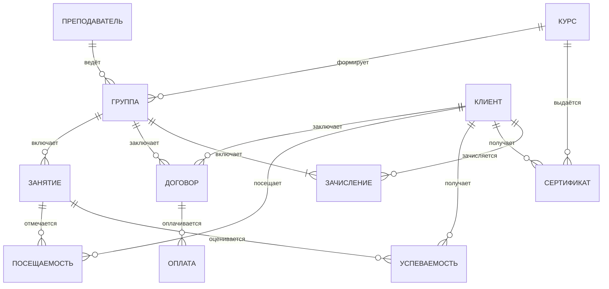

# Глава 2. Проектирование базы данных

## 2.1. Разработка инфологической модели

### 2.1.1. Сущности и их атрибуты

На основании проведённого анализа предметной области выделены следующие сущности:

**Сущность 1: Клиент**

Клиент (слушатель) — основная сущность системы, представляющая физическое лицо, обучающееся в образовательном центре. Клиент является ключевым субъектом учебного процесса, именно для него формируются группы, заключаются договоры и выдаются сертификаты. Атрибуты клиента включают персональные данные, необходимые для идентификации и связи. Данная сущность связана с другими через договоры, посещаемость и успеваемость, что позволяет отслеживать весь процесс обучения. В таблице представлены атрибуты сущности "Клиент".

| Атрибут | Тип | Описание |
|---------|-----|----------|
| id_клиента | INTEGER | Уникальный идентификатор |
| фамилия | VARCHAR(50) | Фамилия клиента |
| имя | VARCHAR(50) | Имя клиента |
| отчество | VARCHAR(50) | Отчество клиента |
| дата_рождения | DATE | Дата рождения |
| телефон | VARCHAR(20) | Номер телефона |
| email | VARCHAR(100) | Электронная почта |
| адрес | TEXT | Адрес проживания |
| дата_регистрации | DATE | Дата обращения в центр |

**Сущность 2: Преподаватель**

Преподаватель — сущность, представляющая сотрудника образовательного центра, осуществляющего учебную деятельность. Преподаватель ведёт группы, проводит занятия и оценивает успеваемость слушателей. Для идентификации и связи с преподавателем хранятся его персональные данные и квалификация. Квалификация преподавателя определяет, какие курсы он может вести, что важно для формирования учебного расписания. Данные о преподавателях необходимы для назначения на группы и формирования отчётности. В таблице представлены атрибуты сущности "Преподаватель".

| Атрибут | Тип | Описание |
|---------|-----|----------|
| id_преподавателя | INTEGER | Уникальный идентификатор |
| фамилия | VARCHAR(50) | Фамилия преподавателя |
| имя | VARCHAR(50) | Имя преподавателя |
| отчество | VARCHAR(50) | Отчество преподавателя |
| телефон | VARCHAR(20) | Номер телефона |
| email | VARCHAR(100) | Электронная почта |
| квалификация | VARCHAR(100) | Специализация |
| стаж_работы | INTEGER | Стаж в годах |

**Сущность 3: Курс**

Курс — сущность, определяющая программу обучения в образовательном центре. Курс характеризуется названием, описанием содержания, продолжительностью в часах и стоимостью. На основе курса формируются учебные группы, и по результатам обучения выдаются сертификаты. Параметры курса определяют его привлекательность для клиентов и ценовую политику центра. Уровень сложности помогает правильно подобрать группу для каждого клиента. В таблице представлены атрибуты сущности "Курс".

| Атрибут | Тип | Описание |
|---------|-----|----------|
| id_курса | INTEGER | Уникальный идентификатор |
| название | VARCHAR(200) | Название курса |
| описание | TEXT | Описание программы |
| продолжительность_часов | INTEGER | Общая длительность |
| стоимость | DECIMAL(10,2) | Стоимость обучения |
| уровень_сложности | VARCHAR(30) | Начальный/средний/продвинутый |

**Сущность 4: Группа**

Группа — объединяющая сущность, связывающая курс, преподавателя и слушателей. Группа имеет определённый период обучения (даты начала и окончания), формируется для конкретного курса и ведётся назначенным преподавателем. Максимальный размер группы ограничен для обеспечения качества обучения. Статус группы отражает её текущее состояние: формируется, в процессе обучения или завершена. Группы являются основной единицей организации учебного процесса. В таблице представлены атрибуты сущности "Группа".

| Атрибут | Тип | Описание |
|---------|-----|----------|
| id_группы | INTEGER | Уникальный идентификатор |
| название | VARCHAR(100) | Наименование группы |
| id_курса | INTEGER | Ссылка на курс |
| id_преподавателя | INTEGER | Ссылка на преподавателя |
| дата_начала | DATE | Дата начала обучения |
| дата_конца | DATE | Дата окончания обучения |
| максимальный_размер | INTEGER | Максимум слушателей |
| статус | VARCHAR(30) | Формируется/В процессе/Завершена |

**Сущность 5: Занятие**

Занятие — сущность, представляющая конкретное учебное занятие в рамках группы. Занятие имеет дату, время начала и окончания, аудиторию и тему. Последовательность занятий формирует учебный процесс, на основе которого отслеживается посещаемость и успеваемость слушателей. Номер занятия определяет его порядок в рамках курса, а тема — содержание учебного материала. Занятия являются основой для формирования расписания и отчётности. В таблице представлены атрибуты сущности "Занятие".

| Атрибут | Тип | Описание |
|---------|-----|----------|
| id_занятия | INTEGER | Уникальный идентификатор |
| id_группы | INTEGER | Ссылка на группу |
| номер_занятия | INTEGER | Порядковый номер |
| дата_занятия | DATE | Дата проведения |
| время_начала | TIME | Время начала |
| время_конца | TIME | Время окончания |
| аудитория | VARCHAR(20) | Номер аудитории |
| тема_занятия | VARCHAR(200) | Тема занятия |

**Сущность 6: Договор**

Договор — сущность, фиксирующая юридическое соглашение между образовательным центром и клиентом. Договор содержит информацию о номере, дате заключения, сумме и статусе выполнения. На основании договора осуществляются оплаты и контролируется задолженность. Статус договора отражает его актуальность: действует, расторгнут или завершён. Договор является связующим звеном между клиентом и группой. В таблице представлены атрибуты сущности "Договор".

| Атрибут | Тип | Описание |
|---------|-----|----------|
| id_договора | INTEGER | Уникальный идентификатор |
| номер_договора | VARCHAR(50) | Номер договора |
| id_клиента | INTEGER | Ссылка на клиента |
| id_группы | INTEGER | Ссылка на группу |
| дата_заключения | DATE | Дата подписания |
| сумма | DECIMAL(10,2) | Сумма по договору |
| статус | VARCHAR(30) | Действует/Расторгнут |

**Сущность 7: Посещаемость**

Посещаемость — сущность, фиксирующая присутствие или отсутствие клиента на конкретном занятии. Посещаемость позволяет отслеживать дисциплину слушателей и своевременно выявлять проблемы с посещением занятий. При отсутствии указывается причина, которая может быть уважительной или неуважительной. Данные о посещаемости необходимы для формирования отчётов и анализа посещаемости групп. Посещаемость напрямую влияет на успеваемость и результаты обучения. В таблице представлены атрибуты сущности "Посещаемость".

| Атрибут | Тип | Описание |
|---------|-----|----------|
| id_посещаемости | INTEGER | Уникальный идентификатор |
| id_клиента | INTEGER | Ссылка на клиента |
| id_занятия | INTEGER | Ссылка на занятие |
| статус | VARCHAR(20) | Присутствовал/Отсутствовал |
| причина | VARCHAR(100) | Причина отсутствия |

**Сущность 8: Успеваемость**

Успеваемость — сущность, отражающая результаты учебной деятельности клиента по каждому занятию. Успеваемость включает оценки, домашние задания и их статус проверки. Данная сущность позволяет преподавателю отслеживать прогресс каждого слушателя и своевременно выявлять трудности в обучении. Оценки выставляются по пятибалльной шкале, что является стандартом для образовательных учреждений. Домашние задания позволяют закрепить пройденный материал. В таблице представлены атрибуты сущности "Успеваемость".

| Атрибут | Тип | Описание |
|---------|-----|----------|
| id_успеваемости | INTEGER | Уникальный идентификатор |
| id_клиента | INTEGER | Ссылка на клиента |
| id_занятия | INTEGER | Ссылка на занятие |
| оценка | INTEGER | Оценка (1-5) |
| домашнее_задание | TEXT | Задание |
| проверено | BOOLEAN | Статус проверки |

**Сущность 9: Оплата**

Оплата — сущность, фиксирующая платежи по договору на обучение. Оплата содержит дату, сумму, способ оплаты и статус. Система отслеживает историю платежей для контроля задолженностей и формирования финансовых отчётов. Способы оплаты могут включать наличные, безналичный расчёт и онлайн-оплату. Статус оплаты показывает, был ли платёж успешно обработан. В таблице представлены атрибуты сущности "Оплата".

| Атрибут | Тип | Описание |
|---------|-----|----------|
| id_оплаты | INTEGER | Уникальный идентификатор |
| id_договора | INTEGER | Ссылка на договор |
| дата_оплаты | DATE | Дата платежа |
| сумма | DECIMAL(10,2) | Сумма платежа |
| способ_оплаты | VARCHAR(30) | Наличные/Безнал/Онлайн |
| статус | VARCHAR(30) | Оплачен/В ожидании |

**Сущность 10: Зачисление (Состав группы)**

Зачисление — связующая сущность между клиентом и группой, реализующая связь "многие ко многим". Она фиксирует факт зачисления слушателя в группу с указанием даты зачисления и статуса обучения. Данная сущность позволяет отслеживать историю обучения каждого клиента. Статус обучения может быть "Обучается", "Отчислен" или "Завершил", что отражает текущее состояние клиента в группе. Зачисление также позволяет зафиксировать дату отчисления, если клиент прекратил обучение досрочно. В таблице представлены атрибуты сущности "Зачисление".

| Атрибут | Тип | Описание |
|---------|-----|----------|
| id_зачисления | INTEGER | Уникальный идентификатор |
| id_клиента | INTEGER | Ссылка на клиента |
| id_группы | INTEGER | Ссылка на группу |
| дата_зачисления | DATE | Дата зачисления в группу |
| дата_отчисления | DATE | Дата отчисления (если применимо) |
| статус_обучения | VARCHAR(30) | Обучается/Отчислен/Завершил |

**Сущность 11: Сертификат**

Сертификат — сущность, подтверждающая успешное окончание обучения по конкретному курсу. Сертификат выдаётся клиенту после завершения обучения и содержит информацию о номере, дате выдачи и оценке. Является официальным документом, подтверждающим квалификацию слушателя. Оценка в сертификате может быть "отлично", "хорошо" или "удовлетворительно" в зависимости от результатов обучения. Номер сертификата является уникальным для предотвращения подделки документов. В таблице представлены атрибуты сущности "Сертификат".

| Атрибут | Тип | Описание |
|---------|-----|----------|
| id_сертификата | INTEGER | Уникальный идентификатор |
| номер_сертификата | VARCHAR(50) | Уникальный номер |
| id_клиента | INTEGER | Ссылка на клиента |
| id_курса | INTEGER | Ссылка на курс |
| дата_выдачи | DATE | Дата выдачи |
| оценка | VARCHAR(20) | Оценка (отлично/хорошо/удовлетворительно) |

### 2.1.2. Связи между сущностями

На основе выделенных сущностей необходимо определить связи между ними. Связи отражают взаимодействие объектов предметной области и реализуются через внешние ключи в реляционной модели. Рассмотрим основные связи между сущностями. Типы связей определяют кардинальность взаимодействия: "один к одному" (1:1), "один ко многим" (1:N) и "многие ко многим" (M:N). Правильное определение связей обеспечивает целостность данных и эффективность запросов. В таблице представлены основные связи между сущностями.

| Связь | Тип | Описание |
|-------|-----|----------|
| Преподаватель — Группа | 1:N | Один преподаватель ведёт несколько групп |
| Курс — Группа | 1:N | Один курс может иметь несколько групп |
| Группа — Занятие | 1:N | Одна группа имеет несколько занятий |
| **Клиент — Группа** | **M:N** | **Один клиент может учиться в нескольких группах, в одну группу входит несколько клиентов** |
| Клиент — Посещаемость | 1:N | Клиент имеет посещаемость по многим занятиям |
| Занятие — Посещаемость | 1:N | На занятие много записей посещаемости |
| Клиент — Успеваемость | 1:N | Клиент имеет оценки по многим занятиям |
| Занятие — Успеваемость | 1:N | На занятие много оценок |
| Договор — Оплата | 1:N | По одному договору несколько оплат |
| Курс — Сертификат | 1:N | Один курс может иметь несколько сертификатов |

### 2.1.3. ER-диаграмма

На основе выделенных сущностей и определённых связей между ними можно построить ER-диаграмму, которая наглядно отображает структуру базы данных. Диаграмма показывает все сущности и связи между ними, включая типы связей (один-к-одному, один-ко-многим, многие-ко-многим). Это позволяет визуально оценить архитектуру базы данных перед переходом к физическому проектированию. Ниже представлена ER-диаграмма разработанной модели данных.



Описание атрибутов сущностей приведено в таблице 2.1 (раздел 2.1.1).

---

## 2.2. Обоснование выбора модели данных

Для разрабатываемой базы данных выбрана **реляционная модель данных** [3, 8] по следующим причинам:

1. **Теоретическая база.** Реляционная модель основана на математической теории отношений, что обеспечивает строгость и непротиворечивость данных [17].

2. **Стандартизация.** Язык SQL является стандартом для работы с реляционными базами данных, что обеспечивает переносимость и унификацию запросов [4, 13].

3. **Гибкость запросов.** Реляционная алгебра позволяет формулировать сложные запросы к данным из множества таблиц.

4. **Целостность данных.** Реляционная модель поддерживает механизмы обеспечения целостности через первичные и внешние ключи [6].

5. **Широкое распространение.** Большинство современных СУБД поддерживают реляционную модель, что обеспечивает доступность инструментов и специалистов.

6. **Соответствие предметной области.** Данные образовательного центра естественно представляются в виде таблиц с отношениями между ними.

Для реализации выбрана **СУБД PostgreSQL** [7, 16] — объектно-реляционная система с открытым исходным кодом, которая соответствует реляционной модели и поддерживает все необходимые функции для данного проекта.

---

## 2.3. Даталогическое проектирование

### 2.3.1. Переход от ER-модели к реляционной схеме

Согласно правилам перехода от инфологической модели к даталогической:

- Каждая сущность преобразуется в таблицу
- Атрибуты сущности становятся столбцами таблицы
- Первичный ключ сущности становится первичным ключом таблицы
- Связи 1:N реализуются через внешний ключ в дочерней таблице
- Связи M:N реализуются через промежуточную таблицу (сущность «Зачисление»)

### 2.3.2. Описание таблиц

**Таблица: Клиент**
```sql
CREATE TABLE Клиент (
    id_клиента SERIAL PRIMARY KEY,
    фамилия VARCHAR(50) NOT NULL,
    имя VARCHAR(50) NOT NULL,
    отчество VARCHAR(50),
    дата_рождения DATE,
    телефон VARCHAR(20),
    email VARCHAR(100),
    адрес TEXT,
    дата_регистрации DATE DEFAULT CURRENT_DATE
);
```

**Таблица: Преподаватель**
```sql
CREATE TABLE Преподаватель (
    id_преподавателя SERIAL PRIMARY KEY,
    фамилия VARCHAR(50) NOT NULL,
    имя VARCHAR(50) NOT NULL,
    отчество VARCHAR(50),
    телефон VARCHAR(20),
    email VARCHAR(100),
    квалификация VARCHAR(100),
    стаж_работы INTEGER
);
```

**Таблица: Курс**
```sql
CREATE TABLE Курс (
    id_курса SERIAL PRIMARY KEY,
    название VARCHAR(200) NOT NULL,
    описание TEXT,
    продолжительность_часов INTEGER NOT NULL,
    стоимость DECIMAL(10,2) NOT NULL,
    уровень_сложности VARCHAR(30)
);
```

**Таблица: Группа**
```sql
CREATE TABLE Группа (
    id_группы SERIAL PRIMARY KEY,
    название VARCHAR(100) NOT NULL,
    id_курса INTEGER NOT NULL REFERENCES Курс(id_курса),
    id_преподавателя INTEGER NOT NULL REFERENCES Преподаватель(id_преподавателя),
    дата_начала DATE,
    дата_конца DATE,
    максимальный_размер INTEGER DEFAULT 15,
    статус VARCHAR(30) DEFAULT 'Формируется'
);
```

**Таблица: Занятие**
```sql
CREATE TABLE Занятие (
    id_занятия SERIAL PRIMARY KEY,
    id_группы INTEGER NOT NULL REFERENCES Группа(id_группы),
    номер_занятия INTEGER NOT NULL,
    дата_занятия DATE NOT NULL,
    время_начала TIME NOT NULL,
    время_конца TIME NOT NULL,
    аудитория VARCHAR(20),
    тема_занятия VARCHAR(200)
);
```

**Таблица: Договор**
```sql
CREATE TABLE Договор (
    id_договора SERIAL PRIMARY KEY,
    номер_договора VARCHAR(50) NOT NULL UNIQUE,
    id_клиента INTEGER NOT NULL REFERENCES Клиент(id_клиента),
    id_группы INTEGER NOT NULL REFERENCES Группа(id_группы),
    дата_заключения DATE NOT NULL,
    сумма DECIMAL(10,2) NOT NULL,
    статус VARCHAR(30) DEFAULT 'Действует'
);
```

**Таблица: Посещаемость**
```sql
CREATE TABLE Посещаемость (
    id_посещаемости SERIAL PRIMARY KEY,
    id_клиента INTEGER NOT NULL REFERENCES Клиент(id_клиента),
    id_занятия INTEGER NOT NULL REFERENCES Занятие(id_занятия),
    статус VARCHAR(20) DEFAULT 'Присутствовал',
    причина VARCHAR(100),
    UNIQUE(id_клиента, id_занятия)
);
```

**Таблица: Успеваемость**
```sql
CREATE TABLE Успеваемость (
    id_успеваемости SERIAL PRIMARY KEY,
    id_клиента INTEGER NOT NULL REFERENCES Клиент(id_клиента),
    id_занятия INTEGER NOT NULL REFERENCES Занятие(id_занятия),
    оценка INTEGER CHECK (оценка BETWEEN 1 AND 5),
    домашнее_задание TEXT,
    проверено BOOLEAN DEFAULT FALSE,
    UNIQUE(id_клиента, id_занятия)
);
```

**Таблица: Оплата**
```sql
CREATE TABLE Оплата (
    id_оплаты SERIAL PRIMARY KEY,
    id_договора INTEGER NOT NULL REFERENCES Договор(id_договора),
    дата_оплаты DATE NOT NULL,
    сумма DECIMAL(10,2) NOT NULL,
    способ_оплаты VARCHAR(30),
    статус VARCHAR(30) DEFAULT 'Оплачен'
);
```

**Таблица: Зачисление**
```sql
CREATE TABLE Зачисление (
    id_зачисления SERIAL PRIMARY KEY,
    id_клиента INTEGER NOT NULL REFERENCES Клиент(id_клиента),
    id_группы INTEGER NOT NULL REFERENCES Группа(id_группы),
    дата_зачисления DATE NOT NULL,
    дата_отчисления DATE,
    статус_обучения VARCHAR(30) DEFAULT 'Обучается',
    UNIQUE(id_клиента, id_группы)
);
```

**Таблица: Сертификат**
```sql
CREATE TABLE Сертификат (
    id_сертификата SERIAL PRIMARY KEY,
    номер_сертификата VARCHAR(50) NOT NULL UNIQUE,
    id_клиента INTEGER NOT NULL REFERENCES Клиент(id_клиента),
    id_курса INTEGER NOT NULL REFERENCES Курс(id_курса),
    дата_выдачи DATE,
    оценка VARCHAR(20)
);
```

---

## 2.4. Нормализация схемы БД

### 2.4.1. Приведение к нормальным формам

Нормализация схемы базы данных является важным этапом проектирования и позволяет устранить избыточность данных [18]. Все таблицы базы данных приведены к **третьей нормальной форме (3НФ)** [3, 10]:

**Проверка 1НФ:**
- Все атрибуты содержат атомарные значения
- Нет повторяющихся групп данных
- Каждая таблица имеет уникальный идентификатор

**Проверка 2НФ:**
- Таблицы находятся в 1НФ
- Нет частичных зависимостей неключевых атрибутов от составного ключа
- Каждая таблица имеет простой первичный ключ (одно поле SERIAL)

**Проверка 3НФ:**
- Таблицы находятся в 2НФ
- Нет транзитивных зависимостей неключевых атрибутов от первичного ключа
- Все неключевые атрибуты зависят только от первичного ключа

### 2.4.2. Обеспечение целостности

**Первичные ключи:** Каждая таблица имеет уникальный идентификатор (id_*), генерируемый через SERIAL.

**Внешние ключи:** Все связи между таблицами реализованы через ограничения FOREIGN KEY с каскадным удалением (ondeleteCASCADE) для связанных записей.

**Ограничения CHECK:**
- Оценка в таблице Успеваемость ограничена значениями от 1 до 5
- Стоимость курса должна быть положительной

**Уникальные ограничения:**
- Номер договора должен быть уникальным
- Номер сертификата должен быть уникальным

**Комбинированные ограничения:**
- UNIQUE(id_клиента, id_занятия) в таблицах Посещаемость и Успеваемость — один клиент может иметь только одну запись посещаемости и одну оценку на одно занятие

### 2.4.3. Устранённые аномалии

В результате нормализации устранены следующие аномалии:

**Аномалия вставки:** Нет необходимости дублировать информацию о курсе или преподавателе при добавлении новой группы — данные хранятся в отдельных таблицах и связываются через внешние ключи.

**Аномалия удаления:** При удалении группы данные о курсе и преподавателе сохраняются в системе.

**Аномалия обновления:** Изменение стоимости курса или данных преподавателя автоматически отражается во всех связанных записях благодаря нормализованной структуре.

---

## Выводы по главе 2

В результате проектирования базы данных:
- разработана инфологическая модель, содержащая 11 сущностей и 2 связи типа M:N
- обоснован выбор реляционной модели данных и СУБД PostgreSQL
- выполнен переход от ER-модели к даталогической схеме
- созданы 11 таблиц с полным описанием атрибутов и типов данных
- схема приведена к третьей нормальной форме
- определены первичные и внешние ключи, ограничения целостности
- устранены аномалии вставки, удаления и обновления