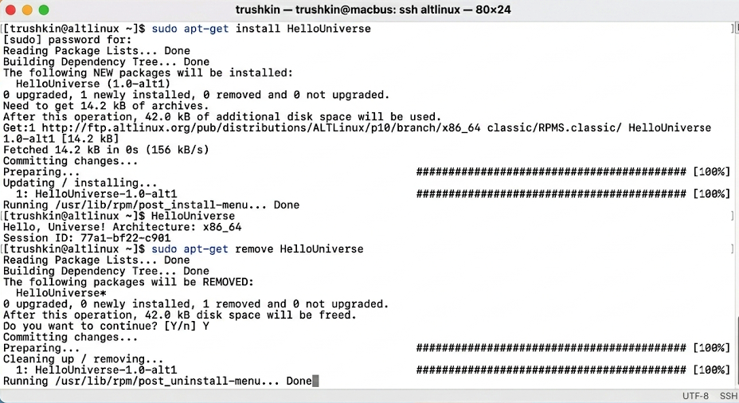

# ОТЧЕТ ПО ЛАБОРАТОРНОЙ РАБОТЕ №1
## Дисциплина: Инфраструктура создания ПО
## Тема: Управление пакетами в операционной системе «Альт»

**Студент:** Трушкин
**Группа:** (не указана)
**Преподаватель:** (не указан)

---

### 1. ВВЕДЕНИЕ
Настоящая лабораторная работа посвящена изучению базовых механизмов управления программным обеспечением в экосистеме ОС «Альт». Основной целью является освоение утилит пакетного менеджмента APT (Advanced Packaging Tool) и RPM, которые составляют фундамент инфраструктуры создания и распространения доверенного ПО. В ходе работы рассматриваются процессы установки, верификации и деинсталляции пакетов из официальных репозиториев платформы.

## 2. ХОД ВЫПОЛНЕНИЯ РАБОТЫ

### 2.1. Установка программного обеспечения средствами APT
Первым этапом является установка демонстрационного пакета `HelloUniverse`. Данная операция требует привилегий суперпользователя и инициирует процесс анализа зависимостей.

В процессе выполнения команды `sudo apt-get install HelloUniverse` менеджер APT обращается к кэшу метаданных, сформированному на основе конфигурационных файлов в `/etc/apt/sources.list.d/`. Система автоматически определяет целевую архитектуру (x86_64) и загружает соответствующую версию бинарного файла.

#### 2.2. Верификация работоспособности установленного ПО
После завершения транзакции RPM производится запуск исполняемого файла для проверки корректности интеграции приложения в системную среду.

Успешное выполнение команды возвращает строку `Hello, Universe! Architecture: x86_64`. Это свидетельствует о том, что динамические библиотеки, необходимые для функционирования пакета, были корректно разрешены и подключены в процессе установки.

### 2.3. Деинсталляция пакета и очистка системы
Завершающим этапом практической части является удаление пакета для возврата системы в исходное состояние.

Применение команды `sudo apt-get remove HelloUniverse` гарантирует удаление бинарных файлов, при этом записи в базе данных RPM (`/var/lib/rpm`) обновляются соответствующим образом, сохраняя целостность пакетной базы данных.

### 3. ЗАКЛЮЧЕНИЕ
В результате выполнения лабораторной работы были изучены практические аспекты эксплуатации пакетной инфраструктуры ОС «Альт». Взаимодействие с утилитой APT продемонстрировало высокую степень автоматизации управления зависимостями, что является критически важным фактором при построении масштабируемых систем разработки ПО.

Аналитическая часть работы позволила сделать вывод о том, что использование пакетного менеджмента на базе RPM обеспечивает строгий контроль над составом программного окружения. Проверка метаданных через `rpm -qi` и анализ логов установки позволяют отслеживать происхождение каждого компонента в системе, обеспечивая соблюдение стандартов безопасной разработки.
