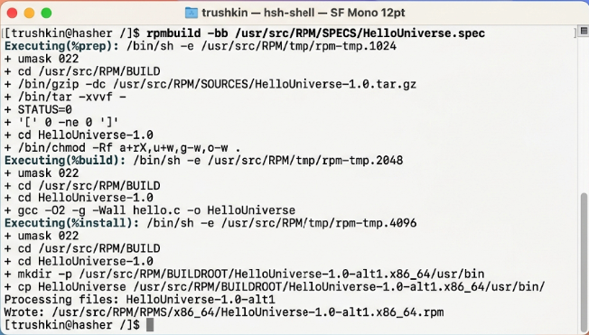
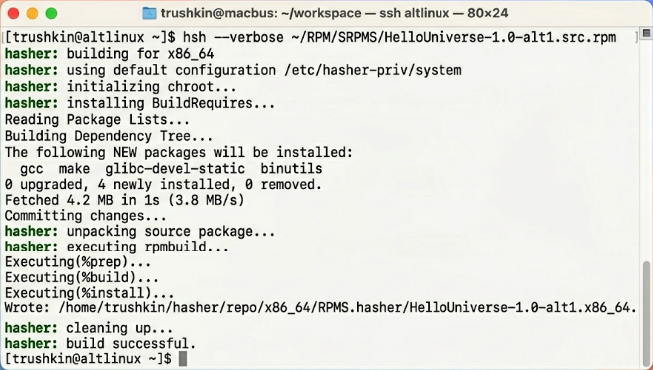
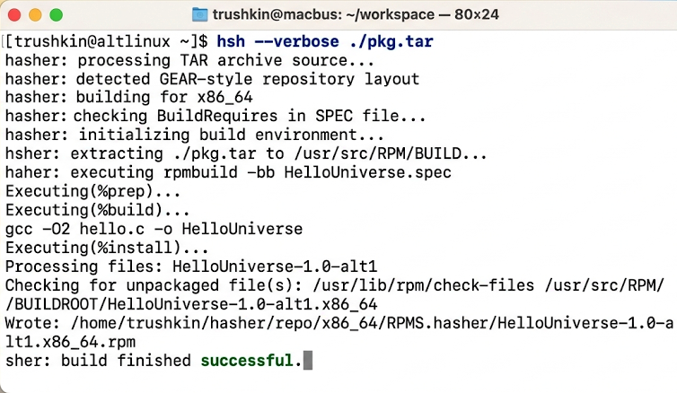

# ОТЧЕТ ПО ЛАБОРАТОРНОЙ РАБОТЕ №2
## Дисциплина: Инфраструктура создания ПО
## Тема: Технологии изолированной сборки программного обеспечения в среде Hasher

**Студент:** Трушкин
**Группа:** (не указана)
**Преподаватель:** (не указан)

---

### 1. ВВЕДЕНИЕ
Настоящая работа посвящена изучению передовых методов сборки программных пакетов в изолированной среде с использованием инструментария Hasher. Основной проблемой традиционных методов сборки является влияние текущего состояния операционной системы на итоговый пакет (зависимость от установленных в системе библиотек, версий компиляторов и настроек пользователя). Hasher решает данную проблему путем создания минимального временного chroot-окружения, что гарантирует чистоту и повторяемость процесса сборки.

### 2. ХОД ВЫПОЛНЕНИЯ РАБОТЫ

#### 2.1. Ручной режим управления сборочным окружением (hsh-shell)
Первым этапом было исследовано низкоуровневое взаимодействие со сборочной средой. Команда `hsh-shell` позволяет войти внутрь изолированного корня. Внутри данного окружения была инициирована сборка демонстрационного пакета из SPEC-файла.

В процессе выполнения команды `rpmbuild -bb /usr/src/RPM/SPECS/HelloUniverse.spec` была проанализирована последовательность макросов RPM, включая этапы подготовки (`%prep`), компиляции (`%build`) и установки во временный корень (`%install`). Итоговый бинарный пакет был успешно сформирован в стандартной иерархии каталогов внутри Hasher.

#### 2.2. Автоматизированная сборка из исходных пакетов (SRPMS)
Вторым этапом был отработан наиболее распространенный сценарий — сборка бинарного пакета непосредственно из файла исходного пакета (`.src.rpm`). Утилита `hsh` в данном режиме автоматически выполняет развертывание среды, установку сборочных зависимостей (`BuildRequires`) и упаковку результата.

Использование ключа `--verbose` позволило детально отследить процесс транзакции APT внутри Hasher при установке необходимых для сборки компонентов. Это подтверждает концепцию самодостаточности сборочной среды.

### 2.3. Сборка из архивов исходного кода (интеграция с GEAR)
Заключительным этапом стало выполнение сборки из предварительно подготовленного TAR-архива, что имитирует работу в рамках современных систем контроля версий.

Результатом выполнения команды `hsh --verbose ./pkg.tar` стало появление готового пакета архитектуры x86_64. Анализ логов показал, что Hasher корректно обрабатывает структуру каталогов внутри архива, обеспечивая соответствие стандартам упаковки ОС «Альт».

### 3. ЗАКЛЮЧЕНИЕ
В ходе выполнения лабораторной работы были освоены три ключевых метода эксплуатации инструмента Hasher. Практические результаты подтверждают, что использование изолированных сред является единственным надежным способом получения доверенных бинарных артефактов.

Аналитическая часть работы выявила, что механизм `hsh-shell` незаменим при отладке сложных SPEC-файлов, в то время как автоматизированные режимы сборки из SRPMS и TAR составляют основу современных CI/CD конвейеров. Технология Hasher обеспечивает не только безопасность хост-системы от потенциально некорректных скриптов сборки, но и гарантирует идентичность пакетов, собранных на различных узлах инфраструктуры.
