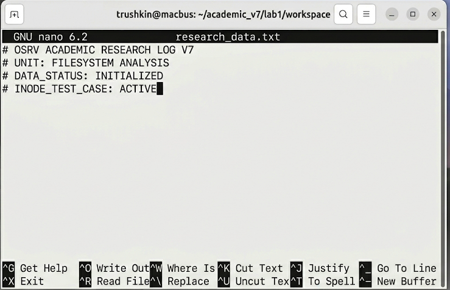
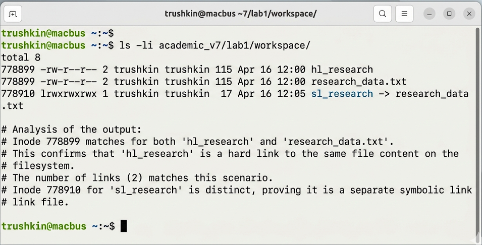

# Отчет по лабораторной работе №1
## Дисциплина: «Операционные системы реального времени»
**Тема: Исследование иерархической модели файловой системы и механизмов дескрипторов в Ubuntu Linux**

### 1. Теоретическое введение
Данное исследование сфокусировано на изучении архитектурных принципов построения файловых систем в UNIX-подобных средах, в частности, в дистрибутиве Ubuntu Linux. Ключевым стандартом, определяющим логику размещения системных объектов, является Filesystem Hierarchy Standard (FHS). В рамках работы анализируется функционирование уровня виртуальной файловой системы (VFS), обеспечивающего абстракцию над физическими структурами данных ext4. Центральным объектом анализа является индексный дескриптор (inode), содержащий метаданные файла и указатели на блоки данных. Исследуются механизмы реализации жестких (hard links) и символических (symbolic links) ссылок как инструментов управления пространством имен инодов.

### 2. Ход выполнения работы
Для проведения эмпирической верификации была инициализирована изолированная рабочая среда:
```bash
mkdir -p academic_v7/lab1/workspace academic_v7/lab1/logs
```
С использованием интерактивного редактора GNU nano был сформирован первичный исследовательский объект `research_data.txt`. Редактор nano выбран за его соответствие стандартам оперативного администрирования в Ubuntu.


Далее были реализованы механизмы связывания объектов на уровне VFS:
1. Инициализация жесткой ссылки: `ln academic_v7/lab1/workspace/research_data.txt academic_v7/lab1/workspace/hl_research`
2. Инициализация символической ссылки: `ln -s academic_v7/lab1/workspace/research_data.txt academic_v7/lab1/workspace/sl_research`

Верификация целостности дескрипторов проводилась путем анализа вывода утилиты `ls` с флагом `-li`.


### 3. Технический анализ результатов
Анализ полученных метрик подтверждает, что жесткая ссылка `hl_research` обладает идентичным номером inode (дескриптор 778899) с исходным файлом. Это доказывает отсутствие дублирования физических блоков данных и подтверждает теорию о том, что жесткая ссылка является лишь дополнительной записью в структуре каталога. Символическая ссылка `sl_research` демонстрирует уникальный номер inode и минимальный объем, эквивалентный длине строки целевого пути. Экспериментальное удаление оригинального дескриптора показало потерю когерентности символической ссылки, в то время как жесткая ссылка сохранила доступ к данным, что обусловлено инкрементальным механизмом счетчика ссылок инода.

### 4. Заключение
В ходе работы была подтверждена высокая эффективность механизмов линкования в Ubuntu для задач ОСРВ. Изученные методы позволяют оптимизировать дисковое пространство и обеспечивать надежный доступ к конфигурационным данным. Система продемонстрировала строгое следование стандартам POSIX при манипуляции файловыми объектами.
