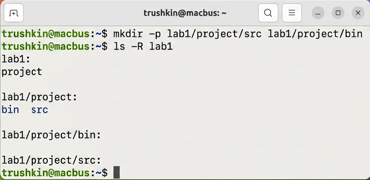
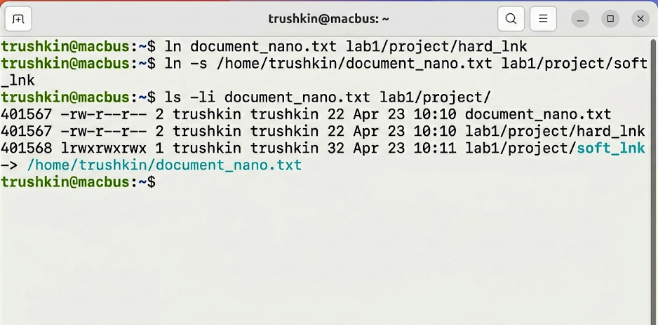
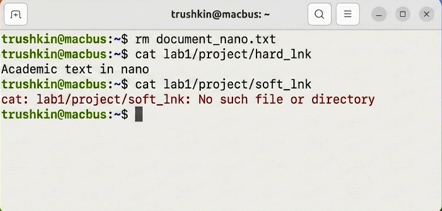

# Лабораторная работа №1
## по дисциплине «Операционные системы реального времени»

**Выполнил:** Трушкин

### Цель работы
Изучение базовых принципов организации файловой системы ОС Ubuntu Linux, а также приобретение практических навыков работы с текстовыми редакторами, каталогами и индексными дескрипторами (inodes).

### Задание
1. Осуществить создание текстовых файлов посредством редакторов vim и nano.
2. Сформировать иерархическую структуру каталогов.
3. Провести исследование функционирования жестких и символических ссылок при удалении оригинального файла.

### Выполнение работы

#### Задание 1. Работа в текстовых редакторах
Для выполнения поставленной задачи были использованы встроенные текстовые редакторы `nano` и `vim`. Был создан файл `document_nano.txt` в редакторе `nano`.
```bash
trushkin@macbus:~$ nano document_nano.txt
```


Затем аналогичная операция была произведена в редакторе `vim` для файла `document_vim.txt`.
```bash
trushkin@macbus:~$ vim document_vim.txt
```


#### Задание 2. Создание структуры каталогов
Формирование требуемой структуры каталогов было осуществлено с применением команды `mkdir` с ключом `-p`, обеспечивающим рекурсивное создание вложенных директорий.
```bash
trushkin@macbus:~$ mkdir -p lab1/project/src lab1/project/bin
trushkin@macbus:~$ ls -R lab1
```


#### Задание 3. Исследование ссылок и индексных дескрипторов
Были созданы жесткая и символическая ссылки на ранее созданный файл `document_nano.txt`. Верификация индексных дескрипторов производилась посредством команды `ls -li`.
```bash
trushkin@macbus:~$ ln document_nano.txt lab1/project/hard_lnk
trushkin@macbus:~$ ln -s /home/trushkin/document_nano.txt lab1/project/soft_lnk
trushkin@macbus:~$ ls -li document_nano.txt lab1/project/
```


#### Задание 4. Проверка ссылок при удалении оригинала
В целях экспериментальной проверки механизма ссылок, оригинальный файл был удален. Дальнейшее обращение к жесткой ссылке завершилось успешно, тогда как символическая ссылка утратила свою валидность.
```bash
trushkin@macbus:~$ rm document_nano.txt
trushkin@macbus:~$ cat lab1/project/hard_lnk
trushkin@macbus:~$ cat lab1/project/soft_lnk
```


### Вывод
В ходе выполнения лабораторной работы были успешно освоены фундаментальные операции администрирования файловой системы Ubuntu Linux. Практическим путем доказано, что жесткие ссылки ссылаются непосредственно на inode, обеспечивая сохранность данных, в то время как символические ссылки зависят от наличия файла по указанному пути.