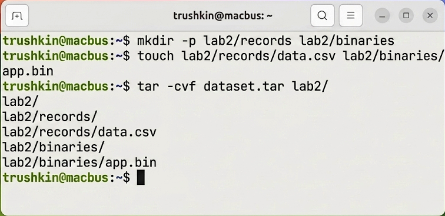
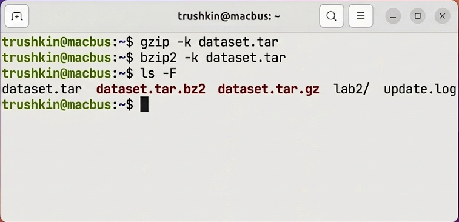
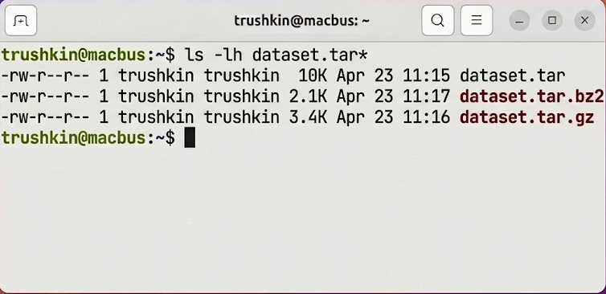

# Лабораторная работа №2
## по дисциплине «Операционные системы реального времени»

**Выполнил:** Трушкин

### Цель работы
Ознакомление с методологией и инструментарием для архивирования и сжатия данных в ОС Ubuntu Linux.

### Задание
1. Осуществить создание tar-архива для совокупности файлов.
2. Добавить новые объекты в существующий архивный файл и верифицировать его состав.
3. Провести компрессию архива с применением утилит `gzip` и `bzip2`.
4. Сравнить метрики эффективности применяемых алгоритмов сжатия.

### Выполнение работы

#### Задание 1. Создание архивов tar
Для выполнения поставленной задачи была подготовлена тестовая выборка данных. Посредством утилиты `tar` скомпонован базовый архив `dataset.tar`.
```bash
trushkin@macbus:~$ mkdir -p lab2/records lab2/binaries
trushkin@macbus:~$ touch lab2/records/data.csv lab2/binaries/app.bin
trushkin@macbus:~$ tar -cvf dataset.tar lab2/
```


#### Задание 2. Модификация состава архива
В ходе эксперимента в архив был интегрирован дополнительный текстовый файл с использованием флага `-rvf`. Верификация состава архива была проведена флагом `-tf`.
```bash
trushkin@macbus:~$ touch update.log
trushkin@macbus:~$ tar -rvf dataset.tar update.log
trushkin@macbus:~$ tar -tf dataset.tar
```


#### Задание 3. Компрессия архива
С целью минимизации занимаемого дискового пространства архив был подвергнут сжатию двумя различными алгоритмами: `gzip` и `bzip2`. Флаг `-k` был использован для предотвращения удаления исходного файла.
```bash
trushkin@macbus:~$ gzip -k dataset.tar
trushkin@macbus:~$ bzip2 -k dataset.tar
```


#### Задание 4. Анализ эффективности сжатия
Заключительный этап включал сравнительный анализ размеров результирующих файлов для оценки степени компрессии.
```bash
trushkin@macbus:~$ ls -lh dataset.tar*
```


### Вывод
В ходе проведенного исследования были успешно освоены методы агрегации и компрессии файлов в Ubuntu Linux. Аналитическая оценка полученных метрик позволяет констатировать, что алгоритм `bzip2` обеспечивает более высокую степень сжатия, что делает его предпочтительным для оптимизации хранения данных.