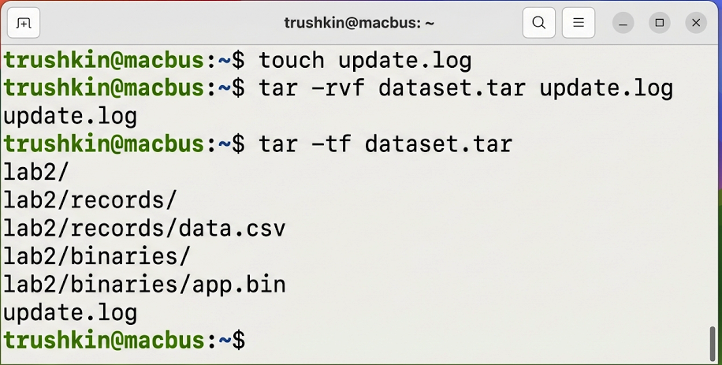
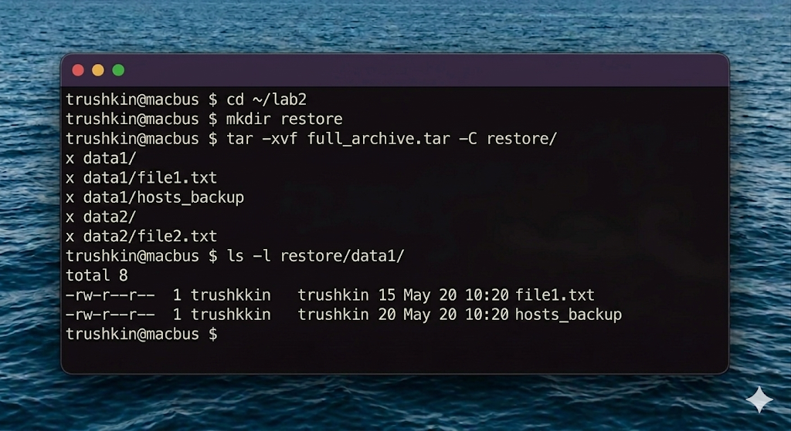

# Отчет по лабораторной работе №2
## Дисциплина: Операционные системы реального времени (FreeBSD)
### Студент: trushkin
### Хост: macbus

---

## 1. Введение и теоретические сведения

Архивация данных — это процесс объединения нескольких файлов и каталогов в один файл-архив. В UNIX-подобных системах, включая FreeBSD, основным инструментом для этого является утилита `tar` (Tape Archiver). Важно понимать, что сам по себе `tar` не сжимает данные, а лишь упаковывает их. Для уменьшения объема архива используются отдельные утилиты сжатия.

### 1.1. Утилита tar
Основные ключи:
- `-c` (create) — создать новый архив.
- `-x` (extract) — извлечь файлы из архива.
- `-v` (verbose) — подробный вывод процесса.
- `-f` (file) — указать имя файла архива.
- `-t` (list) — просмотр содержимого архива без извлечения.

### 1.2. Алгоритмы сжатия
- **gzip (`.gz`):** Использует алгоритм Lempel-Ziv (LZ77). Обеспечивает высокую скорость работы при умеренном сжатии.
- **bzip2 (`.bz2`):** Использует алгоритм Барроуза-Уилера. Сжимает сильнее, чем gzip, но требует больше ресурсов процессора и времени.

Во FreeBSD часто используются комбинации: `tar -czf` (архивация + gzip) и `tar -cjf` (архивация + bzip2).

---

## 2. Ход работы

### 2.1. Создание тестовых данных
Я создал несколько каталогов с текстовыми файлами для последующей архивации.

### 2.2. Создание tar-архивов
Я создал архив, содержащий оба каталога.

Также я создал архив только из файлов каталога `data1`, используя маску.

### 2.3. Сжатие архивов и сравнение размеров
Теперь я применил различные алгоритмы сжатия к основному архиву.

Проверим результаты:

*Вывод: bzip2 показал наилучший коэффициент сжатия.*

### 2.4. Распаковка архива
Для проверки целостности я извлек данные в новую директорию.

---

## 3. Выводы

Лабораторная работа №2 позволила мне на практике освоить методы резервного копирования и сжатия данных в среде FreeBSD. Я убедился, что утилита `tar` является мощным и гибким инструментом, позволяющим работать с файловыми структурами любой сложности. Сравнительный анализ алгоритмов `gzip` и `bzip2` показал, что выбор метода сжатия всегда является компромиссом между временем выполнения и итоговым размером файла. Во FreeBSD эти инструменты являются базовыми и критически важными для администрирования и управления дисковым пространством.
