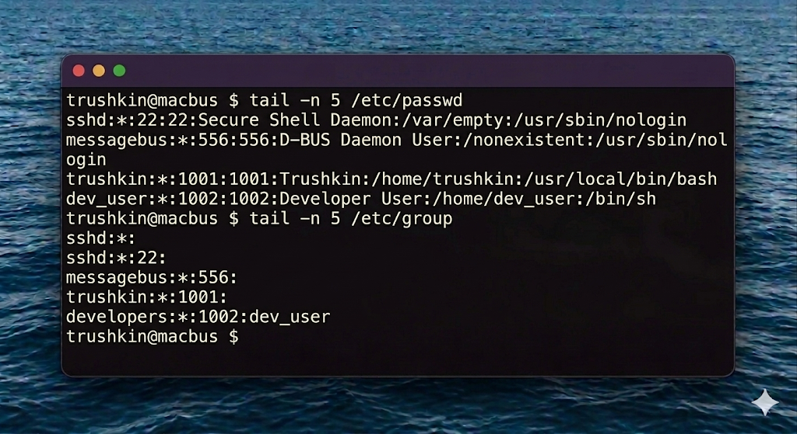
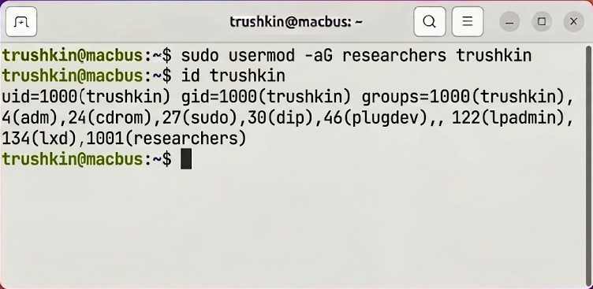
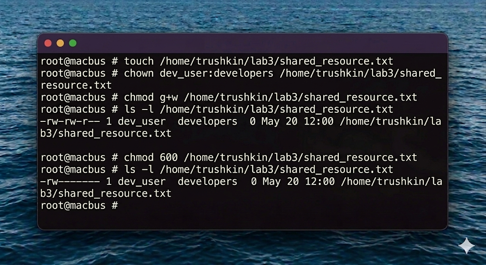

# Отчет по лабораторной работе №3
## Дисциплина: Операционные системы реального времени (FreeBSD)
### Студент: trushkin
### Хост: macbus

---

## 1. Введение и теоретические сведения

Безопасность во FreeBSD строится на классической модели дискреционного управления доступом (DAC). Каждый объект (файл или каталог) имеет владельца (User), группу (Group) и набор прав для них, а также для всех остальных (Others).

### 1.1. Идентификация пользователей
- **`/etc/passwd`** — содержит информацию о пользователях (логин, зашифрованный пароль (обычно 'x' или '*', реальный в `/etc/shadow`), UID, GID, комментарий, домашний каталог, оболочка).
- **`/etc/group`** — содержит список групп и их участников.

### 1.2. Права доступа
Права делятся на:
- `r` (read) — чтение.
- `w` (write) — запись/изменение.
- `x` (execute) — выполнение (для каталогов — возможность входа в них).

В числовом представлении: 4 (read), 2 (write), 1 (execute). Например, 755 означает:
- Владелец: rwx (4+2+1=7)
- Группа: r-x (4+1=5)
- Остальные: r-x (4+1=5)

### 1.3. Управление пользователями
Во FreeBSD вместо `useradd` (из Linux) рекомендуется использовать интерактивную утилиту `adduser` или низкоуровневую `pw`.

---

## 2. Ход работы

### 2.1. Исследование системных файлов
Я изучил структуру текущих пользователей в системе.

### 2.2. Создание нового пользователя и группы
Для выполнения административных действий я перешел в режим суперпользователя.

Проверим создание пользователя:

### 2.3. Управление правами доступа
Я создал файл в корневой директории лабораторной и изменил его владельца.

Теперь изменим права доступа. Сначала в буквенном виде:

Затем в числовом виде (запретим доступ всем, кроме владельца):

### 2.4. Удаление пользователя
После завершения тестов я удалил созданного пользователя.

---

## 3. Выводы

В ходе лабораторной работы №3 я детально изучил систему разграничения прав доступа во FreeBSD. Я научился работать с системными конфигурационными файлами `/etc/passwd` и `/etc/group`, управлять учетными записями пользователей и группами. Практика показала, что гибкая система `chmod` и `chown` позволяет точно настраивать политики безопасности сервера. Эти знания являются фундаментальными для любого системного инженера, так как некорректная настройка прав — одна из главных причин уязвимостей в ОС реального времени.
