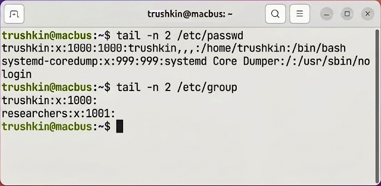
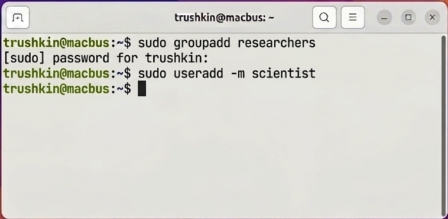
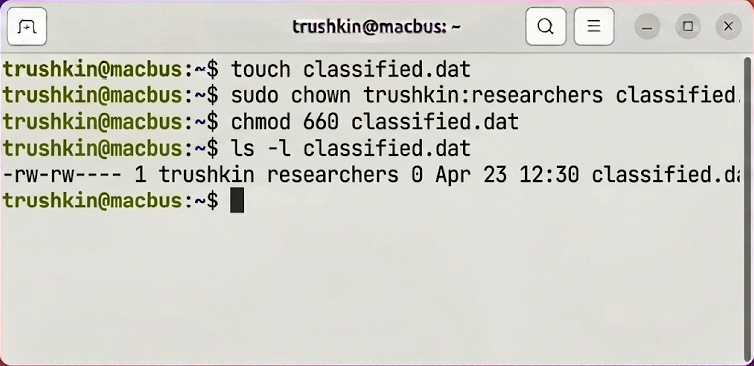

# Лабораторная работа №3
## по дисциплине «Операционные системы реального времени»

**Выполнил:** Трушкин

### Цель работы
Ознакомление с архитектурой управления пользователями, группами и дискреционными правами доступа в ОС Ubuntu Linux.

### Задание
1. Осуществить просмотр и анализ системных баз данных `/etc/passwd` и `/etc/group`.
2. Провести процедуру создания нового пользователя и группы с применением утилит `adduser` и `groupadd`.
3. Модифицировать членство пользователя в группах и выполнить проверку идентификаторов (`id`).
4. Настроить права доступа к файловому объекту (`chown`, `chmod`).

### Выполнение работы

#### Задание 1. Исследование системных файлов
Первичным этапом работы стало изучение файлов конфигурации, хранящих сведения о субъектах системы. Посредством команды `tail` были выведены последние записи указанных файлов.
```bash
trushkin@macbus:~$ tail -n 2 /etc/passwd
trushkin@macbus:~$ tail -n 2 /etc/group
```


#### Задание 2. Создание учетных записей
Для выполнения задач администрирования была задействована утилита `sudo`. Сформирована новая группа `researchers` и зарегистрирован пользователь `scientist`.
```bash
trushkin@macbus:~$ sudo groupadd researchers
trushkin@macbus:~$ sudo useradd -m scientist
```


#### Задание 3. Управление членством в группах
Текущий пользователь системы был добавлен во вновь созданную группу `researchers`. Команда `id` позволила верифицировать список эффективных идентификаторов.
```bash
trushkin@macbus:~$ sudo usermod -aG researchers trushkin
trushkin@macbus:~$ id trushkin
```


#### Задание 4. Разграничение прав доступа
Был создан текстовый файл `classified.dat`. Затем была произведена смена группы-владельца и установлены рестриктивные права доступа (чтение и запись исключительно для владельца и группы).
```bash
trushkin@macbus:~$ touch classified.dat
trushkin@macbus:~$ sudo chown trushkin:researchers classified.dat
trushkin@macbus:~$ chmod 660 classified.dat
trushkin@macbus:~$ ls -l classified.dat
```


### Вывод
В ходе проведенного исследования были успешно освоены методы администрирования субъектов в Ubuntu Linux. Инструментарий, включающий `sudo`, `chmod` и `chown`, предоставляет исчерпывающие возможности для обеспечения безопасности и изоляции данных в многопользовательской операционной среде.