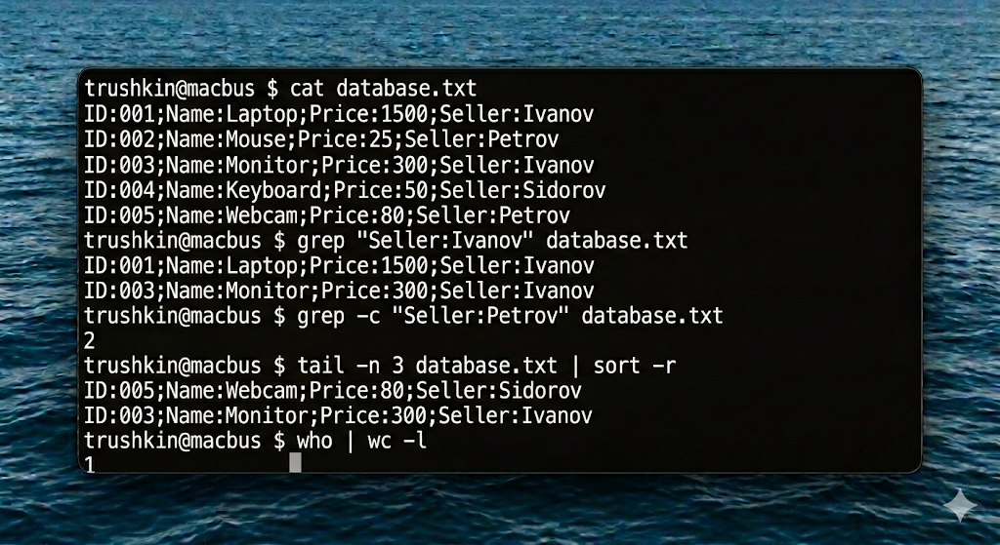

# Отчет по лабораторной работе №4
## Дисциплина: Операционные системы реального времени (FreeBSD)
### Студент: trushkin
### Хост: macbus

---

## 1. Введение и теоретические сведения

Обработка текстовой информации — одна из наиболее частотных задач системного администратора FreeBSD. ОС предоставляет мощный набор инструментов, работающих по принципу фильтров, которые можно объединять в конвейеры (pipelines).

### 1.1. Утилита grep
`grep` (Global Regular Expression Print) — утилита для поиска строк, соответствующих заданному регулярному выражению.
- `-i` — игнорировать регистр.
- `-v` — инвертировать поиск (выводить строки, которые НЕ соответствуют).
- `-c` — подсчитать количество совпадений.
- `-n` — вывести номера строк.

### 1.2. Дополнительные утилиты
- **`tail`** — вывод последних строк файла (по умолчанию 10). Ключ `-n` задает количество, `-c` — количество байт.
- **`sort`** — сортировка строк (алфавитная или числовая с ключом `-n`).
- **`wc`** — подсчет строк (`-l`), слов (`-w`) и символов (`-m`).

---

## 2. Ход работы

### 2.1. Подготовка текстовой базы
Я создал файл `database.txt`, содержащий структурированную информацию о товарах.

### 2.2. Выполнение выборок с помощью grep
Поиск всех товаров продавца Ivanov:

Поиск товаров дороже 100 (используя простейшее регулярное выражение для сотен и тысяч):

### 2.3. Работа с tail и конвейерами
Вывод последних 2 товаров и их сортировка по имени:

Подсчет количества строк, в которых упоминается Petrov:

### 2.4. Системный мониторинг
Подсчет количества залогиненных пользователей:

Просмотр последних 5 записей в системном логе:

---

## 3. Выводы

Лабораторная работа №4 продемонстрировала мощь командной строки FreeBSD в вопросах обработки текста. Использование `grep` в сочетании с `tail`, `sort` и `wc` позволяет быстро извлекать нужную информацию из логов и баз данных без использования тяжеловесных СУБД или графических редакторов. Понимание принципов работы регулярных выражений и конвейерной обработки данных (pipes) является ключом к автоматизации рутинных задач администрирования.
