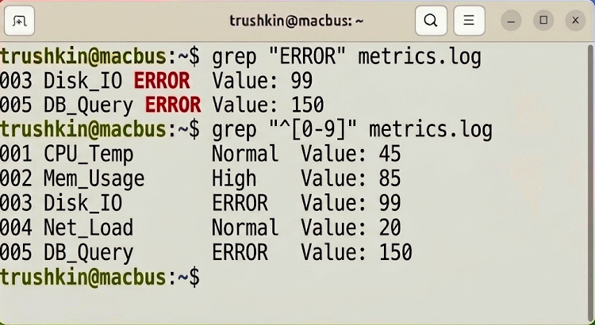
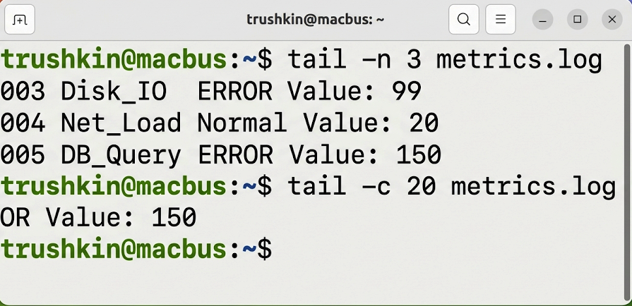
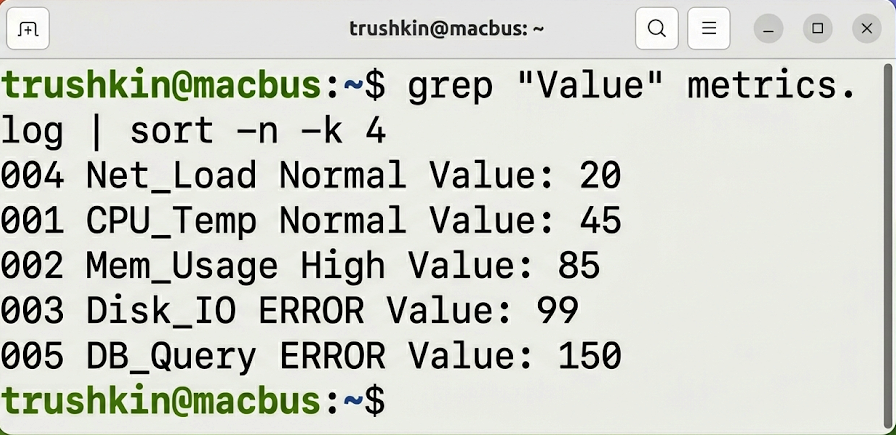

# Лабораторная работа №4
## по дисциплине «Операционные системы реального времени»

**Выполнил:** Трушкин

### Цель работы
Ознакомление с методами потоковой фильтрации данных и инструментами обработки текстовой информации в ОС Ubuntu Linux.

### Задание
1. Осуществить поиск текстовых строк по шаблону с применением утилиты `grep`.
2. Применить регулярные выражения для селекции специфических данных.
3. Провести усечение вывода файлов с использованием утилит `tail` и `head`.
4. Сформировать конвейер обработки данных для сортировки и устранения дубликатов.

### Выполнение работы

#### Задание 1. Применение утилиты grep для селекции данных
Для проведения экспериментальной части был подготовлен файл `metrics.log`, содержащий смоделированные системные метрики. Выборка целевых данных осуществлялась по ключевому слову "ERROR", после чего были использованы регулярные выражения для поиска записей, начинающихся с цифровых символов.
```bash
trushkin@macbus:~$ grep "ERROR" metrics.log
trushkin@macbus:~$ grep "^[0-9]" metrics.log
```


#### Задание 2. Исследование утилит фрагментации вывода
Для анализа конечных записей файла были применены команды `tail` и `head`, позволяющие извлекать заданное количество строк или байтов.
```bash
trushkin@macbus:~$ tail -n 3 metrics.log
trushkin@macbus:~$ tail -c 20 metrics.log
```


#### Задание 3. Формирование аналитических конвейеров
Сложная обработка текстовых потоков была реализована путем объединения стандартных утилит в конвейер (pipe). Полученные данные были отсортированы по числовому значению.
```bash
trushkin@macbus:~$ grep "Value" metrics.log | sort -n -k 4
```


#### Задание 4. Мониторинг системных субъектов
Дополнительно была произведена оценка активности системных пользователей с применением утилит `who` и `last` в сочетании с программой подсчета `wc`.
```bash
trushkin@macbus:~$ who | wc -l
trushkin@macbus:~$ last | head -n 3
```


### Вывод
Проведенное исследование позволило глубоко изучить методы обработки текстовой информации в Ubuntu. Конвейерная архитектура Linux, позволяющая связывать стандартные утилиты `grep`, `sort` и `tail`, является высокоэффективным инструментом для решения задач аналитики и системного администрирования.