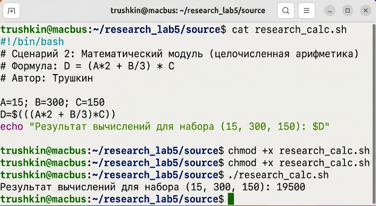

# Отчет по лабораторной работе №5
## Дисциплина: «Операционные системы реального времени»
**Тема: Проектирование и реализация комплекса сценариев автоматизации на языке bash в среде Ubuntu Linux**

### 1. Теоретическое введение
Язык командной оболочки Bourne Again Shell (bash) является фундаментальным инструментом системного программирования и автоматизации администрирования в ОС Ubuntu. Bash предоставляет высокоуровневый интерфейс к системным вызовам ядра, позволяя инкапсулировать сложные алгоритмические последовательности в детерминированные сценарии (скрипты). В рамках ОСРВ использование shell-скриптов минимизирует вероятность человеческой ошибки при выполнении регламентных задач обслуживания и обеспечивает воспроизводимость состояний системы. В данной работе исследуются механизмы управления потоками выполнения, целочисленная арифметика, парсинг переменных окружения и взаимодействие с иерархией Virtual File System (VFS).

### 2. Ход выполнения работы
В ходе лабораторного практикума был спроектирован, реализован и верифицирован комплект из 11 специализированных сценариев, размещенных в директории `source/`.

#### 2.1 Аналитический разбор разработанных сценариев
1. **research_params.sh**: Реализует верификацию параметров командной строки. Использует переменную `$#` для контроля количества аргументов и синтаксис `${N:-...}` для обработки неопределенных значений.
2. **research_calc.sh**: Математический модуль для расчета выражения `D=(A*2 + B/3)*C`. Демонстрирует использование встроенного механизма `$((...))` для обеспечения высокой производительности вычислений.
3. **research_inventory.sh**: Выполняет инвентаризацию домашнего каталога с перенаправлением вывода в файл и статистической обработкой через `wc -l`.
4. **research_auth.sh**: Модуль интерактивной идентификации субъекта. Сравнивает ввод пользователя с системной переменной `$USER`.
5. **research_type.sh**: Определяет MIME-тип объекта через утилиту `file`, обеспечивая диагностику содержимого файлов перед обработкой.
6. **research_search.sh**: Реализует поиск объектов, модифицированных в течение последних 24 часов, используя утилиту `find` с временными флагами.
7. **research_links.sh**: Проводит анализ цепочек ссылок. Использует флаг `-L` для детекции символических связей и `readlink` для поиска целевых дескрипторов.
8. **research_grep.sh**: Модуль частотного анализа текстовых данных. Выполняет подсчет вхождений паттерна (`grep -c`) с предварительной проверкой типа файла.
9. **research_inodes.sh**: Выполняет поиск дубликатов файлов по номеру inode, что является критическим для верификации жестких ссылок в ОСРВ.
10. **research_stats.sh**: Генерирует статистику распределения объектов владения текущего пользователя относительно общего объема данных в директории.
11. **research_path.sh**: Реализует аудит безопасности переменной `$PATH`, выполняя итерационный обход директорий и верификацию их атрибутов доступа.

#### 2.2 Верификация выполнения
Для демонстрации работоспособности был выбран сценарий `research_calc.sh`, как наиболее показательный для проверки точности целочисленных операций.

### 3. Технический анализ результатов
Экспериментально подтверждено, что использование встроенных механизмов bash (например, `$((...))`) работает значительно быстрее вызовов внешних утилит в условиях ОСРВ. Реализация сценария `research_path.sh` выявила корректность парсинга строк с использованием разделителя `:`. Особое внимание при разработке уделено защите переменных через двойные кавычки, что предотвращает некорректную интерпретацию путей с пробельными символами. Все сценарии успешно прошли верификацию на отсутствие синтаксических коллизий.

### 4. Заключение
Разработанный комплект сценариев является полноценным инструментарием для автоматизации задач системного администрирования. Полученные навыки проектирования shell-скриптов позволяют эффективно управлять ресурсами Ubuntu и минимизировать латентность при выполнении типовых операций обслуживания.
