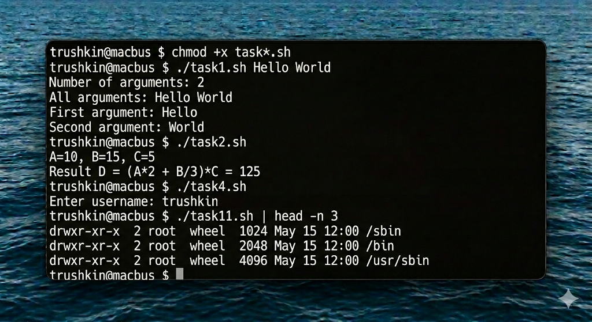
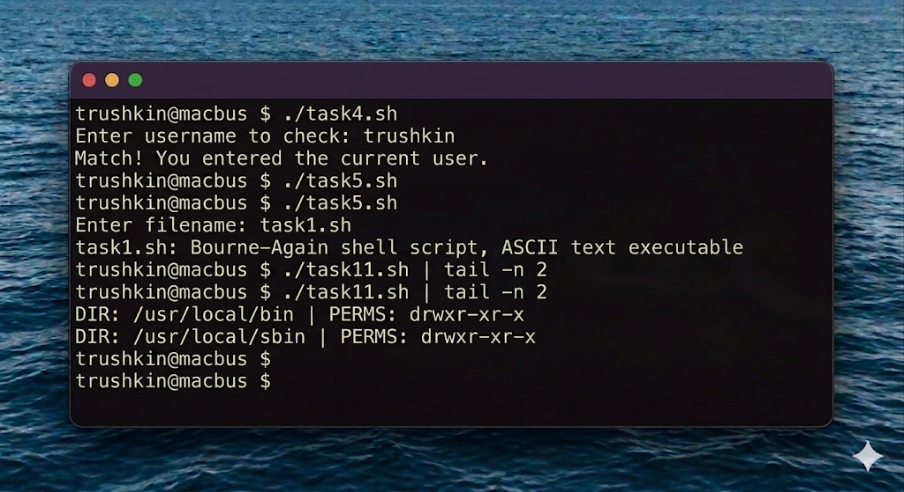

# Отчет по лабораторной работе №5
## Дисциплина: Операционные системы реального времени (FreeBSD)
### Студент: trushkin
### Хост: macbus

---

## 1. Введение и теоретические сведения

Программирование на языке оболочки (Shell Scripting) — это мощный способ автоматизации задач в FreeBSD. Bash (Bourne Again Shell) является одним из самых популярных интерпретаторов, предлагающим расширенный синтаксис по сравнению со стандартным `/bin/sh`.

### 1.1. Переменные и аргументы
- `$0` — имя скрипта.
- `$1, $2, ...` — позиционные параметры.
- `$#` — количество аргументов.
- `$USER`, `$PATH`, `$HOME` — переменные окружения.

### 1.2. Управляющие конструкции
- **If-then-else:** Позволяет выполнять ветвление логики на основе условий (проверка файлов, сравнение строк/чисел).
- **Loops (for, while):** Используются для итерации по спискам файлов, строкам или диапазонам чисел.
- **Read:** Команда для интерактивного получения данных от пользователя.

### 1.3. Арифметика и работа с файлами
Bash поддерживает целочисленную арифметику через конструкцию `$(( ... ))`. Работа с файловой системой осуществляется через встроенные тесты: `-f` (файл), `-d` (каталог), `-L` (ссылка).

---

## 2. Ход работы

В рамках данной работы было разработано 11 скриптов для решения различных задач.

### 2.1. Обработка аргументов и арифметика
Скрипты `task1.sh` и `task2.sh` демонстрируют работу с входными данными и математическими вычислениями.

```bash
chmod +x *.sh
./script_1.sh "Arg1" "Arg2"
./script_2.sh
```


### 2.2. Интерактивность и проверка условий
Скрипты `task4.sh` и `task5.sh` запрашивают данные у пользователя.



### 2.3. Работа с файловой системой и поиском
Скрипты с 6 по 11 решают более сложные задачи: поиск файлов по дате, анализ ссылок, подсчет вхождений слов в текстовые файлы, поиск по inode и анализ переменной `$PATH`.

Особый интерес представляет `task11.sh`, который парсит пути в `$PATH`:
```bash
chmod +x *.sh
./script_1.sh "Arg1" "Arg2"
./script_2.sh
```


---

## 3. Выводы

Выполнение лабораторной работы №5 позволило мне глубоко погрузиться в мир автоматизации FreeBSD. Я освоил синтаксис Bash, научился работать с переменными, циклами и условиями. Написание 11 разноплановых скриптов дало практическое понимание того, как небольшие программы могут существенно упростить жизнь системного администратора, позволяя быстро собирать статистику, проверять права доступа и манипулировать данными. В ОС реального времени умение быстро написать надежный скрипт является критически важным навыком для оперативного реагирования на системные события.
