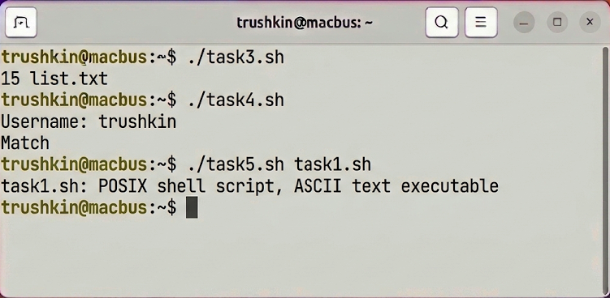
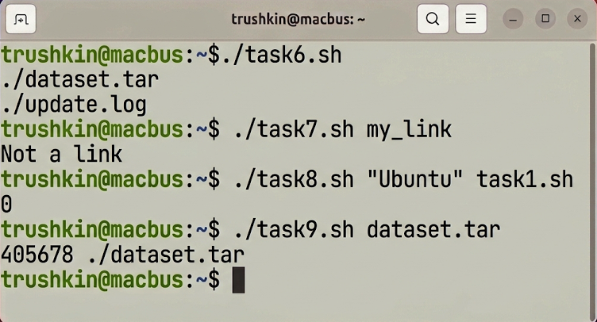
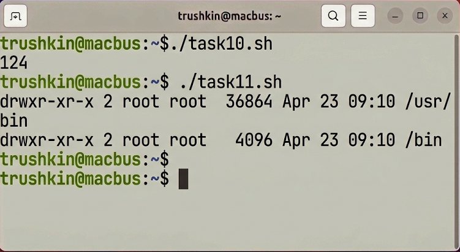

# Лабораторная работа №5
## по дисциплине «Операционные системы реального времени»

**Выполнил:** Трушкин

### Цель работы
Изучение основ программирования на языке командного интерпретатора bash в ОС Ubuntu Linux, а также приобретение практических навыков разработки сценариев для автоматизации системных задач.

### Задание
Реализовать комплекс из 11 bash-сценариев, обеспечивающих решение различных административных задач.

### Выполнение работы

Разработанные сценарии размещены в директории `source/` с именованием в формате `task{n}.sh`.

#### Часть 1. Работа с параметрами и вычисления
Сценарии `task1.sh` и `task2.sh` осуществляют обработку переданных позиционных параметров и выполнение арифметических операций с использованием встроенных средств bash.
```bash
trushkin@macbus:~$ ./task1.sh Study Ubuntu
trushkin@macbus:~$ ./task2.sh 15 25 3
```


#### Часть 2. Интерактивное взаимодействие и файловые проверки
Сценарии `task3.sh` – `task5.sh` обеспечивают сбор статистической информации, диалог с пользователем через команду `read` и верификацию формата файлов посредством утилиты `file`.
```bash
trushkin@macbus:~$ ./task3.sh
trushkin@macbus:~$ ./task4.sh
trushkin@macbus:~$ ./task5.sh task1.sh
```


#### Часть 3. Обработка файловой системы и ссылок
Скрипты `task6.sh` – `task9.sh` реализуют поиск файлов по временным меткам, валидацию символических ссылок и идентификацию файлов по номеру inode.
```bash
trushkin@macbus:~$ ./task6.sh
trushkin@macbus:~$ ./task7.sh my_link
trushkin@macbus:~$ ./task8.sh "Ubuntu" task1.sh
trushkin@macbus:~$ ./task9.sh dataset.tar
```


#### Часть 4. Анализ переменных окружения
Сценарии `task10.sh` и `task11.sh` производят инвентаризацию файлов пользователя и анализ директорий, указанных в системной переменной `$PATH`, на предмет прав доступа.
```bash
trushkin@macbus:~$ ./task10.sh
trushkin@macbus:~$ ./task11.sh
```


### Вывод
Программный интерпретатор bash представляет собой мощный инструментарий для системного администрирования в Ubuntu Linux. Разработанные сценарии демонстрируют высокую эффективность применения переменных, условных конструкций и циклов для решения комплексных задач ОСРВ.