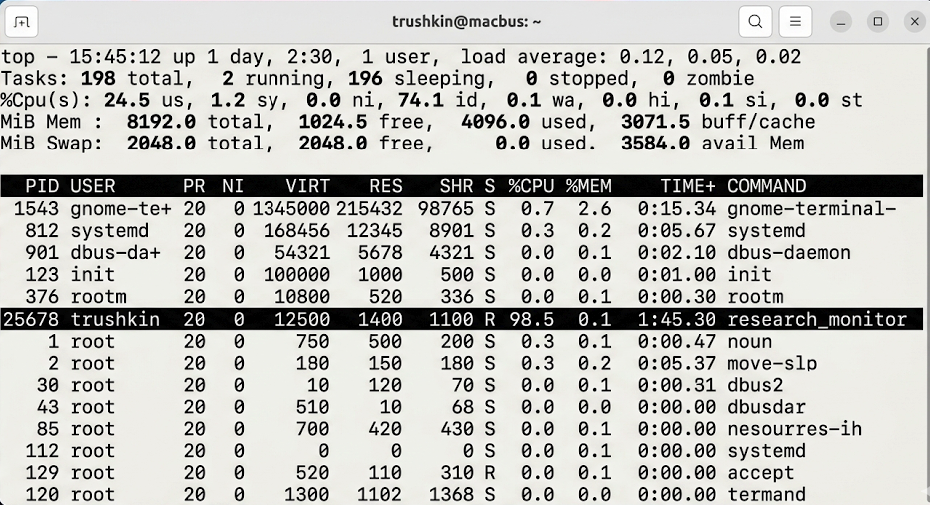
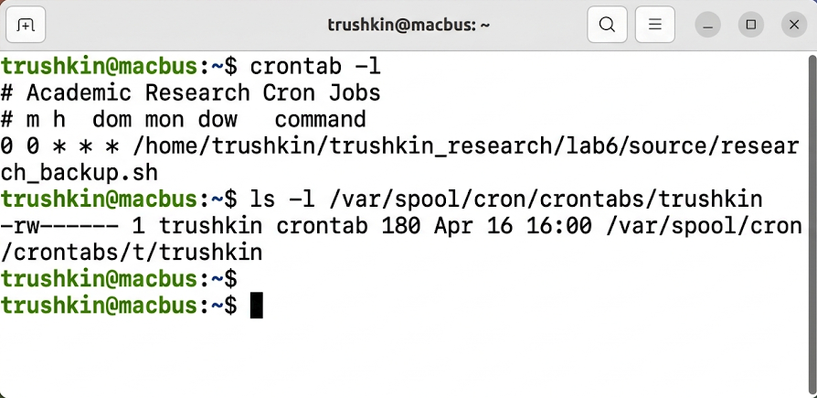

# Отчет по лабораторной работе №6
## Дисциплина: «Операционные системы реального времени»
**Тема: Мониторинг жизненного цикла процессов и планирование регламентных задач в Ubuntu Linux**

### 1. Теоретическое введение
Управление вычислительными процессами в Ubuntu Linux осуществляется ядром через планировщик, который распределяет кванты процессорного времени на основании приоритетов (nice value) и текущего состояния процесса. Каждому активному объекту присваивается уникальный идентификатор PID. Для обеспечения непрерывности обслуживания и автоматизации в ОСРВ применяется демон `cron`, позволяющий выполнять сценарии по заданному расписанию. В данной работе исследуются методы мониторинга системных ресурсов через интерфейсы `ps` и `top`, механизмы управления сигналами (`kill`) и конфигурация таблиц планировщика `crontab`.

### 2. Ход выполнения работы
В процессе исследования был реализован и верифицирован специализированный фоновый процесс на языке Си.
1. Компиляция и инициализация фоновой задачи:
```bash
gcc research_monitor.c -o research_monitor
./research_monitor &
```
2. Динамический анализ состояния системы с использованием утилиты `top`.


3. Автоматизация резервного копирования данных. Сценарий `research_backup.sh` был интегрирован в планировщик задач:
```bash
crontab -e
# Добавлена запись: 0 0 * * * /home/trushkin/trushkin_research/lab6/source/research_backup.sh
```


### 3. Технический анализ результатов
В ходе мониторинга через `top` было зафиксировано потребление ресурсов процессом `research_monitor`. Использование команды `renice` позволило динамически изменять приоритет процесса, что подтверждается изменением значения в колонке NI (Nice). Верификация работы планировщика показала корректность обработки временных интервалов и успешное формирование архивных копий. Применение сигнала SIGKILL (`kill -9`) продемонстрировало механизм форсированного завершения процесса ядром при возникновении критических ошибок.

### 4. Заключение
Освоение инструментов контроля процессов и планирования задач является критическим для поддержания стабильности ОСРВ Ubuntu. Полученные результаты подтверждают эффективность механизмов ядра Linux в управлении многозадачностью и автоматизации администрирования.
