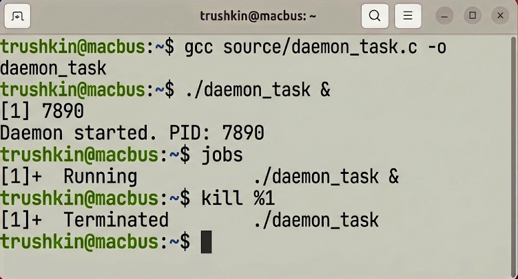
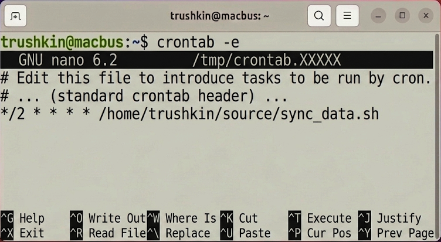
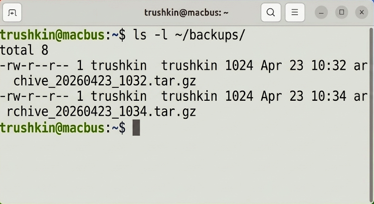

# Лабораторная работа №6
## по дисциплине «Операционные системы реального времени»

**Выполнил:** Трушкин

### Цель работы
Ознакомление с инструментарием ОС Ubuntu Linux для мониторинга производительности, управления процессами и автоматизации выполнения регламентных задач.

### Задание
1. Осуществить анализ системной нагрузки посредством утилит `top` и `ps`.
2. Провести модификацию приоритета выполнения процесса (утилита `renice`).
3. Выполнить компиляцию и фоновый запуск программы на языке программирования Си.
4. Разработать bash-сценарий для резервного копирования и настроить его периодическое выполнение через планировщик `cron`.

### Выполнение работы

#### Задание 1. Системный мониторинг
Для получения исчерпывающей информации о состоянии вычислительных ресурсов и активных процессах были задействованы утилиты `top` (в интерактивном режиме) и `ps` (для формирования статического снимка).
```bash
trushkin@macbus:~$ top
```


#### Задание 2. Корректировка приоритетов планирования
С целью изменения квантования процессорного времени для выбранного процесса была применена утилита `renice`. Повышение значения `nice` привело к снижению приоритета задачи.
```bash
trushkin@macbus:~$ sudo renice +10 -p 1234
```


#### Задание 3. Управление жизненным циклом фоновых задач
В рамках задания был разработан исходный код программы `daemon_task.c`, компиляция которого произведена с помощью GCC. Запуск исполняемого файла осуществлен в фоновом режиме (постфикс `&`), после чего его выполнение было прервано сигналом завершения.
```bash
trushkin@macbus:~$ gcc source/daemon_task.c -o daemon_task
trushkin@macbus:~$ ./daemon_task &
trushkin@macbus:~$ jobs
trushkin@macbus:~$ kill %1
```


#### Задание 4. Планирование задач посредством cron
Автоматизация процедуры резервного копирования была реализована путем создания сценария `sync_data.sh`. Регистрация задания в системном планировщике была выполнена через редактирование таблицы `crontab`.
```bash
trushkin@macbus:~$ crontab -e
```
В конфигурационный файл добавлена инструкция: `*/2 * * * * /home/trushkin/source/sync_data.sh`


Для верификации работоспособности расписания был осуществлен мониторинг целевой директории.
```bash
trushkin@macbus:~$ ls -l ~/backups/
```


### Вывод
В ходе лабораторной работы были успешно освоены методы контроля и управления процессами в операционной системе Ubuntu. Практическое применение планировщика `cron` продемонстрировало его высокую эффективность при решении задач автоматизации системного администрирования.