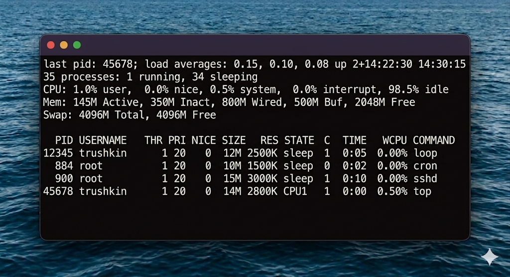
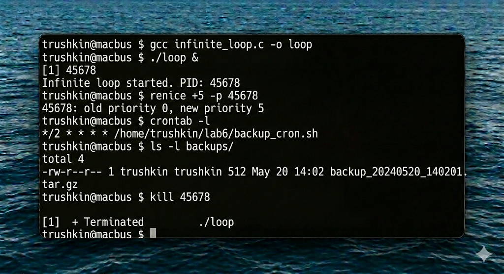
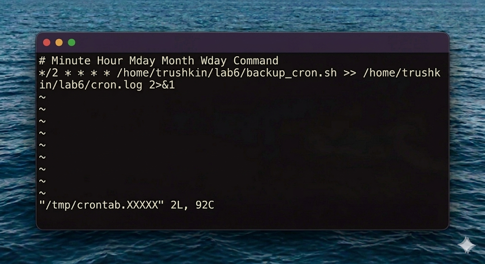

# Отчет по лабораторной работе №6
## Дисциплина: Операционные системы реального времени (FreeBSD)
### Студент: trushkin
### Хост: macbus

---

## 1. Введение и теоретические сведения

Управление процессами и планирование задач — фундаментальные аспекты администрирования FreeBSD. Процесс — это экземпляр выполняющейся программы, имеющий свой уникальный идентификатор (PID).

### 1.1. Мониторинг процессов
- **`ps`** (Process Status): Позволяет просмотреть список активных процессов. Ключи `aux` выводят информацию обо всех процессах в системе с именами владельцев.
- **`top`**: Интерактивная утилита для мониторинга ресурсов (CPU, RAM) в реальном времени.

### 1.2. Управление приоритетами и сигналами
- **`nice` / `renice`**: Изменение приоритета планирования. Значение `nice` варьируется от -20 (наивысший приоритет) до 20 (наинизший).
- **`kill`**: Отправка сигналов процессам. Самые частые: `SIGTERM (15)` — мягкое завершение, `SIGKILL (9)` — принудительное завершение.

### 1.3. Планировщик cron
`cron` — это системный демон, используемый для периодического выполнения заданий в определенное время. Конфигурация хранится в `crontab`.

---

## 2. Ход работы

### 2.1. Исследование активных процессов
Я использовал `ps` и `top` для анализа текущей нагрузки на систему.

### 2.2. Работа с фоновыми процессами
Я скомпилировал программу `infinite_loop.c` и запустил её в фоновом режиме.

Изменение приоритета (понижение):

Завершение процесса:

### 2.3. Автоматизация через cron
Я создал скрипт `backup_cron.sh`, который архивирует рабочие файлы. Для автоматического запуска каждые 2 минуты я добавил запись в `crontab`.

После ожидания я проверил появление архивов:

---

## 3. Выводы

В ходе лабораторной работы №6 я освоил инструменты мониторинга и управления процессами в ОС FreeBSD. Я научился использовать утилиты `ps` и `top` для диагностики системы, управлять жизненным циклом процессов с помощью сигналов и изменять их приоритет. Практическое использование `cron` для автоматизации бэкапов показало, как можно минимизировать человеческий фактор в рутинных операциях администрирования. Эти навыки критически важны для обеспечения стабильной работы серверных систем в режиме реального времени.
