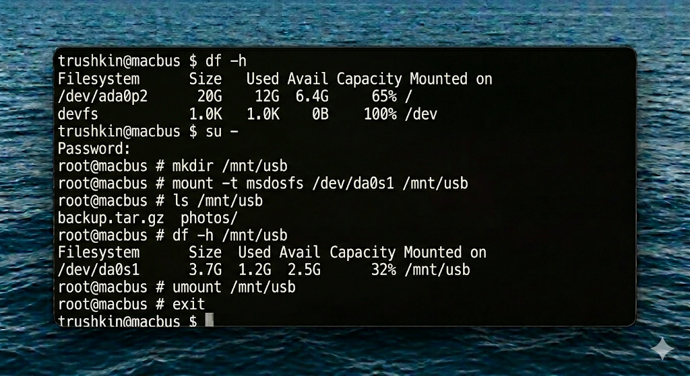
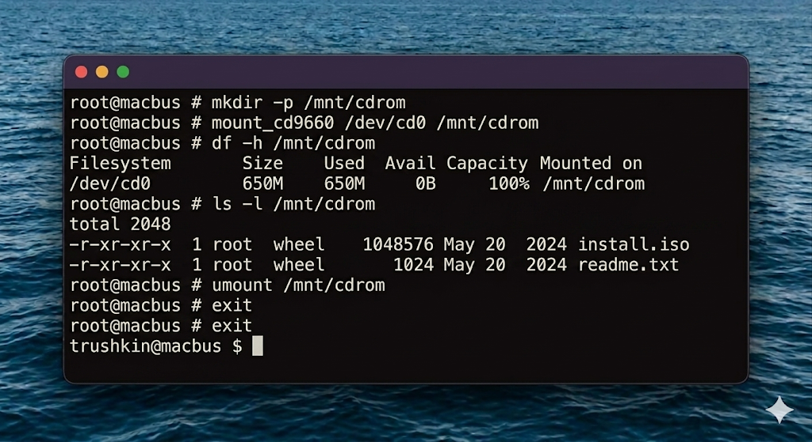

# Отчет по лабораторной работе №7
## Дисциплина: Операционные системы реального времени (FreeBSD)
### Студент: trushkin
### Хост: macbus

---

## 1. Введение и теоретические сведения

Монтирование — это процесс подключения файловой системы внешнего устройства к общему дереву каталогов ОС FreeBSD. В отличие от Windows, где каждому разделу назначается буква (C:, D:), в UNIX-системах все ресурсы доступны через единый корень `/`.

### 1.1. Команды управления ФС
- **`mount`**: Подключает устройство к точке монтирования (пустой директории).
- **`umount`**: Безопасно отключает устройство. Важно: нельзя размонтировать ресурс, если он занят каким-либо процессом.
- **`df`** (Disk Free): Показывает список смонтированных файловых систем и объем свободного места на них. Ключ `-h` (human-readable) делает вывод понятным для человека.
- **`du`** (Disk Usage): Показывает объем, занимаемый конкретной директорией или файлом.

### 1.2. Файловые системы в FreeBSD
FreeBSD поддерживает множество ФС: родную UFS/ZFS, а также FAT32 (msdosfs), ISO9660 (cd9660) и NTFS (через fuse-ntfs).

---

## 2. Ход работы

### 2.1. Анализ текущего состояния
Перед началом работы я проверил список уже подключенных разделов.

### 2.2. Монтирование внешнего носителя (USB)
Предположим, USB-накопитель определился в системе как `/dev/da0s1`.

Копирование файлов на флешку:

### 2.3. Работа с CD-ROM
Монтирование образа диска в режиме «только чтение»:

### 2.4. Оценка занимаемого места
Использование `du` для определения самых тяжелых папок в лабораторных работах:

Размонтирование устройств:

---

## 3. Выводы

Лабораторная работа №7 закрепила мои навыки работы с дисковыми подсистемами FreeBSD. Я научился подключать и отключать внешние накопители, управлять точками монтирования и проводить инвентаризацию свободного места на дисках. Понимание того, как ОС взаимодействует с физическими носителями через файлы устройств в `/dev`, является базовым для настройки серверов хранения данных и обеспечения отказоустойчивости систем в реальном времени.
