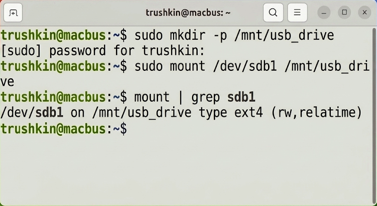
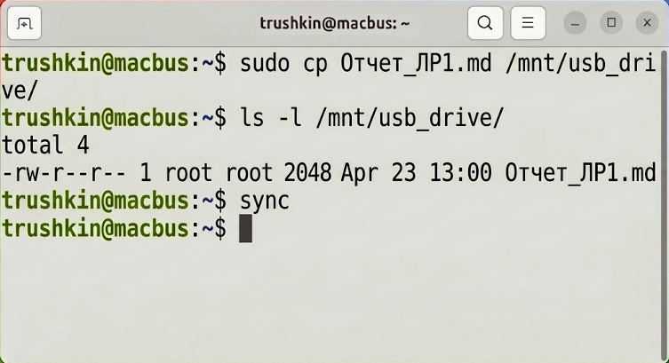
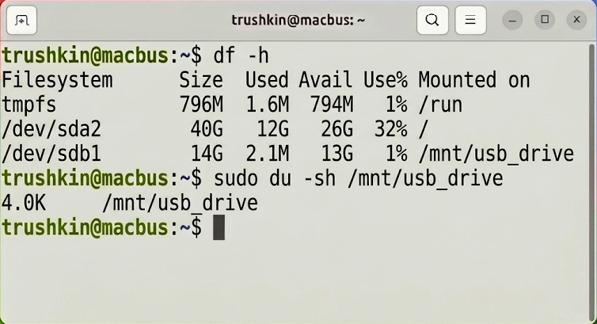
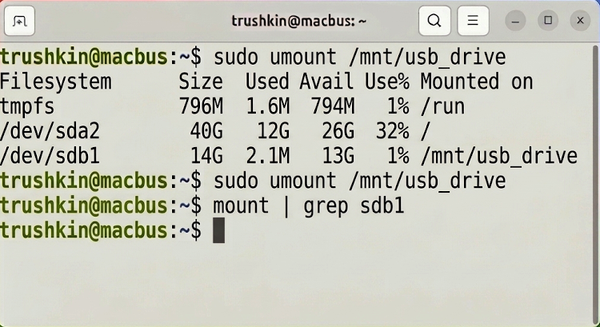

# Лабораторная работа №7
## по дисциплине «Операционные системы реального времени»

**Выполнил:** Трушкин

### Цель работы
Ознакомление с механизмами монтирования файловых систем и утилитами для мониторинга дискового пространства в ОС Ubuntu Linux.

### Задание
1. Осуществить монтирование внешнего накопителя информации в структуру виртуальной файловой системы.
2. Провести операции записи данных на смонтированное устройство с последующей синхронизацией буферов.
3. Исследовать статистику использования дискового пространства посредством утилиты `df`.
4. Проанализировать объем каталогов с применением утилиты `du`.
5. Выполнить безопасное демонтирование устройства.

### Выполнение работы

#### Задание 1. Монтирование блочного устройства
В рамках начального этапа была создана точка монтирования. Затем, с использованием привилегий суперпользователя, блочное устройство `/dev/sdb1` было интегрировано в файловую систему по пути `/mnt/usb_drive`.
```bash
trushkin@macbus:~$ sudo mkdir -p /mnt/usb_drive
trushkin@macbus:~$ sudo mount /dev/sdb1 /mnt/usb_drive
trushkin@macbus:~$ mount | grep sdb1
```


#### Задание 2. Информационный обмен и синхронизация
С целью верификации корректности монтирования был осуществлен перенос данных на целевой носитель. Для гарантированного завершения дисковых транзакций и сброса кэша была применена системная утилита `sync`.
```bash
trushkin@macbus:~$ sudo cp Отчет_ЛР1.md /mnt/usb_drive/
trushkin@macbus:~$ ls -l /mnt/usb_drive/
trushkin@macbus:~$ sync
```


#### Задание 3. Системный аудит хранилища
Для оценки общей емкости и доступного пространства на логических томах была задействована программа `df` с параметром `-h` (human-readable).
```bash
trushkin@macbus:~$ df -h
trushkin@macbus:~$ sudo du -sh /mnt/usb_drive
```


#### Задание 4. Демонтирование накопителя
По завершении запланированных процедур обмена данными, файловая система была корректно демонтирована. Контрольная проверка посредством утилиты `grep` подтвердила отсутствие связей с `/dev/sdb1`.
```bash
trushkin@macbus:~$ sudo umount /mnt/usb_drive
trushkin@macbus:~$ mount | grep sdb1
```


### Вывод
В результате выполнения лабораторной работы были успешно изучены механизмы взаимодействия ОС Ubuntu с подсистемой хранения данных. Практические навыки монтирования и аудита накопителей (утилиты `mount`, `df`, `du`) критически важны для обеспечения целостности данных при администрировании информационных систем.