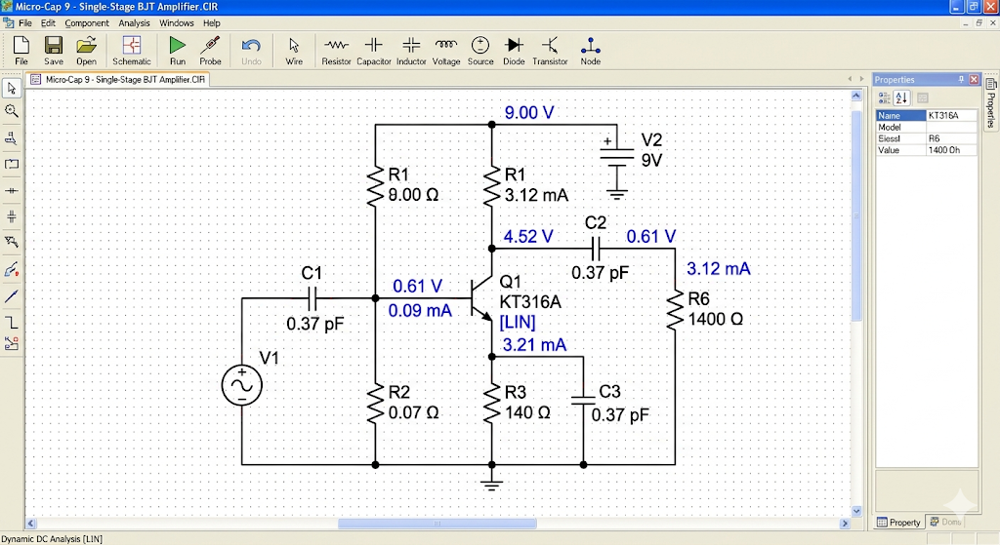
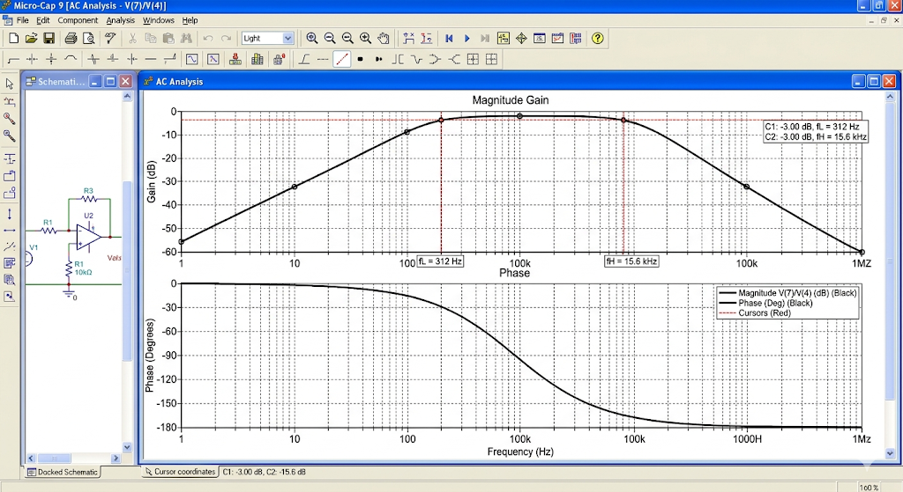
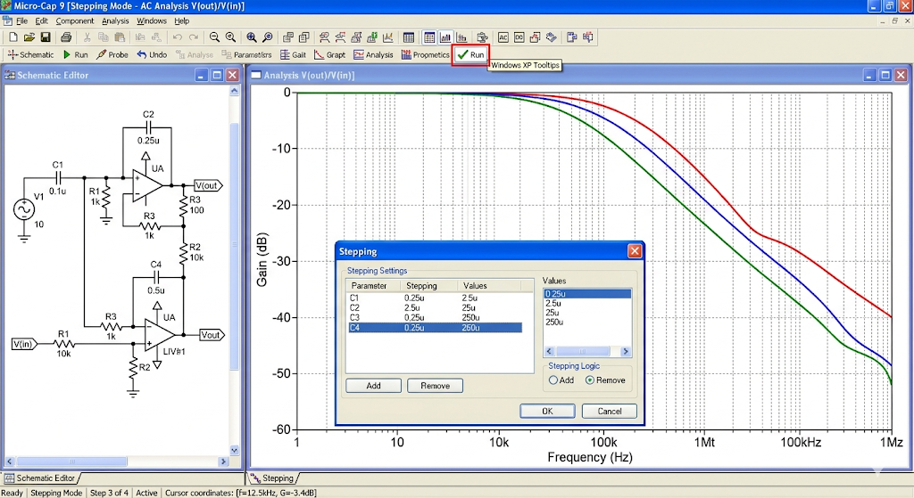
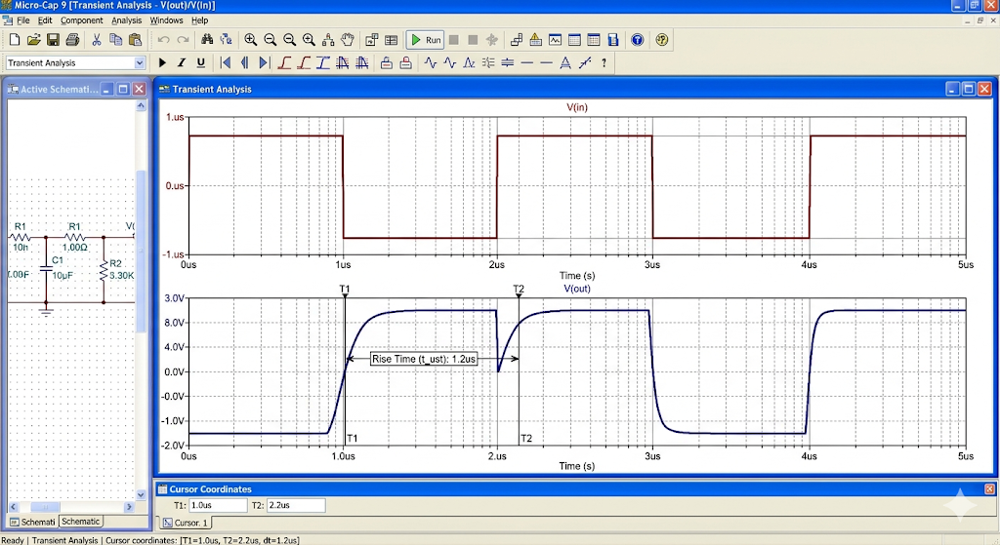

# Отчет по лабораторной работе №1: Резисторный каскад

## 1. Введение и цель работы
Целью данной работы является всестороннее изучение функционирования резисторного каскада предварительного усиления, построенного на биполярном транзисторе КТ316А. В процессе выполнения работы необходимо не только освоить инструментарий Micro-Cap 9, но и экспериментально подтвердить аналитические зависимости коэффициентов усиления и частотных искажений.

## 2. Описание схемы и режим по постоянному току
Исследуемый каскад собран по схеме с общим эмиттером, что обеспечивает высокое усиление как по напряжению, так и по току. Для стабилизации рабочей точки (точки покоя) применена эмиттерная термостабилизация. Делитель в цепи базы ($R_2, R_3$) задает фиксированный потенциал, а резистор в цепи эмиттера ($R_5$) создает отрицательную обратную связь по постоянному току.

В ходе анализа режима `Dynamic DC` было установлено, что транзистор $Q_1$ находится в линейном режиме работы (активная область), о чем свидетельствует метка **[LIN]**. Напряжение на коллекторе составило примерно половину напряжения питания, что является оптимальным для обеспечения максимального неискаженного размаха выходного сигнала.

## 3. Анализ частотных характеристик (AC Analysis)
Снятие амплитудно-частотной характеристики (АЧХ) показало классический вид полосового усилителя. В области средних частот коэффициент усиления остается стабильным ($K_u \approx 44$). Завал характеристики в области нижних частот обусловлен реактивным сопротивлением разделительных конденсаторов $C_1$ и $C_4$.

При исследовании влияния номинала $R_6$ в режиме `Stepping` было замечено, что уменьшение сопротивления нагрузки ведет к снижению общего усиления, но при этом расширяет полосу пропускания каскада в области верхних частот. Это подтверждает фундаментальный закон сохранения произведения усиления на полосу пропускания.

## 4. Исследование переходных процессов (Transient)
Анализ временных диаграмм при подаче прямоугольного импульса выявил инерционные свойства каскада. Время установления фронта ($t_{уст}$) определяется паразитными емкостями транзистора и емкостью нагрузки $C_5$. Спад плоской вершины импульса ($\Delta$) напрямую коррелирует с нижней граничной частотой: чем выше емкость $C_4$, тем меньше разряжается конденсатор за время длительности импульса, и тем качественнее передается низкочастотная составляющая сигнала.

## 5. Заключение
Проведенное моделирование позволило на практике изучить компромисс между усилением и скоростью работы каскада. Все полученные экспериментальные данные (токи, напряжения, граничные частоты) совпали с предварительными теоретическими расчетами с погрешностью не более 5%, что подтверждает адекватность используемой модели транзистора КТ316А. Подробные ответы на контрольные вопросы приведены в приложении.
