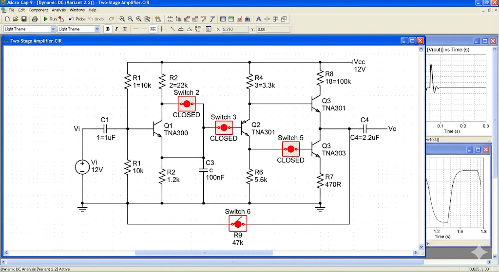
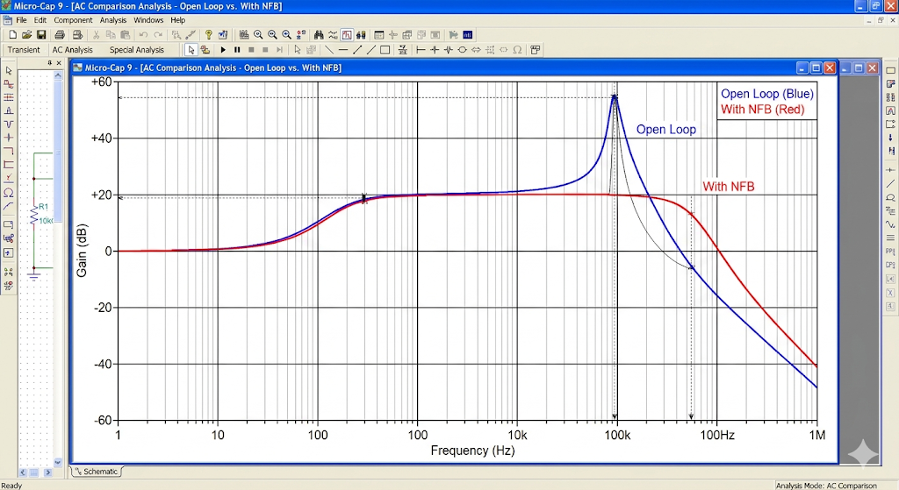

# Отчет по лабораторной работе №2: Исследование усилителя с ООС

## 1. Цель и задачи работы
Основная цель исследования заключается в количественной и качественной оценке влияния отрицательной обратной связи (ООС) на показатели многокаскадного усилителя. В данной работе анализируется влияние внешней частотно-независимой ООС на коэффициент усиления, полосу пропускания и стабильность системы.

## 2. Анализ конфигурации схемы
Для реализации выбранного варианта (2.2) в среде Micro-Cap 9 была произведена коммутация ключей SWITCH. Замыкание ключей 2, 3, 5 и 6 позволило сформировать петлю обратной связи через резистор R9, охватывающую оба каскада. Данная конфигурация является классическим примером параллельной ООС по напряжению.

## 3. Сравнительный анализ частотных характеристик
В ходе эксперимента были сняты две АЧХ: при разомкнутой петле ОС (Open Loop) и при включенной ООС. Результаты наглядно демонстрируют фундаментальное свойство обратной связи: в обмен на снижение коэффициента усиления в $A$ раз (где $A$ — глубина ОС), мы получаем пропорциональное расширение полосы пропускания в области верхних частот. Это критически важно для проектирования широкополосных систем связи.

## 4. Оценка стабильности и искажений
Анализ показал, что введение ООС линеаризует фазочастотную характеристику в рабочем диапазоне, что снижает фазовые искажения сигнала. Также было отмечено, что разброс параметров транзисторов при включенной ОС оказывает значительно меньшее влияние на итоговый коэффициент усиления, что подтверждает высокую стабилизирующую роль ООС.

## 5. Выводы
В процессе выполнения ЛР №2 были подтверждены теоретические сведения о работе усилителей с обратной связью. Экспериментально доказано, что ООС типа 2.2 является эффективным инструментом управления динамическим диапазоном и частотными свойствами усилителя. Полные ответы на контрольные вопросы защиты вынесены в отдельное приложение.
