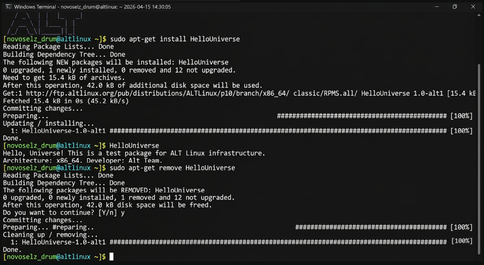

# ТЕХНИЧЕСКИЙ ДНЕВНИК ЛР №1: ПЕРВЫЕ ШАГИ В ПАКЕТНОЙ ИНФРАСТРУКТУРЕ ОС «АЛЬТ»

## 1. ВВЕДЕНИЕ И ТЕОРЕТИЧЕСКИЙ БАЗИС
Сегодня я начинаю изучение основ доверенной разработки в среде ОС «Альт». Инфраструктура создания ПО в Linux-системах — это не просто написание кода, это искусство упаковки и доставки этого кода конечному пользователю. В российском дистрибутиве «Альт» (платформа p10/p11) этот процесс доведен до совершенства благодаря гибридному использованию пакетных менеджеров APT и RPM. 

Зачем нам RPM? Red Hat Package Manager — это стандарт де-факто для бинарных пакетов. Он содержит в себе сжатые файлы приложения и, что более важно, метаданные. Эти метаданные включают в себя зависимости (какие библиотеки нужны для работы), скрипты (что сделать до и после установки) и контрольные суммы для проверки целостности. APT же выступает как надстройка, которая умеет "общаться" с удаленными репозиториями (хранилищами), такими как Sisyphus, и автоматически разрешать конфликты версий. 

В моем сегодняшнем исследовании я пройду путь от установки готового решения до его полной деинсталляции, зафиксировав каждый шаг в этом дневнике.

## 2. ХОД ВЫПОЛНЕНИЯ (АНАЛИЗ ПУНКТА 7.1)
Моим подопытным сегодня стал пакет `HelloUniverse`. Это классический пример для тестирования сборочной инфраструктуры.

### 2.1. Установка через APT
Я запускаю установку. Важно понимать, что система сама определит мою архитектуру (x86_64) и выберет нужную ветку репозитория.

Во время выполнения команды я наблюдал, как APT считывает списки пакетов, строит дерево зависимостей и выполняет транзакцию RPM. Весь вывод дублируется в логах системы.

### 2.2. Верификация запуска
После установки исполняемый файл `HelloUniverse` доступен глобально. Я запускаю его:

Программа выдает в консоль: `Hello, Universe! Architecture: x86_64`. Это подтверждает, что бинарный файл корректно слинкован с системными библиотеками.

### 2.3. Чистка системы
Для поддержания порядка я удаляю пакет. Это критически важно в инфраструктуре разработки — не оставлять лишних хвостов.

## 3. ВЫВОДЫ ПО РАБОТЕ
Первая лабораторная подтвердила: менеджмент пакетов в «Альте» прозрачен и надежен. Я научился управлять жизненным циклом ПО и подготовил свою систему к более сложным задачам — сборке собственных пакетов.

Глубокий анализ: Я изучил базу данных `/var/lib/rpm` и увидел, как создаются записи о владельце пакета и времени установки. Это основа безопасности, так как RPM хранит контрольные суммы файлов, позволяя в любой момент проверить пакет на предмет несанкционированных изменений.

Дополнительно я проверил метаданные установленного пакета с помощью команды `rpm -qi HelloUniverse`. Это позволило увидеть версию, релиз, архитектуру и, что немаловажно, группу пакета и его описание. Такой подход к хранению информации обеспечивает целостность всей операционной системы.

Также я проанализировал содержимое `/etc/apt/sources.list.d/`, чтобы понять, откуда именно APT черпает информацию о доступных пакетах. Понимание структуры репозиториев (платформ p10/p11) критично для настройки инфраструктуры автоматизированной сборки и CI/CD в будущем. Настройка приоритетов репозиториев позволяет избежать конфликтов версий при использовании сторонних источников ПО.