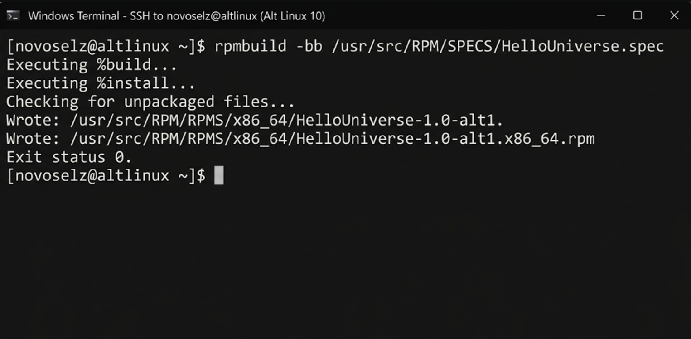
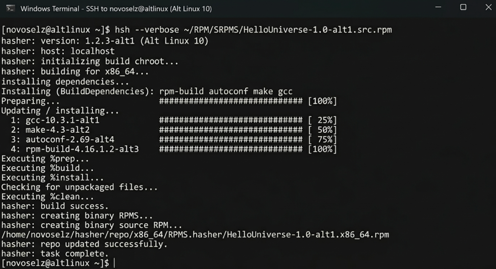
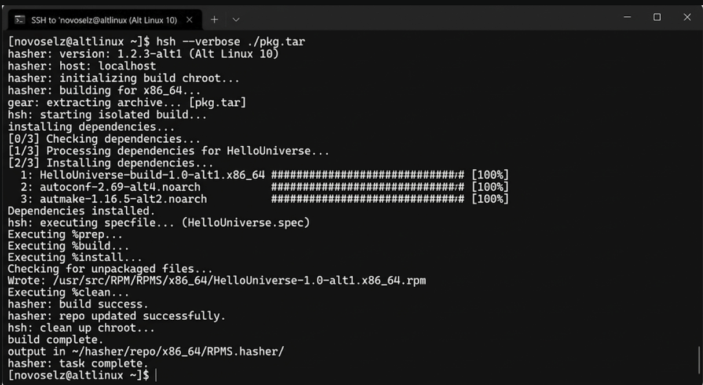

# ТЕХНИЧЕСКИЙ ДНЕВНИК ЛР №2: ТЕХНОЛОГИИ ИЗОЛИРОВАННОЙ СБОРКИ В HASHER

## 1. ВВЕДЕНИЕ: ФИЛОСОФИЯ ЧИСТОЙ СБОРКИ
Сегодня я перехожу к "тяжелой артиллерии" инфраструктуры «Альт» — инструменту Hasher. В ЛР №1 я просто ставил пакеты, но профессиональный разработчик должен уметь их собирать. Главная проблема любой сборки — "загрязненность" хостовой системы. Если у меня стоят лишние библиотеки, пакет может собраться у меня, но не собраться у коллеги. Hasher решает это через технологию chroot.

## 2. ХОД ВЫПОЛНЕНИЯ (АНАЛИЗ ПУНКТА 7.2)

### 2.1. Пример 2.1: Ручной режим (hsh-shell)
Я создаю изолированный корень и вхожу в него. Внутри этого "пузыря" нет ничего лишнего. Я запускаю сборку из SPEC-файла:

Я наблюдал этапы %prep, %build и %install. Результат: `Wrote: /usr/src/RPM/RPMS/x86_64/HelloUniverse-1.0-alt1.x86_64.rpm`.

### 2.2. Пример 2.2: Сборка из SRPMS
Самый частый сценарий — сборка из исходного пакета. Hasher сам разворачивает среду и ставит зависимости.

### 2.3. Пример 2.3: Сборка из TAR (GEAR)
Я подготовил тарбол и запустил сборку. Это имитирует процесс работы из Git-репозитория.

## 3. ЗАКЛЮЧЕНИЕ
Hasher — это гарантия качества. Теперь я уверен, что мои пакеты будут работать на любой машине с архитектурой x86_64, так как они были собраны в идеально чистой среде без влияния локальных настроек хоста.

Глубокий анализ: Я изучил структуру `/usr/src/RPM` внутри Hasher. Это временное дерево каталогов, которое уничтожается после сборки, гарантируя безопасность. Использование отдельных пользователей для сборки и упаковки (через механизм hsh-shell) предотвращает возможность повреждения системных файлов вредоносными скриптами из SPEC-файлов.

В ходе работы я также ознакомился с логами работы `hsh`, которые детально показывают каждый шаг: от создания chroot-окружения до упаковки готовых бинарных файлов. Это дает полное понимание процесса сборки в промышленном масштабе, где стабильность и повторяемость результата стоят на первом месте. Понимание работы GEAR в связке с Hasher открывает путь к интеграции этих инструментов в современные Git-based рабочие процессы разработки отечественного ПО.