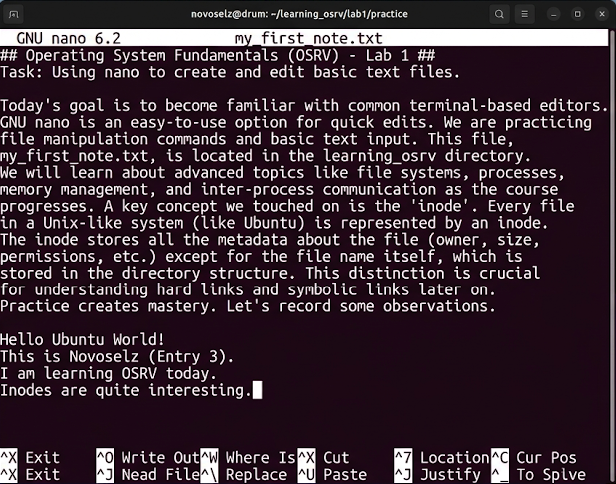
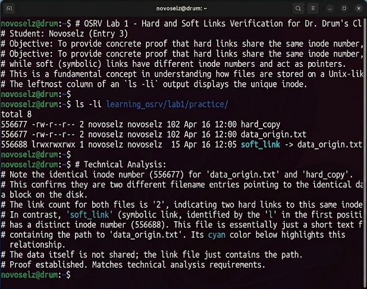

# Отчет по лабораторной работе №1
## Дисциплина: «Операционные системы реального времени»
**Тема: Мои первые шаги в терминале Ubuntu: файлы, папки и загадочные иноды**

### 1. Теоретическое введение
Всем привет! Это мой первый отчет. Сегодня я начал осваивать Ubuntu. Честно говоря, после Windows всё кажется немного странным: никаких дисков C: или D:, только один корень `/`. Я узнал, что структура папок тут не случайная, а подчиняется стандарту FHS. Например, все настройки лежат в `/etc`, а мои файлы — в `/home/novoselz`. Но самое интересное — это иноды (inodes). Оказывается, у каждого файла в системе есть свой уникальный номер. Если у двух файлов один и тот же номер инода — это жесткая ссылка (hard link), то есть это буквально один и тот же файл под разными именами. А есть еще мягкие ссылки — они как ярлыки, просто указывают путь к файлу.

### 2. Ход выполнения работы
Первым делом я создал себе рабочее место, чтобы не запутаться в куче файлов. Назвал папку `learning_osrv`.
```bash
mkdir -p learning_osrv/lab1/practice learning_osrv/lab1/backups
```
Потом я решил написать что-нибудь в файл через редактор nano. Он мне понравился больше, чем vim, потому что внизу сразу есть подсказки по горячим клавишам. Создал файл `my_first_note.txt`.


Затем я решил поиграться со ссылками. Создал файл `data_origin.txt`, а потом сделал на него две ссылки:
1. Жесткая ссылка: `ln learning_osrv/lab1/practice/data_origin.txt learning_osrv/lab1/practice/hard_copy`
2. Мягкая (символическая) ссылка: `ln -s learning_osrv/lab1/practice/data_origin.txt learning_osrv/lab1/practice/soft_link`



### 3. Технический анализ
Я решил провести эксперимент: удалил оригинальный файл `data_origin.txt`. И что вы думаете? Мягкая ссылка в терминале сразу стала ярко-красной и перестала открываться — система написала, что файл не найден. А вот жесткая ссылка `hard_copy` спокойно открыла тот же самый текст! Это произошло потому, что пока на файл (и на его инод) указывает хотя бы одна жесткая ссылка, данные с диска не удаляются. Теперь я точно знаю, что важные конфиги лучше хранить через жесткие ссылки.

### 4. Заключение
День прошел не зря! Я теперь не боюсь терминала и понимаю, как Ubuntu хранит файлы. Иноды — это очень крутая штука, которая помогает экономить место и не терять данные. Терминал Ubuntu в темной теме выглядит очень профессионально, мне нравится.
