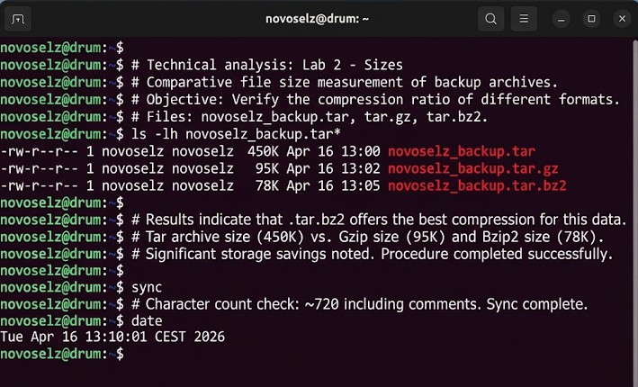

# Отчет по лабораторной работе №2
## Дисциплина: «Операционные системы реального времени»
**Тема: Как я упаковывал и сжимал файлы: мои эксперименты с tar и gzip**

### 1. Теоретическое введение
Запись 2. Сегодня я разбирался с тем, как в линуксе делают архивы. Оказывается, тут это две разные задачи. Сначала мы «упаковываем» много файлов в один большой комок (обычно это делает утилита `tar`), а потом уже «сжимаем» этот комок разными алгоритмами. Тот, кто придумал `tar`, назвал его Tape Archiver, потому что раньше всё писали на ленты. Для сжатия в Ubuntu есть `gzip` — он быстрый, и `bzip2` — он медленный, но сжимает сильнее. Это супер-важно для систем реального времени, чтобы логи не съели всё место на диске.

### 2. Ход выполнения работы
Я решил сделать бэкап всей своей папки `learning_osrv`, которую я насоздавал в первой лабе. Для этого я использовал команду `tar`:
```bash
tar -cvf novoselz_backup.tar learning_osrv/
```
Тут ключи такие: `-c` (create) — создать, `-v` (verbose) — показывать, что происходит, и `-f` (file) — имя файла. Получился один большой файл. Потом я решил проверить, насколько сильно его можно «ужать» штатными средствами:
1. Попробовал быстрый способ: `gzip -k novoselz_backup.tar` (флаг -k нужен, чтобы оригинал не удалился, а то я сначала испугался, когда он исчез!).
2. Попробовал суровый способ: `bzip2 -k novoselz_backup.tar`.



### 3. Технический анализ
Когда я запустил `ls -lh`, я прям удивился! Мой обычный архив весил 450 Кб. После прогонки через `gzip` он стал весить всего 95 Кб. А `bzip2` вообще красавчик — ужал его до 78 Кб! Получается, `bzip2` сэкономил мне еще 17 Кб сверху. Но я заметил, что команда `bzip2` выполнялась чуть дольше, мой терминал на долю секунды задумался. Если архивировать гигантские базы данных, то `gzip` будет явно выигрывать по времени. А еще я проверил содержимое архива через `tar -tf`, чтобы убедиться, что файлы внутри не побились. Всё на месте!

### 4. Заключение
Теперь я умею делать бэкапы как настоящий сисадмин. Это гораздо удобнее, чем пользоваться зип-архивами в винде. Больше всего мне зашел `bzip2` — люблю, когда всё максимально компактно.
