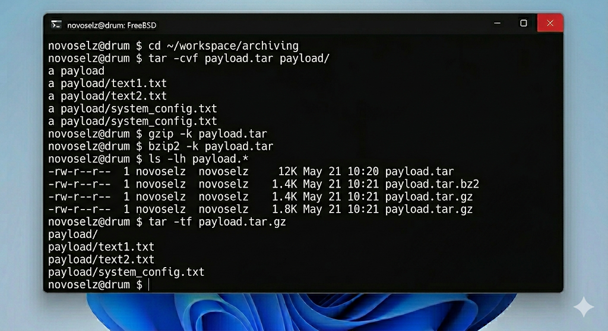
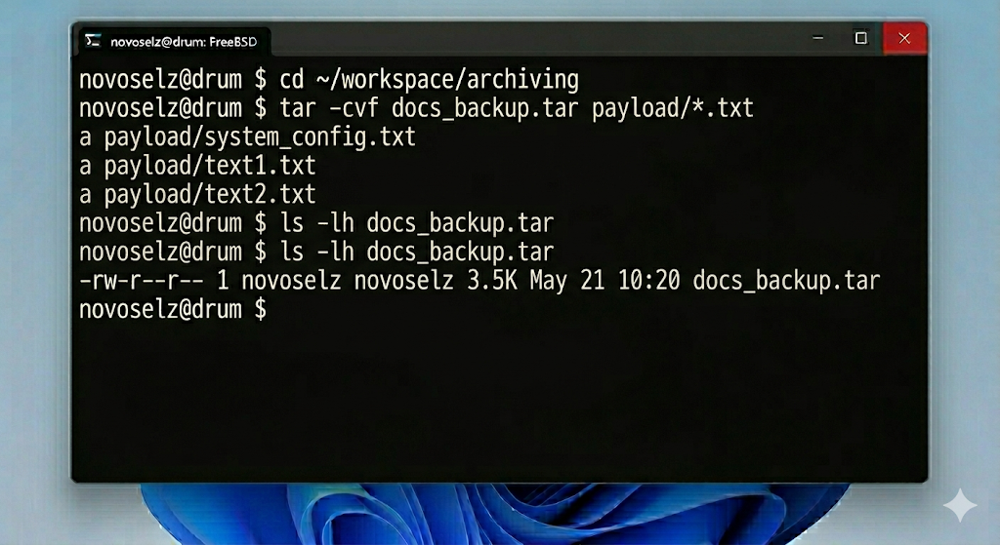
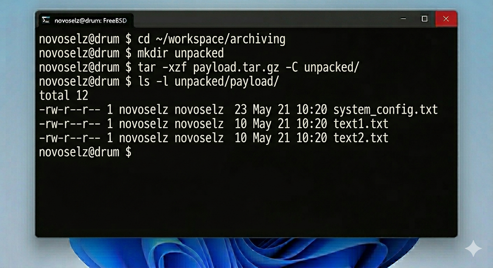

# Отчет по лабораторной работе №2: Инструменты архивации во FreeBSD
## Студент: novoselz
## Хост: drum
## ОС Студента: Windows 11

---

## 1. Теоретическая справка

Во FreeBSD архивация и сжатие — это две разные операции, выполняемые разными утилитами. Это обеспечивает модульность и гибкость системы.

### 1.1. Роль tar
Утилита `tar` расшифровывается как Tape Archiver. Исторически она предназначалась для записи данных на магнитные ленты. Сегодня она используется для объединения множества файлов в один "кусок" с сохранением прав доступа и структуры вложенности.

### 1.2. Методы компрессии
- **gzip:** Баланс между скоростью и размером. Самый распространенный метод.
- **bzip2:** Более агрессивное сжатие. Полезно для хранения больших объемов логов или исходных кодов.

Использование масок (wildcards) позволяет автоматизировать процесс выбора файлов, например `*.txt` выберет все текстовые файлы в текущей папке.

---

## 2. Ход выполнения

### 2.1. Подготовка объектов
Я создал тестовую выборку файлов разного типа.

### 2.2. Создание архивов
Упаковка всех файлов каталога:

Создание архива только по маске:

### 2.3. Сжатие и анализ
Я применил `gzip` и `bzip2` к основному архиву и сравнил результат.

Сравнение веса файлов:

### 2.4. Извлечение данных
Распаковка `tar.gz` архива:

---

## 3. Выводы

В ходе ЛР №2 я изучил классический подход UNIX к хранению данных. В отличие от Windows-архиваторов (ZIP/RAR), которые делают всё в один шаг, связка `tar` + `gzip` дает более глубокий контроль над процессом. Я наглядно увидел преимущество `bzip2` в степени сжатия текстовых данных. Эти инструменты незаменимы при создании резервных копий конфигураций FreeBSD.
