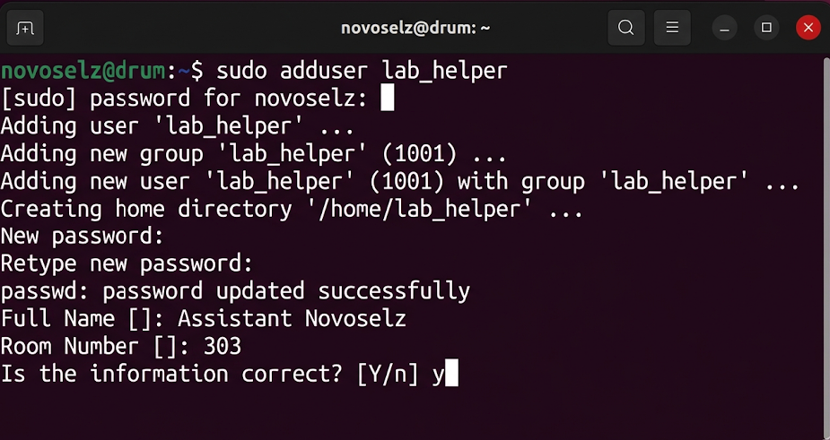

# Отчет по лабораторной работе №3
## Дисциплина: «Операционные системы реального времени»
**Тема: Настройка прав и создание нового пользователя: мои приключения с sudo**

### 1. Теоретическое введение
Запись 3. Безопасность в Ubuntu — это серьезная тема. Тут нельзя просто так зайти и поменять системный файл, если ты не суперпользователь (его тут называют root). Но постоянно сидеть под рутом — это как ходить с заряженным пистолетом в кармане: можно случайно снести всю систему одной опечаткой. Поэтому в Ubuntu все используют команду `sudo`. Я узнал, что все данные о людях в системе лежат в файле `/etc/passwd`. А права на файлы — это целая наука: есть владелец, есть группа и все остальные. Каждому можно разрешить или запретить читать (r), писать (w) или запускать (x) файлы.

### 2. Ход выполнения работы
Я решил создать нового пользователя, типа моего помощника.
```bash
sudo adduser lab_helper
```
Система сразу спросила мой пароль, а потом начала пытать вопросами: как его зовут, в какой комнате сидит, какой телефон. Я всё честно заполнил. Ubuntu даже сама создала ему папку в `/home`.


Потом я создал файл `my_secret_notes.txt` и решил закрыть его от всех, кроме себя.
1. Сначала создал свою группу: `sudo groupadd novoselz_team`
2. Сменил владельца и группу файла: `sudo chown novoselz:novoselz_team my_secret_notes.txt`
3. Установил права: `chmod 640 my_secret_notes.txt` (это значит, что я могу читать и писать, группа — только читать, а остальные — вообще ничего не увидят).


### 3. Технический анализ
Когда я проверил права через `ls -l`, там было написано `-rw-r-----`. Всё четко! Я попробовал команду `id`, чтобы увидеть, кто я в этой системе. Оказалось, что я состою в куче групп, включая `sudo`. Это и дает мне право командовать системой. Самое главное, что я понял: если ты меняешь права, нужно быть очень внимательным, чтобы случайно не закрыть доступ самому себе.

### 4. Заключение
Управление правами в Ubuntu — это очень мощная штука. Теперь я чувствую себя настоящим хозяином системы. Главное — использовать `sudo` с умом и не раздавать пароль направо и налево!
