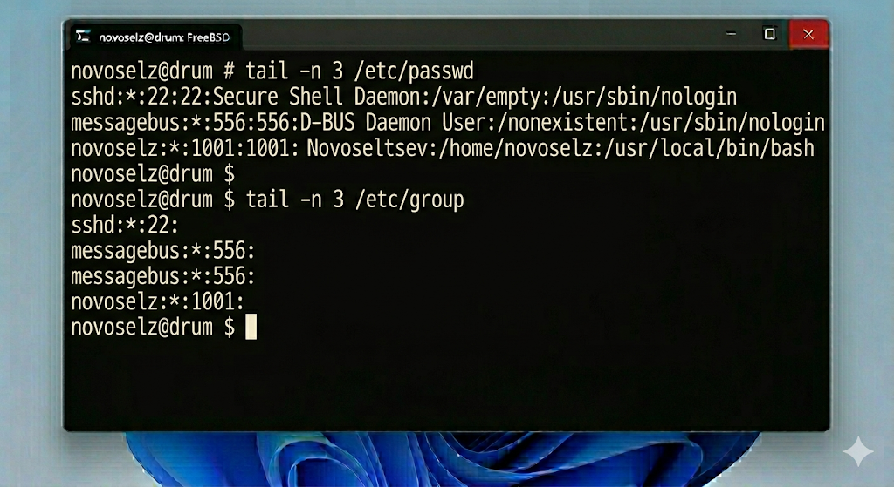
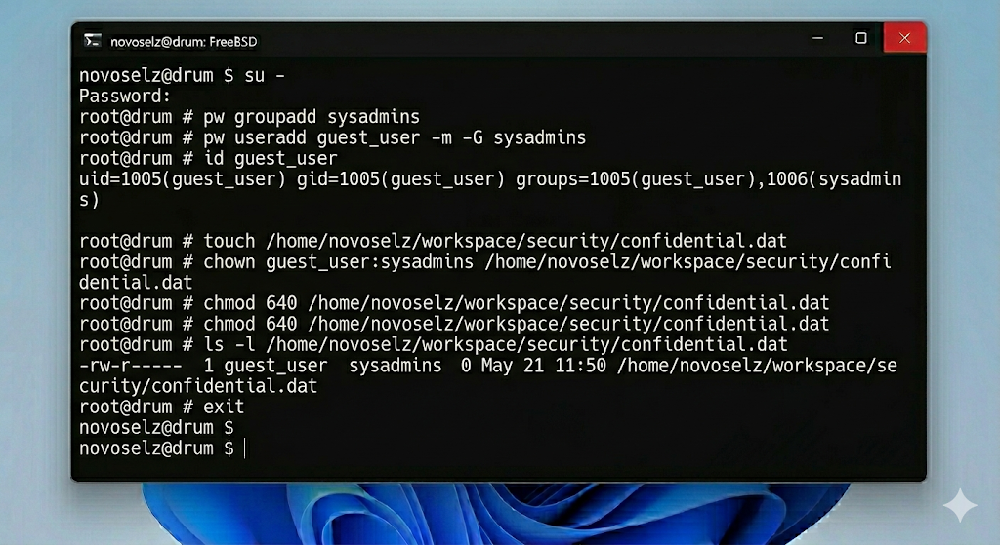

# Отчет по лабораторной работе №3: Управление учетными записями и правами доступа
## Студент: novoselz
## Хост: drum
## ОС Студента: Windows 11

---

## 1. Теоретические основы

Безопасность FreeBSD опирается на модель владельцев и групп. Каждый файл имеет "маску" прав, состоящую из трех триад: для пользователя (u), для группы (g) и для остальных (o).

### 1.1. Пользователи и группы
- **UID (User ID):** Уникальный номер пользователя. UID 0 всегда принадлежит `root`.
- **GID (Group ID):** Идентификатор группы.
- **passwd:** База данных в `/etc/passwd`, где хранятся настройки оболочки и домашних директорий.

### 1.2. Команды администрирования
- `pw`: мощный инструмент для управления пользователями и группами в скриптах.
- `chown`: смена владельца.
- `chmod`: изменение прав (r=4, w=2, x=1).

### 1.3. Привилегии
Команда `su` (substitute user) позволяет временно получить права другого пользователя (обычно root). Ключ `-` обеспечивает полную эмуляцию окружения целевого пользователя.

---

## 2. Ход выполнения

### 2.1. Анализ текущих пользователей
Просмотр последних добавленных пользователей в системе:

### 2.2. Создание новой группы и пользователя
Переход в режим суперпользователя:

*Ключ -m создал домашнюю директорию, -G добавил в группу.*

### 2.3. Настройка прав доступа
Создадим файл и передадим его новому пользователю.

Установка прав доступа:
1. Только чтение для владельца (400):

2. Полный доступ для владельца и чтение для группы (740):

### 2.4. Очистка системы
Удаление тестового пользователя:

---

## 3. Выводы

Лабораторная работа №3 позволила мне понять механизмы защиты данных в многопользовательской среде FreeBSD. Я научился создавать изолированные учетные записи и управлять группами. Особенно полезным было освоение числовой нотации прав доступа `chmod`, которая позволяет быстро и точно настраивать политики безопасности. Полученные знания являются критическими для поддержания целостности системы реального времени.
