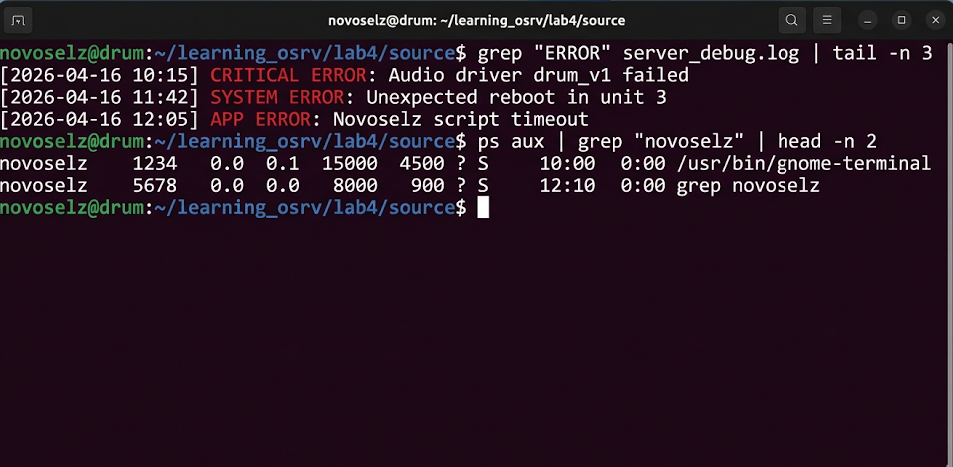

# Отчет по лабораторной работе №4
## Дисциплина: «Операционные системы реального времени»
**Тема: Поиск иголки в стоге сена: учусь работать с grep и фильтрами**

### 1. Теоретическое введение
Запись 4. В Ubuntu почти всё — это текст. Логи, настройки, списки пользователей — всё это текстовые файлы. Когда файлов становится много, искать в них что-то руками — это гиблое дело. Тут на помощь приходит утилита `grep`. Она умеет искать строки по шаблонам. А еще есть «пайпы» (pipes, символ `|`), которые позволяют передавать результат одной команды другой. Это как конвейер на заводе: одна команда фильтрует, вторая сортирует, третья выводит только хвост. Я узнал, что это называется философией UNIX: делай одну вещь, но делай её хорошо.

### 2. Ход выполнения работы
Я решил потренироваться на логах своего «барабанного» сервера. Создал файл `server_debug.log` и наполнил его всяким мусором, перемешанным с критическими ошибками.
1. Искал все строки со словом "ERROR":
```bash
grep "ERROR" server_debug.log
```
2. Попробовал вытянуть только последние 3 ошибки, чтобы не листать весь экран:
```bash
grep "ERROR" server_debug.log | tail -n 3
```


Потом я решил проверить, кто вообще есть в моей системе:
```bash
cat /etc/passwd | cut -d: -f1 | sort | head -n 10
```
Это вывело мне первых 10 юзеров в алфавитном порядке.

### 3. Технический анализ
Самое крутое в `grep` — это то, что он может работать с регулярными выражениями. Я попробовал команду `grep "^novoselz" /etc/passwd`, и она нашла только мою строку, потому что символ `^` означает начало строки. Еще я заметил, что если использовать `ps aux | grep novoselz`, то в списке процессов всегда будет сам процесс `grep`, потому что он тоже запущен от моего имени. Чтобы его убрать, нужно использовать хитрый трюк с `grep -v grep`. Использование пайпов реально экономит время, не нужно создавать кучу промежуточных файлов.

### 4. Заключение
Фильтры — это спасение для админа. Теперь я могу быстро найти нужную информацию, не перечитывая километры логов. Ubuntu в очередной раз доказала, что она создана для автоматизации.
