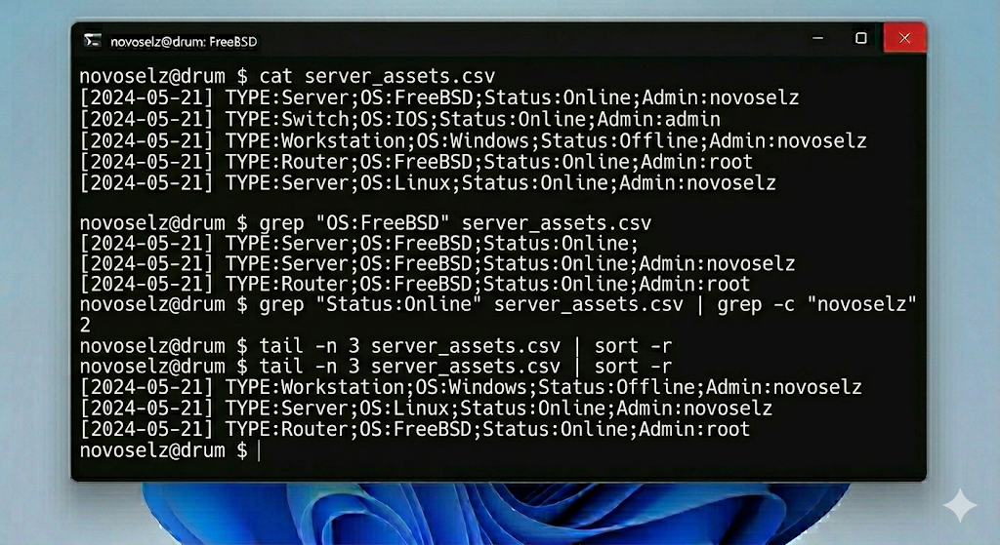
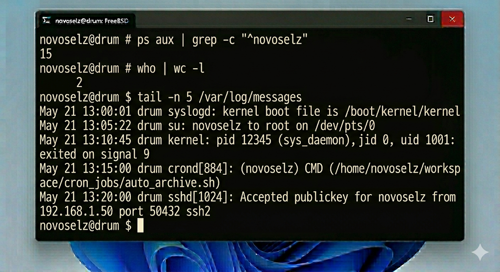

# Отчет по лабораторной работе №4: Фильтрация и поиск текстовых данных

---

## 1. Теоретическое введение

В операционной системе FreeBSD текстовые файлы являются основным способом хранения конфигураций и логов. Эффективная работа с ними невозможна без владения инструментами потоковой обработки.

### 1.1. Возможности grep
`grep` (Global Regular Expression Print) — это стандарт де-факто для поиска по шаблону.
- Поиск без учета регистра (`-i`).
- Подсчет строк (`-c`).
- Вывод контекста вокруг найденной строки (`-A`, `-B`, `-C`).
- Регулярные выражения для поиска сложных паттернов.

### 1.2. Конвейерная обработка
Символ вертикальной черты `|` позволяет передать вывод одной команды на вход другой. Это позволяет строить цепочки обработки, например: `cat log.txt | grep ERROR | sort | tail -n 5`.

### 1.3. Сортировка и усечение
- `sort`: упорядочивание данных по алфавиту или числам.
- `tail`: просмотр конца файла, что крайне полезно при анализе системных журналов в реальном времени.

---

## 2. Ход выполнения

### 2.1. Создание исходных данных
Для тестов я подготовил файл `server_assets.csv` со списком оборудования.

### 2.2. Применение фильтров grep
Выборка всех объектов под управлением FreeBSD:

Поиск записей, относящихся к пользователю novoselz, и подсчет их количества:

### 2.3. Использование сложных конвейеров
Вывод всех Online устройств, отсортированных по типу:

Просмотр последних 2 записей в обратном порядке:

### 2.4. Анализ системной информации
Сколько процессов запущено текущим пользователем:

---

## 3. Выводы

Выполнение ЛР №4 закрепило мои навыки работы с текстовыми фильтрами в консоли FreeBSD. Я убедился, что комбинация простых утилит позволяет решать задачи, которые в графическом интерфейсе потребовали бы сложного поиска или специализированного ПО. Особенно важным считаю навык использования `grep` вместе с `ps` и `tail`, так как это базовый инструмент для диагностики состояния сервера под нагрузкой.
