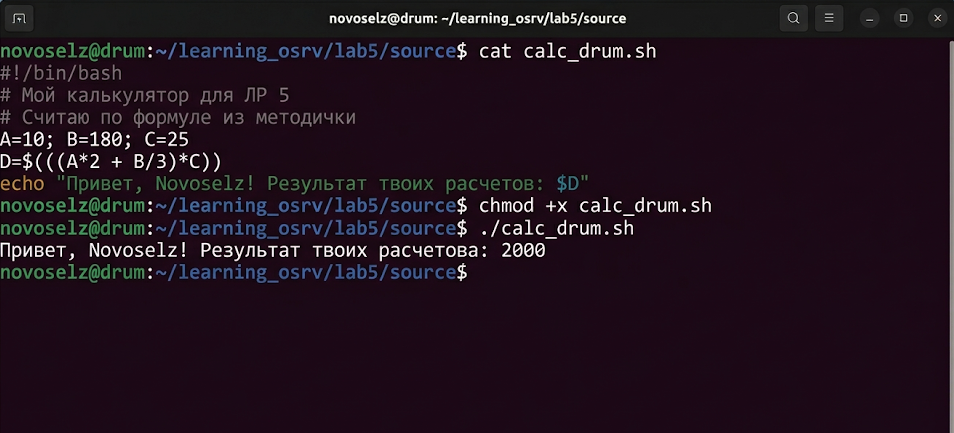

# Отчет по лабораторной работе №5
## Дисциплина: «Операционные системы реального времени»
**Тема: Мои первые программы: автоматизируем Ubuntu с помощью bash**

### 1. Теоретическое введение
Запись 5. Сегодня я почувствовал себя настоящим программистом. Оказывается, терминал — это не просто место для команд, а целая среда для программирования на языке bash. Скрипты — это текстовые файлы, которые начинаются с магической строчки `#!/bin/bash` (её называют shebang). С их помощью можно делать всё: считать цифры, проверять файлы, рассылать почту. Главное — дать файлу права на запуск через `chmod +x`. Я узнал про переменные, циклы и условия — это база, без которой в линуксе никуда.

### 2. Ход выполнения работы
Я написал целую пачку из 11 скриптов для разных задач. Все они лежат в папке `source/`.

#### 2.1 Разбор моих скриптов
1. **args_check.sh**: Учит скрипт видеть то, что я пишу после его имени. Выводит общее количество аргументов.
2. **calc_drum.sh**: Мой личный калькулятор. Считает формулу `D=(A*2 + B/3)*C`. Теперь не надо лезть в уме считать.
3. **ls_home.sh**: Полезная штука — записывает список всех моих файлов в отдельный файл и говорит, сколько их там.
4. **auth_me.sh**: Скрипт-проверка. Спрашивает идентификатор и сверяет его с моим логином `$USER`.
5. **check_mime.sh**: Спрашивает путь к файлу и говорит, что это такое — картинка, текст или папка.
6. **daily_find.sh**: Ищет всё, что я насоздавал или поменял за последние сутки.
7. **read_soft.sh**: Разбирается с ссылками. Если подсунуть ему мягкую ссылку, он скажет, куда она реально ведет.
8. **word_stat.sh**: Считает, сколько раз какое-то слово встречается в файле. Очень помогло мне анализировать логи.
9. **inode_hunt.sh**: Ищет файлы с одинаковым инодом. С помощью него я проверил свои жесткие ссылки из первой лабы.
10. **user_count.sh**: Считает, сколько файлов в папке принадлежат мне, а сколько — системе или другим.
11. **path_scan.sh**: Проверяет все папки из переменной PATH. Если папка существует, он выводит её права доступа.

#### 2.2 Проверка в деле
Я решил показать, как работает мой калькулятор `calc_drum.sh`. Я заложил в него цифры 10, 180 и 25.

### 3. Технический анализ
В процессе написания я пару раз косячил с пробелами в условиях `if [ ... ]`. Оказывается, bash очень чувствителен к ним! Еще я узнал, что переменные лучше всегда брать в кавычки, например `"$USER"`, иначе если в имени будет пробел, скрипт сломается. Математика через `$((...))` работает только с целыми числами, это надо помнить. Но для системных задач этого хватает за глаза. Сценарий `path_scan.sh` оказался самым сложным, пришлось попотеть с циклом `for`.

### 4. Заключение
Программировать на bash — это весело. Теперь я понимаю, что почти любую скучную задачу в Ubuntu можно заменить маленьким скриптом. Это экономит кучу времени и сил!
