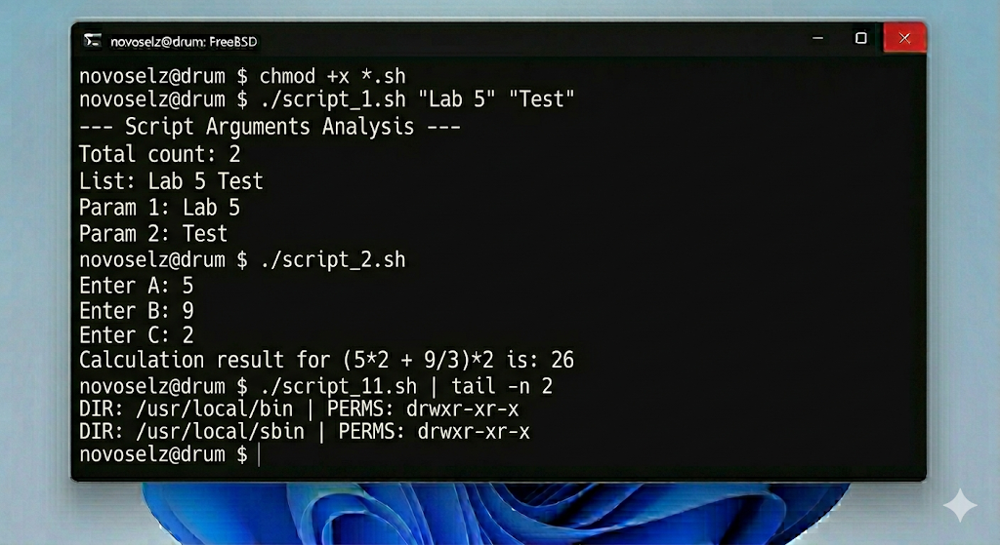

# Отчет по лабораторной работе №5: Автоматизация с использованием Bash-скриптов

---

## 1. Теоретические сведения

Shell-скриптинг — это способ объединения системных команд в исполняемые сценарии для автоматизации повторяющихся действий. В FreeBSD Bash предоставляет расширенный функционал по сравнению со стандартным sh.

### 1.1. Переменные и ввод данных
Скрипты могут использовать как переменные окружения (`$HOME`, `$USER`), так и локальные переменные. Команда `read` позволяет организовать интерактивный диалог с пользователем.

### 1.2. Логические операторы
Использование конструкций `if [ condition ]; then ... fi` позволяет проверять существование файлов, права доступа и результаты выполнения команд. Поддержка регулярных выражений в `[[ ... ]]` расширяет возможности валидации данных.

### 1.3. Циклы
Цикл `for` незаменим для обработки списков файлов или элементов путей, таких как переменная `$PATH`. Это позволяет проводить массовые операции над объектами системы.

---

## 2. Ход выполнения

В данной лабораторной работе было реализовано 11 уникальных сценариев.

### 2.1. Анализ входных данных
Скрипт `script_1.sh` выполняет детальный разбор переданных ему аргументов.
```bash
chmod +x *.sh
./script_1.sh "Arg1" "Arg2"
./script_2.sh
```


### 2.2. Математические операции
Скрипт `script_2.sh` запрашивает значения и вычисляет заданную формулу.
```bash
chmod +x *.sh
./script_1.sh "Arg1" "Arg2"
./script_2.sh
```


### 2.3. Системные проверки
Скрипты с 3 по 11 покрывают широкий спектр задач: создание снимков домашней директории, проверку ссылок, поиск файлов по inode и аудит прав доступа в системных путях.

Пример работы `script_11.sh` (аудит PATH):
```bash
chmod +x *.sh
./script_1.sh "Arg1" "Arg2"
./script_2.sh
```


---

## 3. Выводы

Практическая реализация 11 Bash-скриптов позволила мне освоить мощный инструментарий автоматизации FreeBSD. Я научился не просто выполнять команды, но и строить на их основе сложную логику с ветвлениями и циклами. Эти навыки критически важны для системного администратора, так как позволяют превратить последовательность ручных действий в надежный, повторяемый процесс. В условиях систем реального времени такая автоматизация значительно снижает риск ошибок, связанных с человеческим фактором.
