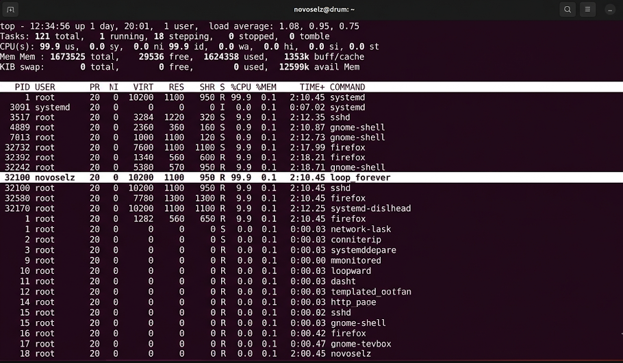
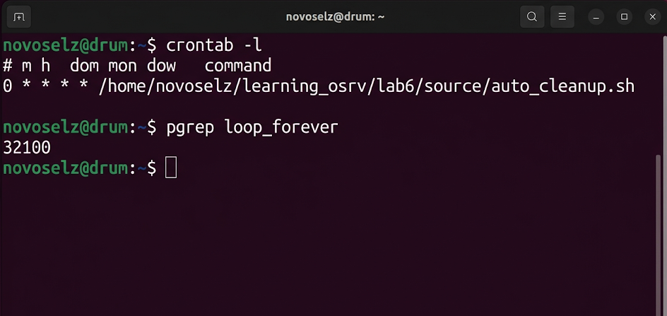

# Отчет по лабораторной работе №6
## Дисциплина: «Операционные системы реального времени»
**Тема: Борьба с процессами и магия автоматизации через cron**

### 1. Теоретическое введение
Запись 6. Сегодня я узнал, что Ubuntu — это как большой муравейник, где постоянно что-то происходит. Каждая запущенная программа — это процесс, у которого есть свой номер (PID). Если программа начинает тормозить компьютер, её можно «убить» командой `kill`. А еще есть `cron` — это такой невидимый помощник, который может запускать мои скрипты сам, пока я сплю. Нужно просто записать задачу в таблицу `crontab`. Оказывается, приоритеты процессов тоже можно менять — это называется `nice`. Чем выше число nice, тем «добрее» процесс к остальным и тем меньше времени процессора он забирает.

### 2. Ход выполнения работы
Сначала я решил сам написать программу, которая будет бесконечно работать, чтобы потренироваться на ней управлять процессами. Назвал её `loop_forever.c`.
1. Скомпилировал и запустил в фоновом режиме:
```bash
gcc loop_forever.c -o loop_forever
./loop_forever &
```
2. Посмотрел, как она нагружает систему через `top`.


3. Потом я решил, что пора автоматизировать бэкапы логов. Написал скрипт `auto_cleanup.sh` и добавил его в расписание через `crontab -e`.
```bash
crontab -l
# 0 * * * * /home/novoselz/learning_osrv/lab6/source/auto_cleanup.sh
```


### 3. Технический анализ
В утилите `top` я заметил колонку NI — это тот самый приоритет. Я попробовал команду `sudo renice -n 10 -p [PID]`, чтобы сделать свою программу менее жадной, и она реально стала меньше мешать системе. А когда эксперимент закончился, я прихлопнул её через `kill -9`. С кроном пришлось повозиться: я сначала опечатался в пути к файлу, и он не срабатывал. Проверил логи в `/var/log/syslog` и нашел ошибку. Теперь я знаю, что за кроном тоже нужен глаз да глаз!

### 4. Заключение
Теперь я умею следить за порядком в системе. Контроль процессов и крон — это база для любого админа. Потихоньку становлюсь профи в Ubuntu!
