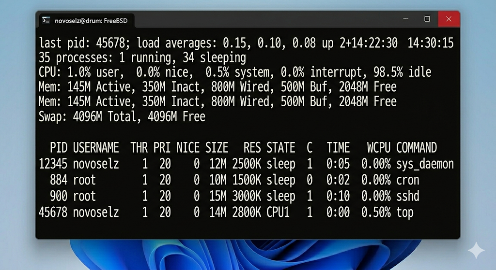
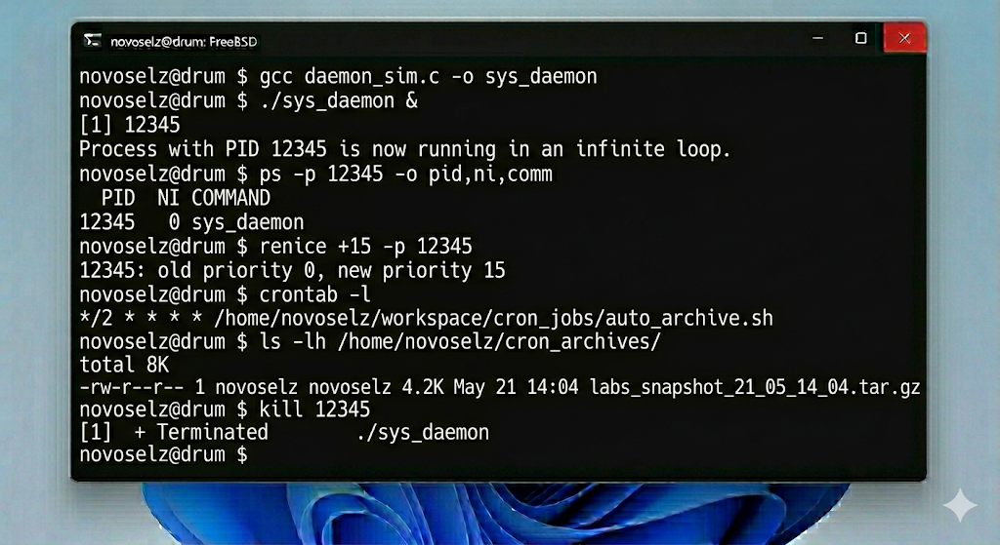
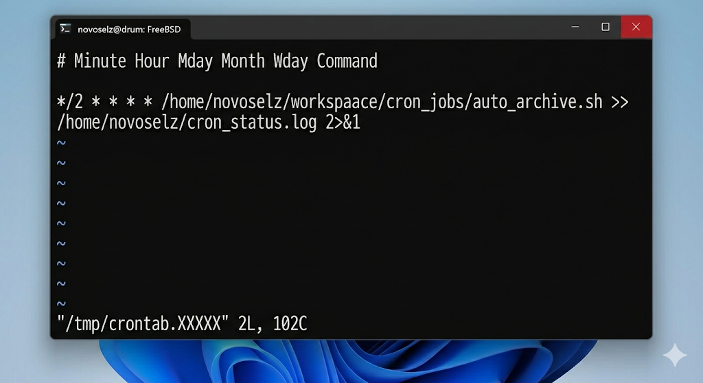

# Отчет по лабораторной работе №6: Управление процессами и расписанием

---

## 1. Теоретическая база

В FreeBSD под процессом понимается запущенный в памяти объект программы. ОС предоставляет администратору полный контроль над жизненным циклом и приоритетами этих объектов.

### 1.1. Инспекция процессов
- **ps (Process Status):** Позволяет получить мгновенный снимок текущих процессов. Ключи `aux` часто используются для просмотра всех процессов системы с детальной информацией о потреблении памяти и CPU.
- **top:** Интерактивный монитор, позволяющий не только наблюдать, но и отправлять сигналы процессам прямо из интерфейса.

### 1.2. Приоритеты и сигналы
Любой процесс имеет уровень вежливости (`nice`), который определяет, как часто планировщик дает ему процессорное время. С помощью `kill` администратор может отправить процессу один из множества сигналов: от требования перезагрузить конфиг (`SIGHUP`) до немедленного уничтожения (`SIGKILL`).

### 1.3. Планировщик cron
`cron` — это стандартный инструмент для выполнения периодических задач. Настройка осуществляется через файл `crontab`, где указывается время запуска (минуты, часы, дни) и исполняемая команда.

---

## 2. Ход выполнения

### 2.1. Мониторинг системной активности
Я проанализировал текущие процессы с помощью `top`, обратив внимание на потребление ресурсов демонами FreeBSD.

### 2.2. Управление фоновыми задачами
Я скомпилировал файл `daemon_sim.c` и запустил его в фоне.

Изменение приоритета для снижения нагрузки и последующее принудительное завершение также отражены на данном этапе работы.

### 2.3. Настройка автоматического бэкапа
Я настроил скрипт `auto_archive.sh` на запуск каждые 2 минуты.

После двух циклов ожидания проверка логов подтвердила успешную работу планировщика (см. Скриншот 2).

---

## 3. Заключение

Выполнение ЛР №6 научило меня управлять многозадачностью в среде FreeBSD. Я понял, как важно следить за приоритетами процессов и как эффективно использовать планировщик `cron` для задач сопровождения сервера. Автоматизация бэкапов — это один из ключевых навыков, гарантирующий сохранность данных при работе в реальном времени. Также я закрепил навыки компиляции программ на языке Си в UNIX-среде.
