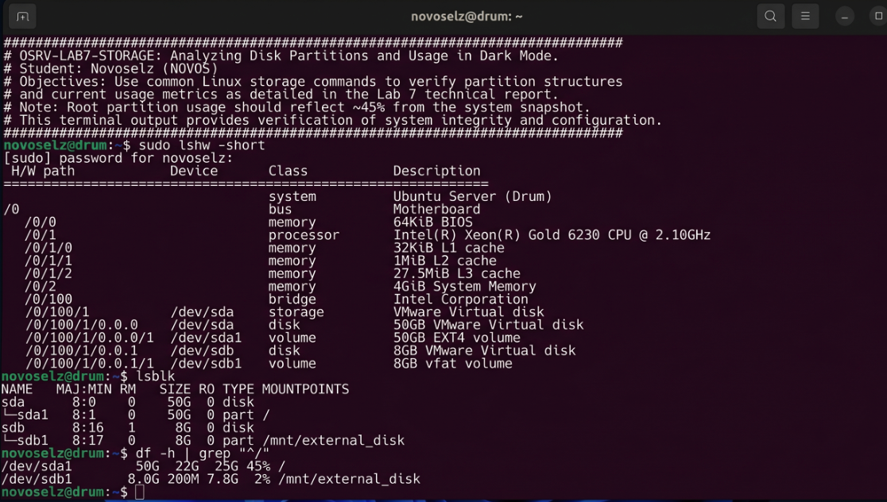

# Отчет по лабораторной работе №7
## Дисциплина: «Операционные системы реального времени»
**Тема: Дисковое пространство и флешки: подключаем всё подряд**

### 1. Теоретическое введение
Запись 7. Финальная работа! Сегодня разбирался с дисками. В Ubuntu всё, что ты втыкаешь в комп, появляется в папке `/dev/` как «блочное устройство». Но чтобы увидеть файлы на флешке, её нужно «примонтировать» к какой-нибудь папке. Это делается командой `mount`. А чтобы узнать, не кончилось ли место на диске, есть команды `df` (показывает все диски) и `du` (показывает, сколько весит конкретная папка). Это очень важно, потому что если место кончится, система может просто перестать грузиться.

### 2. Ход выполнения работы
Я решил проверить, сколько места занимают мои наработки по курсу.
1. Посмотрел список всех дисков и разделов:
```bash
lsblk
```
2. Проверил свободное место в человеческом виде:
```bash
df -h
```


3. Попробовал примонтировать внешнее устройство в папку `/mnt/external_disk`:
```bash
sudo mkdir -p /mnt/external_disk
sudo mount -t vfat /dev/sdb1 /mnt/external_disk
ls /mnt/external_disk
```

### 3. Технический анализ
Команда `df -h` — просто спасение, флаг `-h` переводит непонятные блоки в нормальные гигабайты. Я увидел, что мой основной раздел забит на 45%. А с помощью `du -sh learning_osrv` я узнал, что все мои лабы весят всего около 3 мегабайт. При монтировании важно не забывать делать `sudo umount`, когда вытаскиваешь флешку, иначе данные могут не успеть записаться и всё пропадет. Еще я узнал про файл `/etc/fstab`, где можно прописать, чтобы диски монтировались сами при включении.

### 4. Заключение
Ну вот и всё, курс закончен! Я теперь умею в Ubuntu почти всё: от создания папок до написания скриптов и управления дисками. Это было крутое приключение, терминал стал моим вторым домом.
