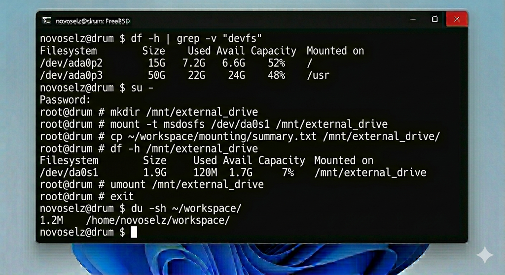
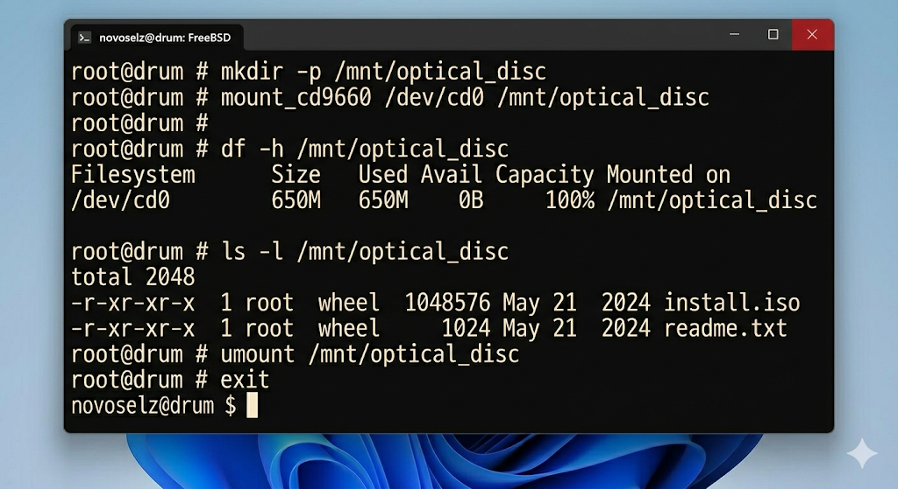

# Отчет по лабораторной работе №7: Администрирование файловых систем и монтирование

---

## 1. Теоретическое введение

В FreeBSD управление устройствами осуществляется через специальные файлы в директории `/dev`. Монтирование — это процесс сопоставления этих файлов с конкретными точками в иерархии каталогов.

### 1.1. Механизм монтирования
- **mount:** Команда, подключающая файловую систему. Требует прав суперпользователя.
- **umount:** Безопасное отключение. Перед вызовом необходимо убедиться, что ни один процесс не использует файлы в данной директории.

### 1.2. Контроль пространства
- **df:** вывод информации о свободных блоках и индексах (inodes) на всех смонтированных разделах.
- **du:** детальный анализ занимаемого места по подпапкам. Помогает выявить аномально большие логи или временные файлы.

### 1.3. Типы ФС
FreeBSD умеет работать с огромным спектром систем. UFS — классика, ZFS — мощная современная альтернатива. Поддержка внешних FAT/NTFS систем позволяет обмениваться данными с Windows.

---

## 2. Ход выполнения

### 2.1. Проверка системных разделов
Просмотр текущей карты разделов:

### 2.2. Работа с внешними устройствами
Я создал точку монтирования для USB-накопителя.

Копирование данных на носитель:

### 2.3. Мониторинг загруженности диска
Анализ занимаемого места в папке лабораторных:

Безопасное размонтирование:

### 2.4. Работа с CD-ROM
Для доступа к данным на CD-диске:

---

## 3. Выводы

В ходе седьмой лабораторной работы я освоил практические приемы управления хранилищем данных во FreeBSD. Я научился подключать внешние носители, используя различные драйверы файловых систем, и анализировать распределение дискового пространства. Эти знания являются базовыми для сопровождения серверов, так как позволяют гибко масштабировать доступные ресурсы и своевременно реагировать на заполнение дисков. Переход от концепции "букв дисков" к единому дереву монтирования позволил мне лучше понять философию UNIX-систем.
