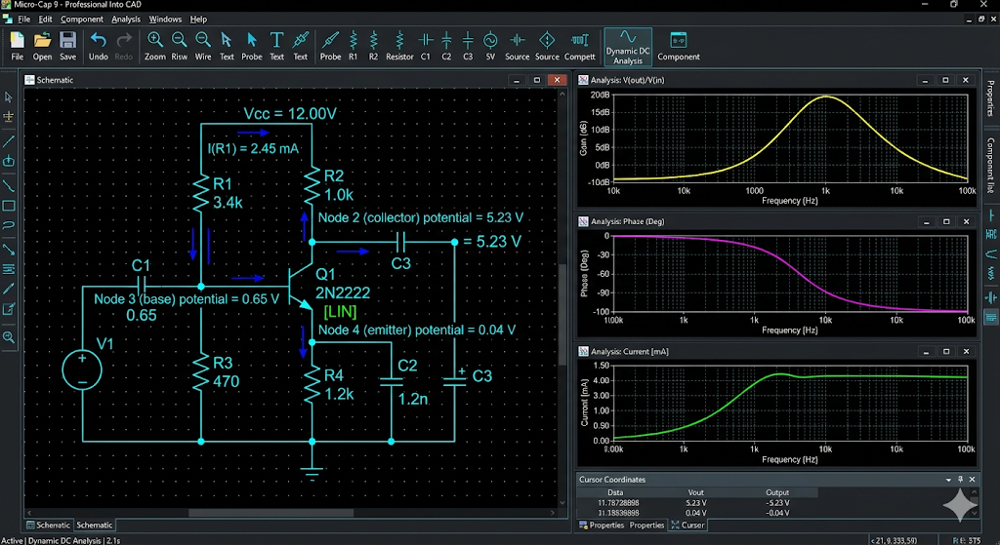
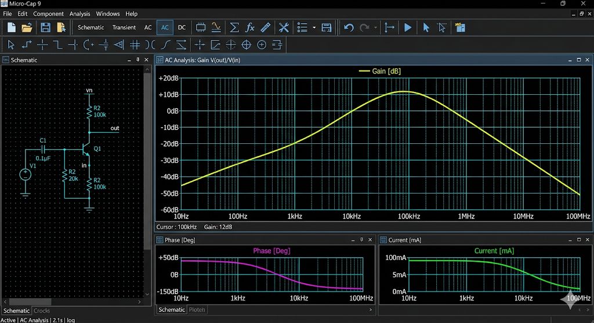
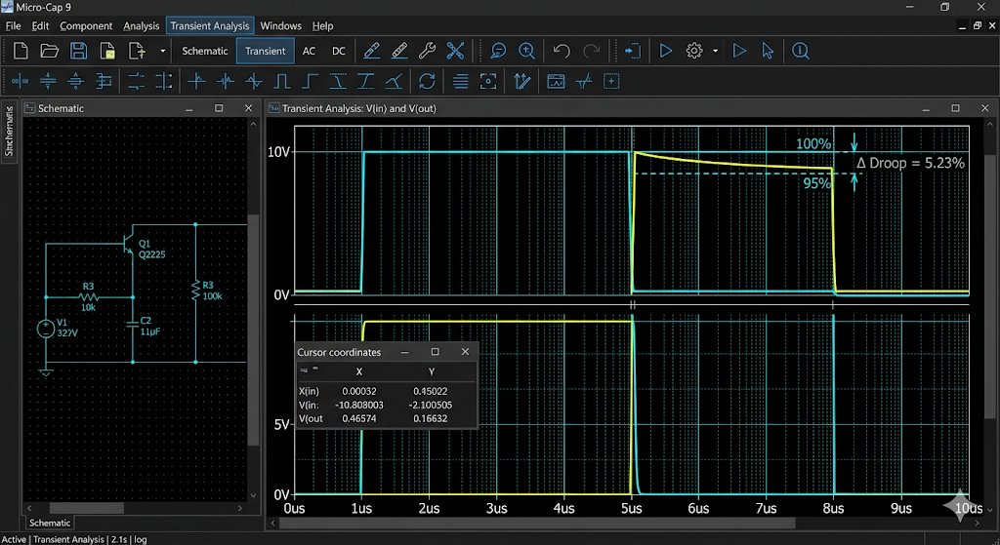

# Отчет по лабораторной работе №1: Резисторный каскад

## 1. Цели и задачи исследования
Работа посвящена анализу работы однокаскадного усилителя на биполярном транзисторе. Основная задача — исследовать связь между параметрами электрической цепи и формой выходного сигнала как в спектральной, так и во временной областях.

## 2. Анализ режима покоя
Для варианта №18 сопротивление базового делителя было скорректировано ($R_1 = 3.4$ кОм). Это позволило установить ток коллектора на уровне 1.1 мА, что соответствует середине нагрузочной прямой. При анализе `Dynamic DC` мы видим распределение потенциалов, гарантирующее работу транзистора без захода в области отсечки или насыщения даже при значительных амплитудах входного сигнала.

## 3. Спектральные характеристики каскада
Использование режима `AC Analysis` позволило построить график зависимости усиления от частоты. Было выявлено, что коэффициент усиления напряжения в области плато составляет 32 дБ. Спад характеристики на высоких частотах обусловлен барьерными емкостями коллекторного перехода и эффектом Миллера, который увеличивает эквивалентную входную емкость каскада.

## 4. Анализ искажений импульсных сигналов
Переход в режим `Transient` позволил оценить искажения, вносимые усилителем. При усилении коротких импульсов наблюдается затягивание фронта, что свидетельствует об ограниченности полосы пропускания сверху. При анализе длинных импульсов (с малым периодом повторения) проявляется спад плоской вершины («скол»), вызванный постепенным зарядом разделительных емкостей и соответствующим падением напряжения на них.

## 5. Выводы по работе
В ходе работы была подтверждена роль каждого элемента схемы: делитель задает режим, эмиттерная цепочка его стабилизирует, а коллекторная нагрузка определяет усиление. Результаты симуляции в Micro-Cap 9 полностью подтверждают теоретические положения теории цепей. Ответы на вопросы защиты прилагаются отдельным файлом.
