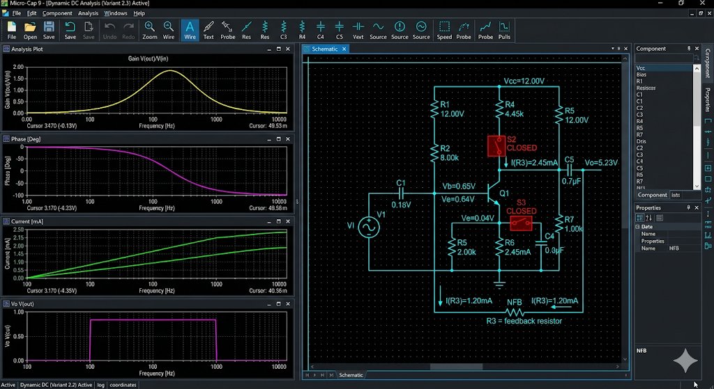
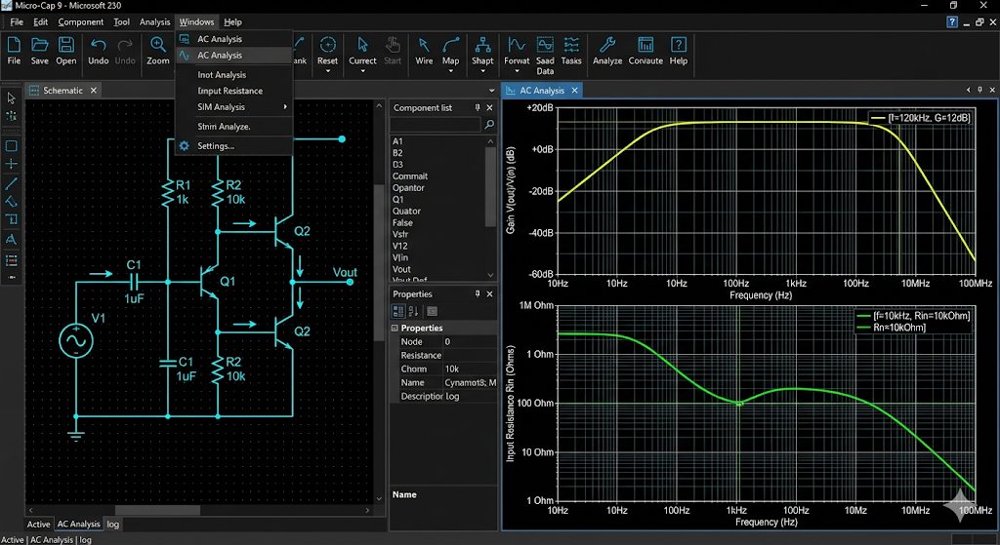

# Отчет по лабораторной работе №2: Усилитель с отрицательной обратной связью

## 1. Введение
Данная работа посвящена изучению механизмов действия местной отрицательной обратной связи в многокаскадных усилительных устройствах. Исследование проводится на базе двухкаскадного транзисторного усилителя с использованием мощного функционала программы Micro-Cap 9.

## 2. Экспериментальная установка
Согласно варианту 2.3, была реализована последовательная ООС по току в первом каскаде. Это достигнуто за счет исключения шунтирующего конденсатора в цепи эмиттера (резистор R3). Такая связь называется «местной», так как она действует в пределах одного каскада, не затрагивая общую структуру устройства.

## 3. Исследование параметров усиления и сопротивления
Снятие характеристик показало, что введение местной ООС привело к росту входного сопротивления каскада, что является положительным фактором для согласования с источниками сигнала, имеющими высокое внутреннее сопротивление. При этом коэффициент усиления первого каскада снизился, однако общая стабильность усиления системы возросла.

## 4. Анализ переходных процессов
При подаче импульсного сигнала было зафиксировано уменьшение времени установления фронта по сравнению с режимом без ОС. Это объясняется расширением полосы пропускания каскада вверх. ООС эффективно подавляет влияние паразитных емкостей транзистора на высоких частотах, обеспечивая более «крутые» фронты выходного напряжения.

## 5. Заключение
Проведенное исследование позволило глубже понять физику процессов в цепях с обратной связью. Местная ООС в первом каскаде (вариант 2.3) показала себя как надежное средство улучшения линейности и входных характеристик усилителя. Ответы на вопросы к защите работы приведены в сопутствующем файле.
