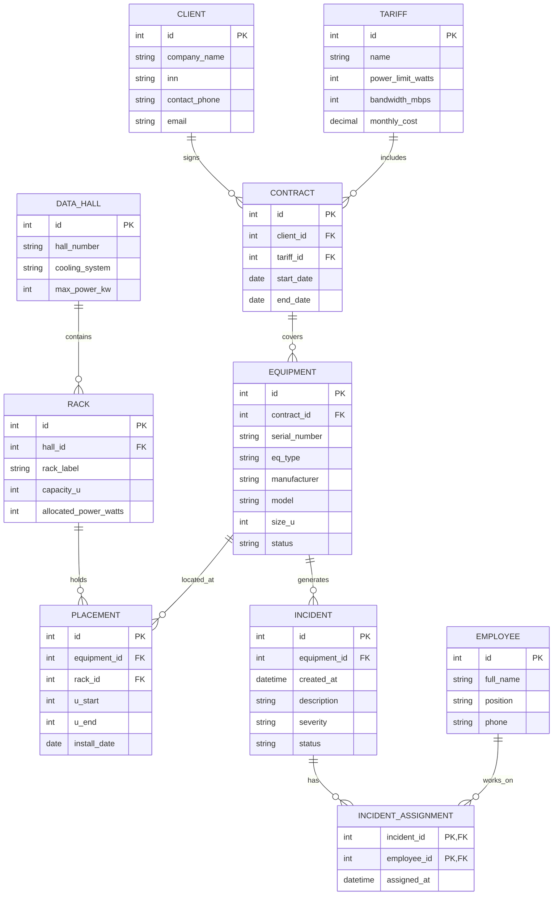

# ГЛАВА 2. ПРОЕКТИРОВАНИЕ БАЗЫ ДАННЫХ

## 2.1. Разработка инфологической модели

Проектирование любой реляционной базы данных начинается с создания концептуальной (инфологической) модели предметной области. Инфологическая модель строится независимо от конкретной системы управления базами данных и аппаратной платформы. Основная цель данного этапа — выявить все информационные сущности, их атрибуты и связи между ними, чтобы обеспечить корректное и полное отражение бизнес-процессов ООО «ДатаСфера».

В качестве инструментального средства моделирования была выбрана нотация Entity-Relationship (ER), предложенная Питером Ченом и расширенная нотацией Crow's Foot («Воронья лапка»). Данная нотация позволяет интуитивно понятно отображать кратность связей.

### 2.1.1. Выделение информационных сущностей

В ходе системного анализа, проведенного в Главе 1, были идентифицированы следующие ключевые сущности:
1. **Клиент (Client)** — физическое или юридическое лицо, заключающее договор на обслуживание. Основные атрибуты: уникальный идентификатор, наименование компании, ИНН, контактный телефон, электронная почта.
2. **Договор (Contract)** — юридический документ, фиксирующий условия аренды оборудования или стоечного пространства. Атрибуты: номер договора, дата заключения, срок действия, идентификатор клиента.
3. **Тарифный план (Tariff)** — шаблон условий обслуживания, определяющий лимиты мощности, сетевого трафика и стоимость. Атрибуты: название тарифа, лимит мощности (Вт), лимит трафика (Мбит/с), ежемесячная стоимость.
4. **Машинный зал (Data_Hall)** — физическое помещение ЦОД, где размещаются телекоммуникационные стойки. Атрибуты: номер зала, система охлаждения, максимальная подведенная мощность.
5. **Стойка (Rack)** — конструктив для установки серверного оборудования. Атрибуты: идентификатор стойки, номер машинного зала, вместимость в юнитах (обычно 42U или 48U), выделенный лимит мощности.
6. **Оборудование (Equipment)** — физическое устройство, устанавливаемое в стойку (сервер, свитч, маршрутизатор). Атрибуты: серийный номер, тип оборудования, производитель, модель, занимаемая высота в юнитах (размер U), статус (Активно, В ремонте, Выведено из эксплуатации).
7. **Размещение (Placement)** — сущность-связка, фиксирующая факт установки конкретного оборудования в определенные юниты конкретной стойки. Атрибуты: идентификатор оборудования, идентификатор стойки, номер начального юнита (U_start), номер конечного юнита (U_end).
8. **Инцидент (Incident)** — запись о нештатной ситуации или заявка на обслуживание оборудования. Атрибуты: номер тикета, дата и время возникновения, описание проблемы, уровень критичности, статус (Открыт, В работе, Закрыт).
9. **Сотрудник (Employee)** — инженер или менеджер ООО «ДатаСфера», ответственный за работу с инцидентами или клиентами. Атрибуты: табельный номер, ФИО, должность, контактный номер.
10. **Назначение инцидента (Incident_Assignment)** — сущность-связка, отражающая связь «многие ко многим» между Инцидентами и Сотрудниками (над одним тикетом могут работать несколько инженеров).

### 2.1.2. Определение связей между сущностями

Для построения целостной картины предметной области необходимо определить связи между выделенными сущностями:
- **Клиент – Договор:** Один клиент может иметь несколько заключенных договоров, но каждый договор всегда привязан строго к одному клиенту. Связь «один ко многим» (1:N).
- **Тарифный план – Договор:** К одному тарифному плану может быть привязано множество договоров, но договор оформляется только по одному тарифному плану. Связь «один ко многим» (1:N).
- **Машинный зал – Стойка:** В одном зале размещается множество стоек, стойка физически находится только в одном зале. Связь «один ко многим» (1:N).
- **Договор – Оборудование:** В рамках одного договора клиент может арендовать множество единиц оборудования, каждая единица оборудования обслуживается в рамках одного договора. Связь «один ко многим» (1:N).
- **Оборудование – Размещение – Стойка:** Единица оборудования физически размещается в одной стойке. Однако, в процессе эксплуатации сервер может быть перемещен из одной стойки в другую, поэтому история размещений фиксируется в сущности «Размещение». Одна стойка может содержать множество размещений. Таким образом, «Размещение» разрешает связь оборудования и стойки во времени.
- **Оборудование – Инцидент:** На одном оборудовании может возникнуть множество инцидентов за время его жизненного цикла, инцидент привязывается к одной единице оборудования. Связь «один ко многим» (1:N).
- **Инцидент – Назначение инцидента – Сотрудник:** Один инцидент может решаться несколькими сотрудниками (например, сетевым инженером и инженером по аппаратному обеспечению), а один сотрудник одновременно решает множество инцидентов. Это классическая связь «многие ко многим» (M:N), которая разрешается через ассоциативную сущность «Назначение инцидента».

Ниже представлена инфологическая модель базы данных в виде ER-диаграммы:

## 2.2. Обоснование выбора даталогической модели данных

Даталогическое проектирование — это процесс перевода инфологической модели (не зависящей от конкретной СУБД) в структуру данных, поддерживаемую выбранной архитектурой управления базами данных.

Существует несколько основных типов даталогических моделей: иерархическая, сетевая, реляционная и объектно-ориентированная. 
1. Иерархическая и сетевая модели являются устаревшими. Они обеспечивают высокую скорость доступа за счет жестко прошитых физических указателей, но обладают крайне низкой гибкостью. При изменении структуры данных (добавлении новых связей) требуется полная переработка программного обеспечения, работающего с БД.
2. Объектно-ориентированные БД хорошо подходят для хранения сложных вложенных структур данных (например, JSON-документов), но уступают реляционным базам в обеспечении строгой транзакционной целостности и выполнении сложных аналитических запросов.
3. **Реляционная модель**, предложенная Э. Коддом в 1970 году, основывается на математическом аппарате теории множеств. Данные представлены в виде двумерных таблиц (отношений). Связи между таблицами устанавливаются логически, через совпадение значений внешних и первичных ключей. Эта модель де-факто является стандартом для корпоративных информационных систем благодаря гибкости, мощному языку запросов SQL и математически доказуемой консистентности данных.

Для разработки АИС «ЦОД» выбор сделан в пользу **реляционной модели данных**. Инфраструктура дата-центра (стойки, серверы, договоры) имеет четкую табличную структуру со строгой типизацией атрибутов и множеством сложных перекрестных запросов (например, «показать всех сотрудников, работающих над инцидентами оборудования клиентов, у которых истекает договор»), что делает реляционную алгебру идеальным инструментом.

## 2.3. Даталогическое проектирование и нормализация схемы БД

Переход от ER-модели к реляционной осуществляется по следующим алгоритмическим правилам:
1. Каждая сильная сущность превращается в таблицу (отношение). Атрибуты сущности становятся столбцами (полями).
2. Первичный ключ сущности (PK) становится первичным ключом таблицы.
3. Связь «один ко многим» (1:N) реализуется путем добавления первичного ключа таблицы со стороны «один» в качестве внешнего ключа (FK) в таблицу со стороны «многие».
4. Связь «многие ко многим» (M:N) (например, между сущностями Incident и Employee) реализуется путем создания дополнительной ассоциативной таблицы (Incident_Assignment), первичный ключ которой является составным и включает внешние ключи связываемых таблиц.

### 2.3.1. Нормализация базы данных

Основополагающим процессом реляционного проектирования является нормализация — пошаговое приведение таблиц к нормальным формам (НФ) для устранения избыточности данных и аномалий обновления, удаления и вставки. В коммерческих системах стандартом является приведение схемы к третьей нормальной форме (3НФ).

**Первая нормальная форма (1НФ):**
Отношение находится в 1НФ, если все его атрибуты атомарны (неделимы). В спроектированной модели все атрибуты содержат атомарные значения. Например, ФИО сотрудника хранится как строковый тип, контактный телефон — как единое значение. Таблицы не содержат массивов или вложенных списков. Следовательно, схема удовлетворяет 1НФ.

**Вторая нормальная форма (2НФ):**
Отношение находится во 2НФ, если оно находится в 1НФ и каждый неключевой атрибут функционально полно зависит от первичного ключа. В нашей модели все первичные ключи, кроме ассоциативной таблицы `Incident_Assignment`, являются простыми (суррогатными идентификаторами `id`). Таким образом, частичная зависимость от составного ключа физически невозможна. В таблице `Incident_Assignment` атрибут `assigned_at` зависит от полного составного ключа `(incident_id, employee_id)`. Схема удовлетворяет 2НФ.

**Третья нормальная форма (3НФ):**
Отношение находится в 3НФ, если оно находится во 2НФ и ни один неключевой атрибут не зависит от другого неключевого атрибута (отсутствуют транзитивные зависимости). 
При анализе первоначальной схемы была выявлена транзитивная зависимость: если бы мы хранили стоимость тарифа (`monthly_cost`) напрямую в таблице `Contract`, то эта стоимость зависела бы от названия тарифа (`tariff_name`), который в свою очередь зависит от `id` контракта. Это привело бы к аномалии обновления: при изменении стоимости тарифа пришлось бы обновлять все контракты. 
Для устранения этой аномалии сущность «Тариф» была выделена в отдельную таблицу `Tariff`, а в таблице `Contract` оставлен только внешний ключ `tariff_id`. Это классический пример приведения к 3НФ. Аналогичным образом машинные залы вынесены в отдельную таблицу `Data_Hall`, чтобы не дублировать характеристики зала в каждой стойке. 
Спроектированная база данных полностью соответствует требованиям 3НФ.

## 2.4. Проектирование пользовательского интерфейса

Пользовательский интерфейс информационной системы должен обеспечивать интуитивно понятное и эргономичное взаимодействие пользователей различных групп с базой данных. Взаимодействие с реляционной базой данных скрыто под слоем абстракции (набором представлений и экранных форм).

Для АИС «ЦОД» интерфейс логически разделен на три рабочие зоны в соответствии с ролевой моделью:
1. **АРМ (Автоматизированное рабочее место) Инженера эксплуатации:** Содержит формы ввода нового оборудования (серверов, коммутаторов). Интерфейс должен позволять отсканировать штрихкод серийного номера, выбрать из выпадающего списка доступную стойку и свободные юниты. Система должна визуализировать графическую заполненность стойки (Rack Map).
2. **АРМ Специалиста поддержки (NOC):** Главный экран представляет собой динамически обновляемую таблицу (представление) активных инцидентов. Цветовое кодирование уровня критичности (Severity: Red, Yellow, Green) позволяет быстро приоритизировать задачи. Форма редактирования инцидента содержит поля для добавления комментариев инженерами и изменения статуса.
3. **АРМ Менеджера:** Содержит аналитические сводки (дашборды), генерируемые на основе агрегирующих SQL-запросов. Выводятся отчеты о доходах в разрезе тарифных планов и отчеты об уровне заполненности машинных залов (Capacity).

Интерфейс строится на основе веб-технологий (HTML5, CSS3, JavaScript), а взаимодействие с БД осуществляется через REST API. Формы ввода данных жестко привязаны к проверке ограничений целостности: например, при добавлении оборудования в стойку система проверяет наличие свободных юнитов с помощью серверных триггеров.

## Выводы
Во второй главе выполнено концептуальное и логическое проектирование базы данных. Разработана инфологическая ER-модель, состоящая из 10 информационных сущностей, которая полностью отражает бизнес-логику управления дата-центром. Обоснован выбор реляционной даталогической модели. Произведена нормализация всех отношений до третьей нормальной формы (3НФ), что исключает аномалии обработки данных. Сформированы требования к пользовательскому интерфейсу для различных групп пользователей системы. Спроектированная структура готова к физической реализации на сервере СУБД.
