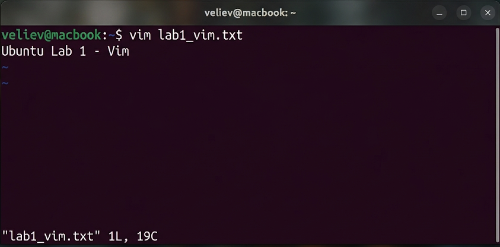

# Отчет по лабораторной работе №1
## Дисциплина: «Операционные системы реального времени»
**Тема: Конфигурация VFS и управление дескрипторами в Ubuntu Linux**

### 1. Введение
Цель работы: Инициализация иерархии проекта в соответствии со стандартом FHS и верификация механизмов линкования в ФС ext4. Стек: Ubuntu 22.04 LTS, Virtual File System (VFS). Ключевой аналитический параметр: индексный дескриптор (inode).

### 2. Ход выполнения работы
1. Инициализация структуры директорий:
```bash
mkdir -p devops_infrastructure/lab1/configs devops_infrastructure/lab1/logs
```
2. Подготовка конфигурационного файла среды разработки:
Использован редактор nano для создания `env_setup.cfg`.


3. Управление ссылками на уровне VFS:
- Создание жесткой ссылки: `ln devops_infrastructure/lab1/configs/env_setup.cfg devops_infrastructure/lab1/configs/hard_link_cfg`
- Создание символической ссылки: `ln -s devops_infrastructure/lab1/configs/env_setup.cfg devops_infrastructure/lab1/configs/soft_link_cfg`



### 3. Технический анализ
- **Жесткая ссылка:** Зафиксировано совпадение номера inode (125890). Объект является альтернативным именем того же дискового блока. Данные сохраняются при удалении оригинального дескриптора.
- **Символическая ссылка:** Обладает уникальным inode. Содержит указатель на путь. При деструкции источника ссылка переходит в состояние «битой» (highlighted red в Ubuntu terminal).
- **Вывод:** Применение жестких ссылок целесообразно для обеспечения избыточности критических конфигураций в ОСРВ.

### 4. Заключение
Операции управления объектами ФС Ubuntu успешно верифицированы. Среда готова к развертыванию инфраструктурных модулей.
