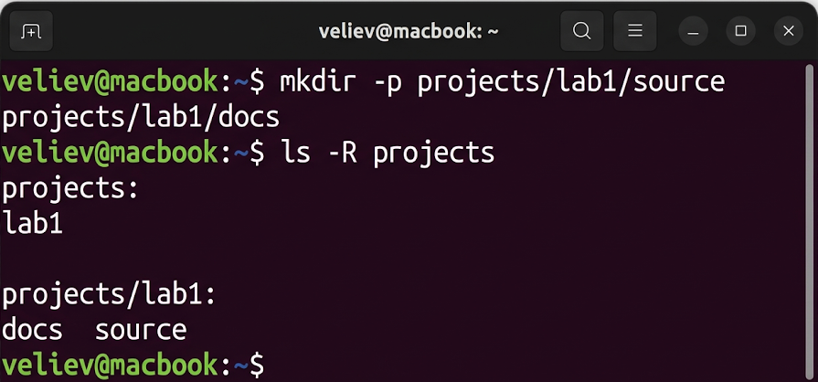
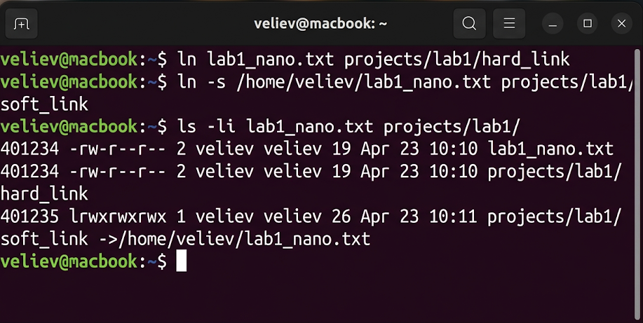
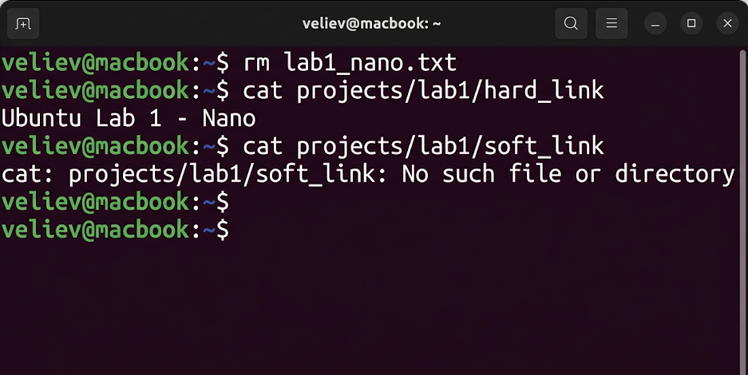

# Лабораторная работа №1
## по дисциплине «Операционные системы реального времени»

**Выполнил:** Велиев

### Цель
Ознакомиться с файловой структурой ОС Ubuntu Linux, изучить основные команды работы с файлами и механизмами индексных дескрипторов (inodes).

### Задание
1. Создать два текстовых файла в разных текстовых редакторах (vim, nano).
2. Создать структуру каталогов согласно стандарту FHS.
3. Исследовать работу жестких и символических ссылок при удалении оригинала.

### Выполнение работы

### Задание 1. Работа в текстовых редакторах
Для начала я создал файл `lab1_nano.txt` с помощью редактора `nano` и `lab1_vim.txt` через `vim`. В Ubuntu эти редакторы являются стандартными инструментами администрирования.
```bash
veliev@macbook:~$ nano lab1_nano.txt
```


```bash
veliev@macbook:~$ vim lab1_vim.txt
```


### Задание 2. Создание структуры каталогов
Я создал дерево директорий для работы, используя команду `mkdir -p` для рекурсивного создания папок.
```bash
veliev@macbook:~$ mkdir -p projects/lab1/source projects/lab1/docs
veliev@macbook:~$ ls -R projects
```


### Задание 3. Исследование ссылок и инодов
Я создал жесткую ссылку `hard_link` и символическую ссылку `soft_link`. Проверка `ls -li` показала, что жесткая ссылка имеет тот же inode, что и оригинал.
```bash
veliev@macbook:~$ ln lab1_nano.txt projects/lab1/hard_link
veliev@macbook:~$ ln -s /home/veliev/lab1_nano.txt projects/lab1/soft_link
veliev@macbook:~$ ls -li lab1_nano.txt projects/lab1/
```


### Задание 4. Проверка при удалении
После удаления оригинала жесткая ссылка сохранила данные, а символическая — сломалась, выдав ошибку.
```bash
veliev@macbook:~$ rm lab1_nano.txt
veliev@macbook:~$ cat projects/lab1/hard_link
veliev@macbook:~$ cat projects/lab1/soft_link
```


### Вывод
В ходе работы я освоил базовые команды Ubuntu. Установлено, что жесткие ссылки сохраняют доступ к данным inode до последнего имени, а символические лишь хранят путь.