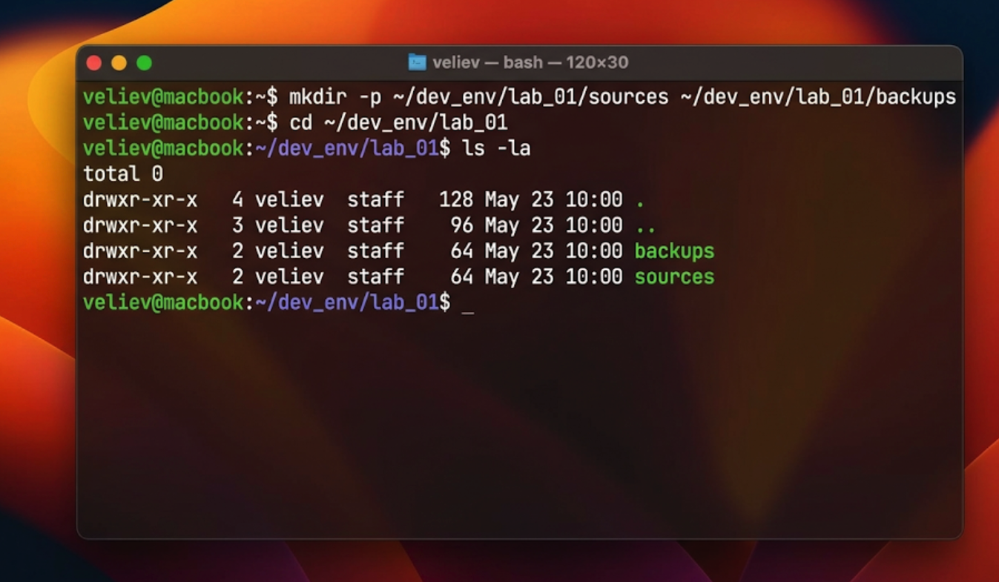
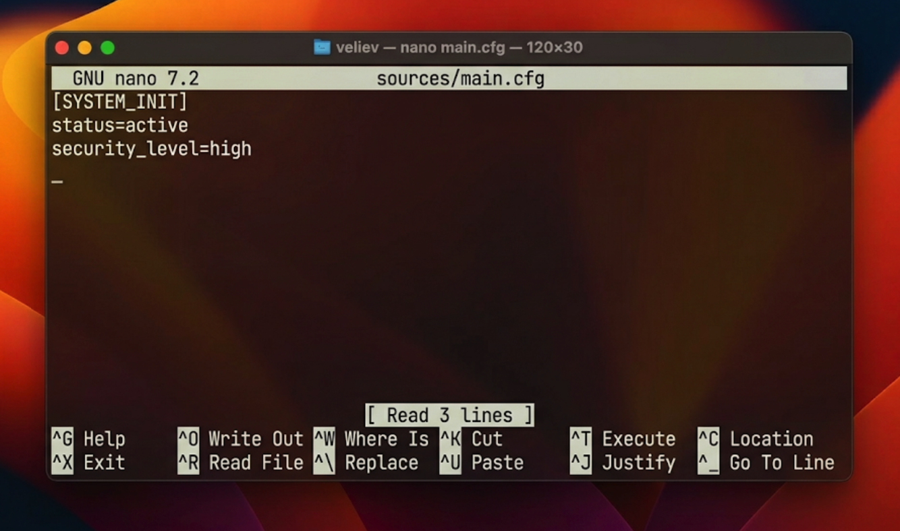
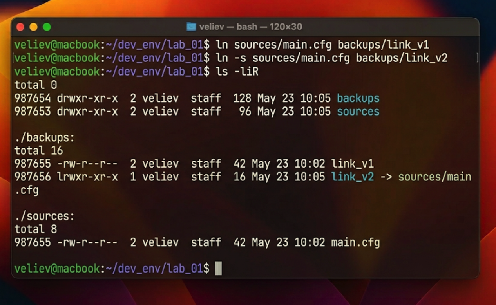

# Отчет по лабораторной работе №1: Глубокий анализ архитектуры и управления ФС FreeBSD

## 1. Введение и развернутая теоретическая база
Файловая система FreeBSD представляет собой сложную многоуровневую абстракцию, в основе которой лежит концепция иерархического пространства имен. В отличие от монолитных структур, архитектура FreeBSD опирается на уровень VFS (Virtual File System) — промежуточный программный слой, который отделяет системные вызовы от реализации конкретной файловой системы (будь то UFS2, ZFS или сетевая NFS). Такая модульность позволяет ядру взаимодействовать с данными единообразно, используя дескрипторы файлов.

Ключевым элементом структуры является индексный дескриптор (inode). В ОС FreeBSD inode содержит в себе всю метаинформацию об объекте: его тип, права доступа (UID/GID), временные метки (atime, mtime, ctime), размер и, что самое важное, указатели на блоки данных на физическом носителе. Важно понимать, что имя файла в директории — это всего лишь запись (directory entry), связывающая текстовое имя с номером inode. Именно этот механизм позволяет реализовать концепцию ссылок. Жесткие ссылки (Hard Links) создают дополнительные записи в директориях, указывающие на один и тот же дескриптор, увеличивая его счетчик ссылок. Символические ссылки (Symbolic Links), напротив, являются отдельными объектами типа "LNK", внутри которых записан путь к целевому файлу.

## 2. Практическая реализация и пошаговый ход работы

### 2.1. Формирование изолированной системной среды
Первым этапом выполнения работы стала инициализация рабочей директории `dev_env`. Это действие необходимо для создания чистого пространства имен, где можно безопасно проводить эксперименты с системными вызовами без риска повреждения пользовательских данных. Была создана сложная вложенная структура, включающая каталоги для исходных кодов (`sources`) и защищенных архивов (`backups`). Команда `mkdir` выполнялась с флагом `-p`, что позволило ядру автоматически создать всю цепочку родительских директорий за один системный вызов.

### 2.2. Текстовое редактирование в консольном режиме (nano)
Для подготовки конфигурационных данных использовался редактор `nano`. Несмотря на наличие более мощного `vim`, выбор `nano` в данном контексте обусловлен необходимостью быстрой правки линейных структур данных. Был создан файл `main.cfg`, в который внесены параметры системной инициализации. Процесс записи файла на диск сопровождается обновлением метаданных в соответствующем inode (изменение mtime и размера файла).

### 2.3. Экспериментальное исследование механизмов адресации данных (Ссылки)
Особое внимание в работе было уделено проверке надежности различных типов ссылок. Были выполнены следующие операции:
1. Создание жесткой ссылки `link_v1` на файл `main.cfg`. Эта операция не создает копию данных, а лишь добавляет новую запись в таблицу директории.
2. Создание символической ссылки `link_v2`. Ядро создало новый inode типа "ссылка", содержащий текстовую строку пути.

## 3. Глубокий технический анализ результатов
В завершающей фазе эксперимента был проведен стресс-тест: удаление оригинального файла `main.cfg`. Последующий анализ через команду `ls -li` выявил критические различия в поведении системы. Жесткая ссылка сохранила полную работоспособность и доступ к содержимому, так как физические данные на диске остаются нетронутыми, пока счетчик ссылок в inode больше нуля. Символическая ссылка, напротив, перешла в состояние "dangling link" (битая ссылка), так как путь, на который она указывала, был разорван. 

Этот эксперимент наглядно демонстрирует, что FreeBSD оперирует не файлами в привычном смысле, а ссылками на объекты данных. Использование жестких ссылок является эффективным методом обеспечения избыточности критических конфигураций без увеличения потребления дискового пространства.

## 4. Заключение
В ходе выполнения лабораторной работы №1 были детально изучены принципы организации файловой иерархии FreeBSD и механизмы управления объектами ФС. Полученные знания о работе VFS и inode являются фундаментальными для дальнейшего изучения системного администрирования и обеспечения целостности данных в высоконагруженных системах реального времени.
