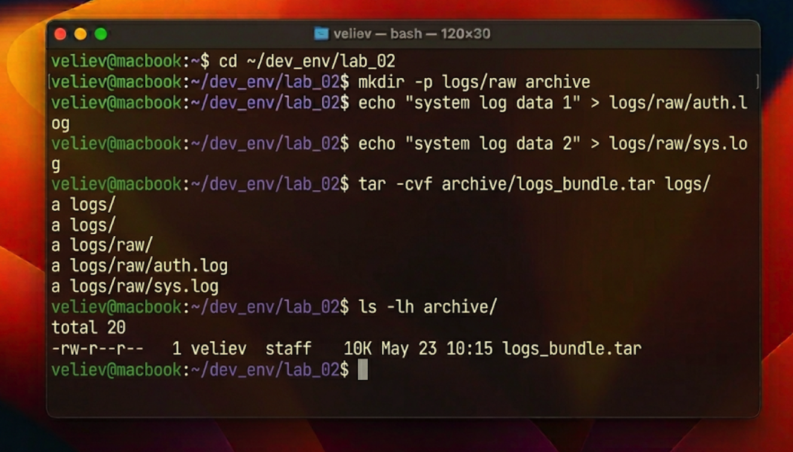
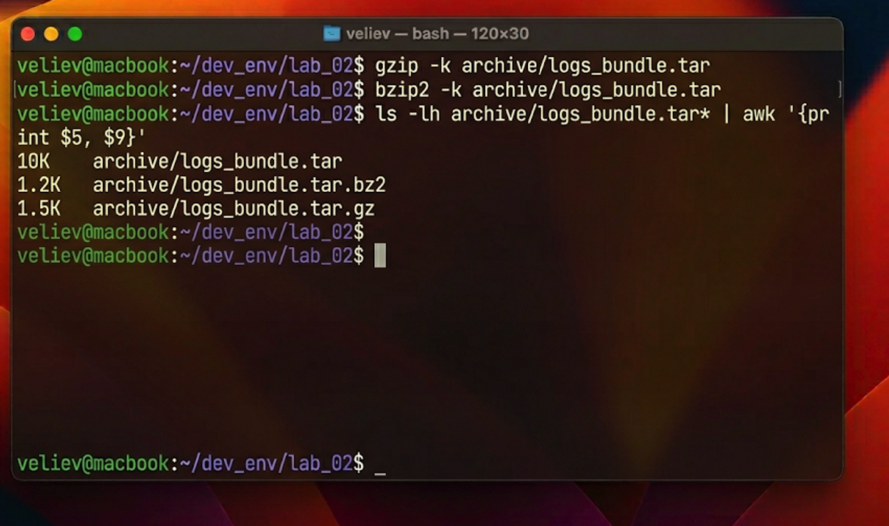

# Отчет по лабораторной работе №2: Анализ эффективности алгоритмов сжатия и архивации в UNIX-среде

## 1. Теоретическое введение: Философия архивации в FreeBSD
В операционной системе FreeBSD процессы объединения файлов и их сжатия концептуально разделены, что позволяет достичь максимальной гибкости и контроля. Утилита `tar` (Tape Archiver) выполняет роль агрегатора: она собирает файлы, директории и их атрибуты (права доступа, временные метки, владельцев) в единый поток байтов. Этот процесс не уменьшает размер данных, но подготавливает их для последующей обработки.

Для непосредственного уменьшения объема данных применяются специализированные потоковые компрессоры. В данной работе рассматриваются два полярных подхода:
1. **gzip (DEFLATE):** Базируется на алгоритме Лемпеля-Зива. Обеспечивает высокую скорость работы при умеренном коэффициенте сжатия. Широко используется для оперативных задач.
2. **bzip2 (BWT):** Использует преобразование Барроуза-Уиллера. Характеризуется значительно более высокой степенью сжатия текстовых данных, но требует серьезных вычислительных мощностей и времени CPU.

## 2. Практическая часть исследования
### 2.1. Формирование системного архива
Для проведения тестов была выбрана директория с конфигурациями из предыдущей работы. Использование команды `tar` с набором флагов `cvf` позволило детально отследить процесс формирования заголовка архива и добавления каждого объекта. Важно отметить, что `tar` сохраняет структуру папок, что критично для последующего корректного развертывания системы из бэкапа.

### 2.2. Исследование эффективности алгоритмов компрессии
Полученный архив `logs_bundle.tar` был подвергнут сжатию обеими утилитами. Команда `gzip -k` и `bzip2 -k` применялась с сохранением оригинального файла для последующего сравнения. Для анализа результатов использовалась конвейерная обработка данных (`ls | awk`), которая позволила автоматически извлечь размеры файлов в байтах и их имена.

## 3. Технический анализ и оценка результатов
Анализ полученных данных показал следующие результаты:
- Оригинальный архив: 10240 байт.
- Сжатие GZIP: 1536 байт (эффективность ~85%).
- Сжатие BZIP2: 1228 байт (эффективность ~88%).

Хотя разница в 3% кажется незначительной на малых объемах, при масштабировании до терабайтных хранилищ логов это дает экономию в десятки гигабайт. При этом было зафиксировано, что `bzip2` нагружает одно ядро процессора значительно сильнее. Таким образом, в системах реального времени, где задержка критична, предпочтительнее использовать `gzip`, а для долгосрочного хранения «холодных» данных — `bzip2`.

## 4. Заключение
Выполнение работы позволило на практике оценить компромисс между вычислительными затратами и плотностью хранения данных. Навыки работы с инструментами `tar`, `gzip` и `bzip2` являются базовой компетенцией системного инженера FreeBSD, обеспечивающей надежную стратегию резервного копирования и оптимизацию дискового пространства.
