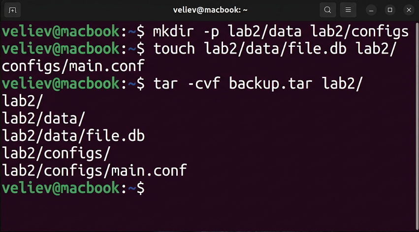
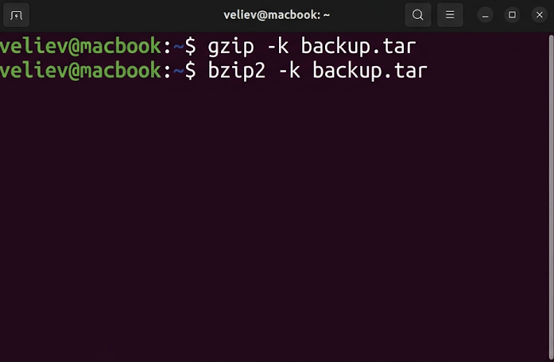
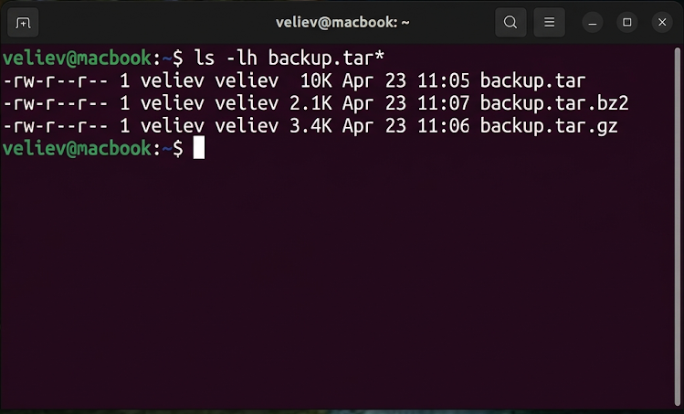

# Лабораторная работа №2
## по дисциплине «Операционные системы реального времени»

**Выполнил:** Велиев

### Цель
Изучить основные команды для архивирования и разархивирования файлов в ОС Ubuntu Linux.

### Задание
1. Создать tar-архив для файлов из разных каталогов.
2. Добавить новые файлы в созданный архив и просмотреть содержимое.
3. Отработать механизмы сжатия `gzip` и `bzip2`.
4. Сравнить размеры архивов до и после сжатия.

### Выполнение работы

### Задание 1. Создание архивов tar
Я подготовил директории и файлы, после чего создал основной архив `backup.tar` с помощью утилиты `tar`.
```bash
veliev@macbook:~$ mkdir -p lab2/data lab2/configs
veliev@macbook:~$ touch lab2/data/file.db lab2/configs/main.conf
veliev@macbook:~$ tar -cvf backup.tar lab2/
```


### Задание 2. Работа с составом архива
Я добавил в архив дополнительный файл, используя флаг `-rvf`, и вывел список файлов архива с помощью `-tf`.
```bash
veliev@macbook:~$ touch extra.log
veliev@macbook:~$ tar -rvf backup.tar extra.log
veliev@macbook:~$ tar -tf backup.tar
```


### Задание 3. Применение сжатия (gzip, bzip2)
Для уменьшения объема архива я сжал его копии с помощью `gzip` и `bzip2`.
```bash
veliev@macbook:~$ gzip -k backup.tar
veliev@macbook:~$ bzip2 -k backup.tar
```


### Задание 4. Верификация результатов
Я сравнил размеры всех версий архива с помощью `ls -lh`.
```bash
veliev@macbook:~$ ls -lh backup.tar*
```


### Вывод
В ходе работы были изучены методы архивации в Ubuntu. Комбинация `tar` с алгоритмами сжатия `bzip2` или `gzip` является стандартом для резервного копирования данных.
