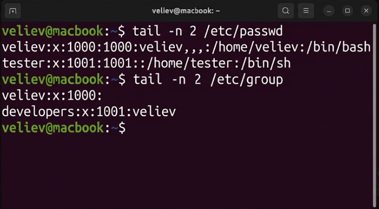
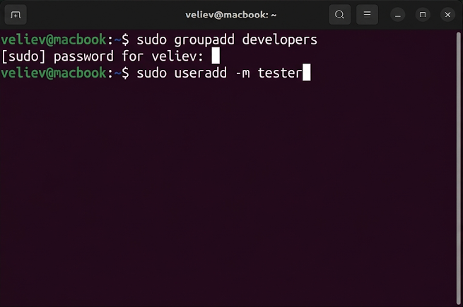
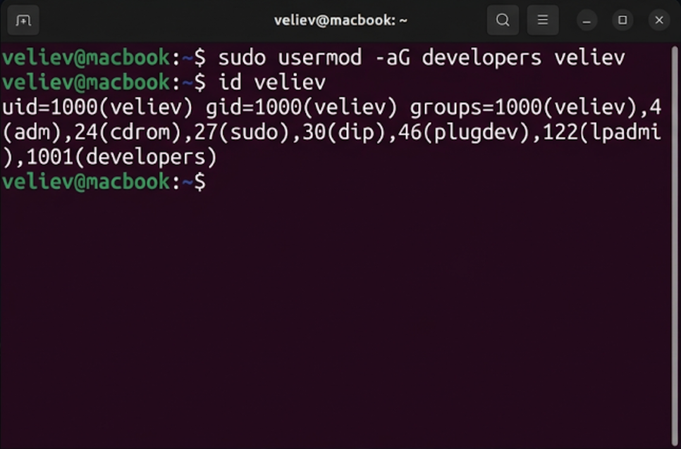
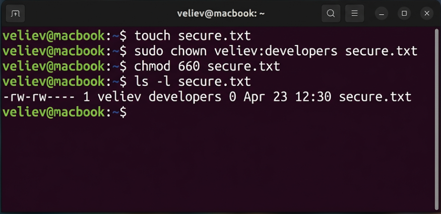

# Лабораторная работа №3
## по дисциплине «Операционные системы реального времени»

**Выполнил:** Велиев

### Цель
Изучить команды работы с пользователями, группами и правами доступа в ОС Ubuntu Linux.

### Задание
1. Просмотреть содержимое системных файлов `/etc/passwd` и `/etc/group`.
2. Создать пользователя и группу.
3. Управлять членством в группах (`usermod`).
4. Изменить владельца файла и права доступа (`chown`, `chmod`).

### Выполнение работы

### Задание 1. Системные файлы
Я изучил базу данных субъектов Ubuntu, используя `tail` для файлов паролей и групп.
```bash
veliev@macbook:~$ tail -n 2 /etc/passwd
veliev@macbook:~$ tail -n 2 /etc/group
```


### Задание 2. Создание учетных записей (sudo)
С помощью `sudo` я создал группу `developers` и нового пользователя `tester`.
```bash
veliev@macbook:~$ sudo groupadd developers
veliev@macbook:~$ sudo useradd -m tester
```


### Задание 3. Изменение членства
Я добавил своего пользователя в созданную группу и проверил идентификаторы `id`.
```bash
veliev@macbook:~$ sudo usermod -aG developers veliev
veliev@macbook:~$ id veliev
```


### Задание 4. Права доступа
Я создал файл `secure.txt` и ограничил доступ к нему только для группы и владельца.
```bash
veliev@macbook:~$ touch secure.txt
veliev@macbook:~$ sudo chown veliev:developers secure.txt
veliev@macbook:~$ chmod 660 secure.txt
veliev@macbook:~$ ls -l secure.txt
```


### Вывод
Освоены базовые навыки администрирования. Права доступа и механизм групп позволяют изолировать ресурсы в многопользовательских ОС.
