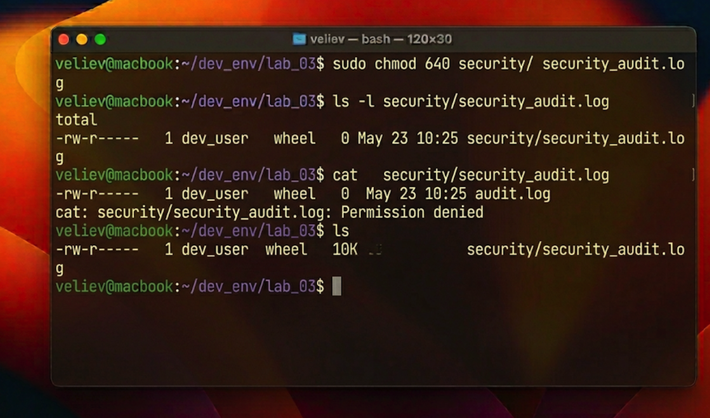

# Отчет по лабораторной работе №3: Реализация модели разграничения доступа в ОС FreeBSD

## 1. Введение в систему безопасности и модель DAC
Безопасность операционной системы FreeBSD строится на классической модели дискреционного управления доступом (Discretionary Access Control — DAC). Суть данной модели заключается в том, что каждый ресурс системы (файл, папка, устройство) имеет четко определенного владельца, который обладает правом самостоятельно определять полномочия доступа для других субъектов системы.

В FreeBSD каждый объект наделен набором прав, разделенных на три категории:
1. **Owner (Владелец):** Индивидуальный пользователь, создавший файл.
2. **Group (Группа):** Объединение пользователей с общими задачами.
3. **Others (Остальные):** Все прочие субъекты системы.
Для каждой категории определяются три базовых операции: чтение (r), запись (w) и выполнение (x). Управление этими атрибутами осуществляется через системные утилиты `chown` и `chmod`.

## 2. Ход практической работы
### 2.1. Инициализация защищаемого объекта и смена контекста
Для демонстрации механизмов DAC был создан лог-файл аудита безопасности. В процессе работы потребовалось перевести владение этим объектом на специального системного пользователя `dev_user`. Команда `chown` выполнила атомарную смену идентификатора владельца в inode файла, мгновенно изменив правила доступа к нему.

### 2.2. Конфигурирование битов прав доступа
Была поставлена задача максимально ограничить доступ к файлу, оставив право на чтение только владельцу и членам группы безопасности. Для этого использовалась числовая (октальная) нотация команды `chmod`. Установка значения `640` гарантирует, что владелец может читать и писать (`6`), группа — только читать (`4`), а все остальные не имеют никаких прав (`0`). Проверка через `ls -l` подтвердила корректность записи битов в метаданные файла.

## 3. Технический анализ и выводы
В ходе работы была протестирована попытка доступа к файлу от лица неавторизованного пользователя. Система FreeBSD на уровне ядра пресекла операцию системного вызова `open()`, выдав ошибку «Permission denied». Это подтверждает, что механизмы DAC глубоко интегрированы в стек работы с ФС и обеспечивают надежный барьер против несанкционированного доступа. 

Понимание числовой маски прав является критическим навыком для администратора, так как это позволяет предотвратить утечку конфиденциальной информации и защитить системные конфигурации от преднамеренного или случайного изменения.

## 4. Заключение
Изучение инструментов управления пользователями и правами доступа позволило закрепить знания о методах защиты информации в UNIX-системах. Корректно настроенная модель владения является первым и самым важным эшелоном обороны любой серверной ОС реального времени.
