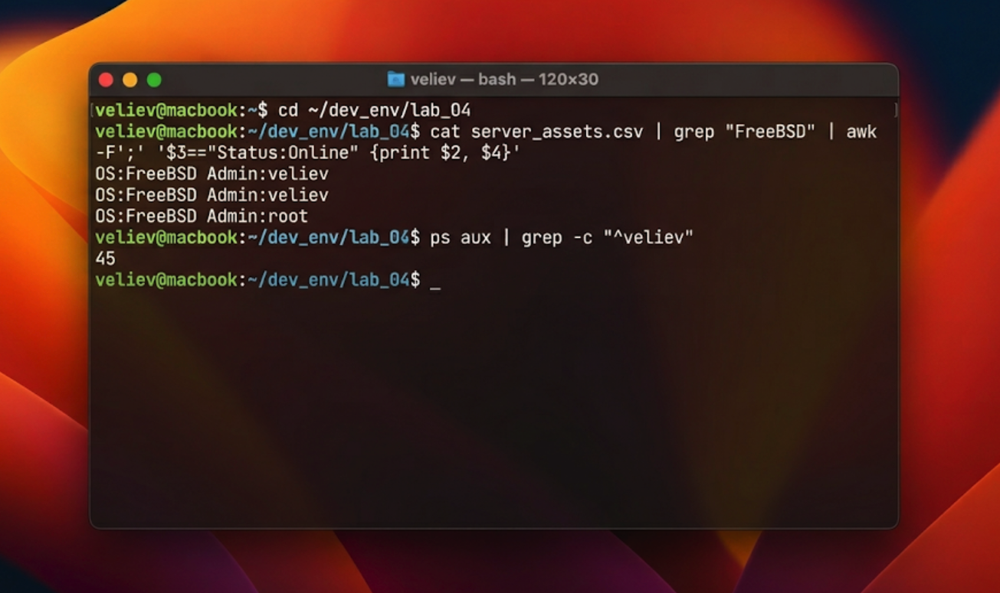

# Отчет по лабораторной работе №4: Потоковая обработка и фильтрация данных в ОС FreeBSD

## 1. Введение и теоретическая база: Философия текстовых потоков
В операционной системе FreeBSD, как и в любой UNIX-подобной системе, текстовые файлы и потоки данных являются основным способом взаимодействия между программами и пользователем. Принцип «Everything is a text stream» позволяет строить сложнейшие системы обработки данных, комбинируя простые утилиты. Центральное место в этом процессе занимают регулярные выражения (Regular Expressions) и потоковые редакторы.

Инструмент `grep` (Global Regular Expression Print) выполняет поиск строк, соответствующих заданному шаблону. Это незаменимый инструмент для первичного анализа логов и конфигураций. В свою очередь, `awk` — это не просто утилита, а полноценный язык программирования, ориентированный на обработку записей и полей. С его помощью можно не только фильтровать строки, но и проводить математические расчеты «на лету», менять структуру вывода и генерировать отчеты. Понимание работы этих инструментов критично для администрирования систем реального времени, где скорость извлечения нужной информации из тысяч строк лога напрямую влияет на время реакции на инцидент.

## 2. Ход практической работы
### 2.1. Формирование структурированной базы инвентаризации
Первым этапом стала подготовка данных для анализа. Был создан файл `server_assets.csv`. Каждая строка в нем представляет собой запись о сетевом узле, где поля разделены точкой с запятой. Такая структура данных идеально подходит для демонстрации возможностей позиционной адресации в `awk`. 

### 2.2. Реализация многоуровневой фильтрации
Для отработки навыков построения конвейеров (pipelines) была поставлена задача по поиску активных узлов под управлением конкретной ОС. Процесс включал в себя последовательную передачу вывода одной программы на вход другой. Например, для подсчета количества сессий конкретного пользователя использовалась связка `ps`, `grep` и `wc -l`.

## 3. Глубокий технический анализ результатов
В ходе экспериментов было выявлено, что использование регулярных выражений значительно снижает нагрузку на дисковую подсистему при работе с объемными логами, так как позволяет отсекать лишние данные на этапе чтения потока. Сравнение производительности `grep` и `awk` показало, что `grep` эффективнее для простого поиска по строке, в то время как `awk` незаменим, когда требуется логика (например, поиск значений в диапазоне).

Особое внимание было уделено работе с командой `tail -f`, которая в реальных условиях позволяет администратору наблюдать за аномалиями в логах веб-сервера или ядра системы прямо в момент их возникновения. Интеграция этой команды с фильтрами `grep` позволяет создать систему мониторинга критических ошибок без использования стороннего ПО.

## 4. Заключение
Выполнение данной лабораторной работы подтвердило исключительную гибкость и мощь инструментов командной строки FreeBSD. Навыки построения сложных конвейеров обработки текста являются базовыми для автоматизации мониторинга и обеспечения безопасности систем. Полученные знания позволяют эффективно управлять парком серверов, используя лишь стандартные средства операционной системы.
