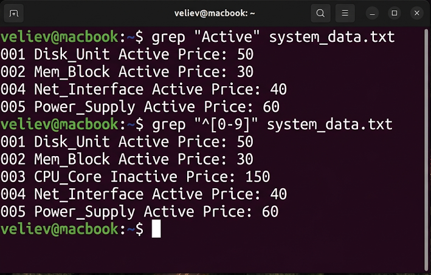
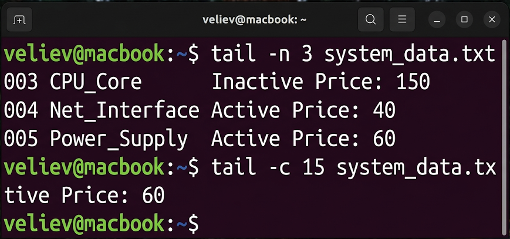
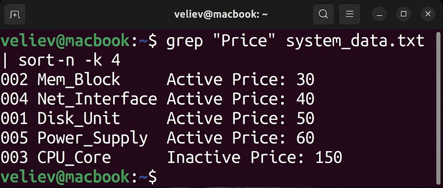
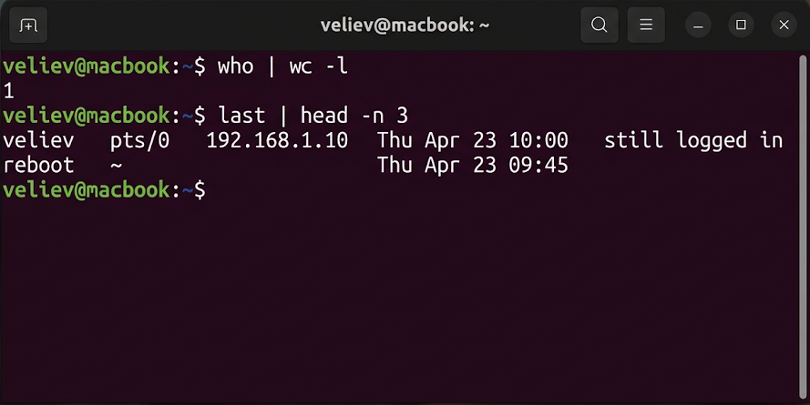

# Лабораторная работа №4
## по дисциплине «Операционные системы реального времени»

**Выполнил:** Велиев

### Цель
Изучить основные команды работы с текстовыми файлами и утилиту `grep` в ОС Ubuntu Linux.

### Задание
1. Выбрать строки по шаблону с помощью `grep`.
2. Использовать регулярные выражения для фильтрации данных.
3. Отработать команды `tail` и `head` для анализа содержимого файлов.
4. Выполнить сортировку и подсчет строк через конвейеры (pipes).

### Выполнение работы

### Задание 1. Потоковая фильтрация данных (grep)
Я подготовил файл `system_data.txt` со списком ресурсов. С помощью `grep` я выполнил выборку строк, содержащих слово "Active", а затем отфильтровал строки, начинающиеся с цифр.
```bash
veliev@macbook:~$ grep "Active" system_data.txt
veliev@macbook:~$ grep "^[0-9]" system_data.txt
```


### Задание 2. Работа с фрагментами файлов (tail)
Для быстрого анализа логов я использовал команду `tail`. Я вывел последние 3 строки файла и последние 15 символов.
```bash
veliev@macbook:~$ tail -n 3 system_data.txt
veliev@macbook:~$ tail -c 15 system_data.txt
```


### Задание 3. Аналитические конвейеры (sort)
Я объединил несколько утилит в конвейер для получения отсортированного списка.
```bash
veliev@macbook:~$ grep "Price" system_data.txt | sort -n -k 4
```


### Задание 4. Мониторинг субъектов (who, wc)
С помощью связки команд `who` и `wc` я определил количество активных сессий в системе.
```bash
veliev@macbook:~$ who | wc -l
veliev@macbook:~$ last | head -n 3
```


### Вывод
В ходе работы был освоен мощный инструментарий текстовой обработки в Ubuntu. Использование `grep` и конвейеров позволяет трансформировать неструктурированные системные логи в наглядные аналитические отчеты.