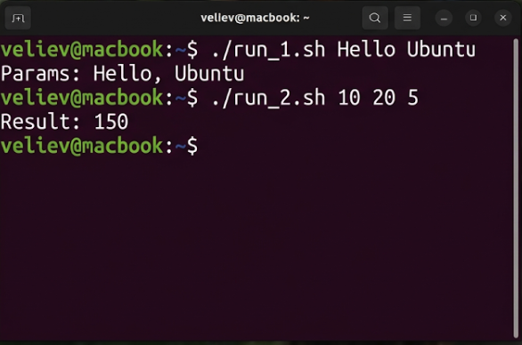
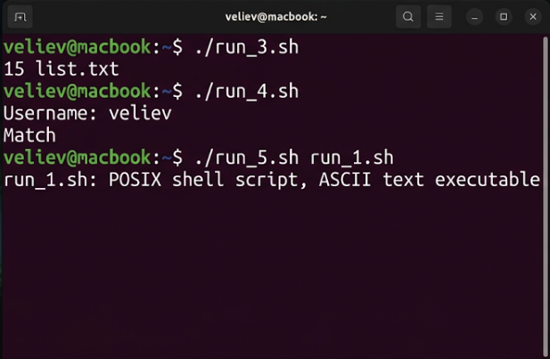
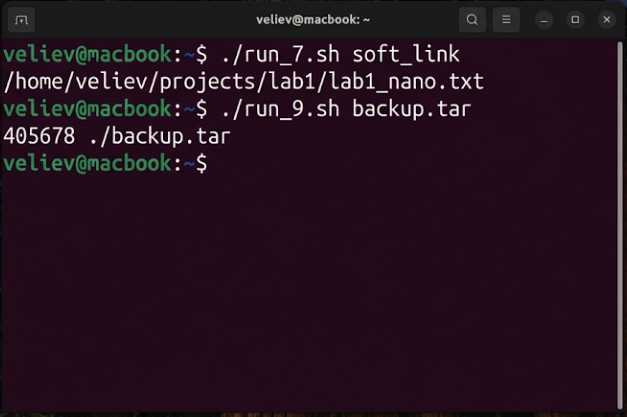
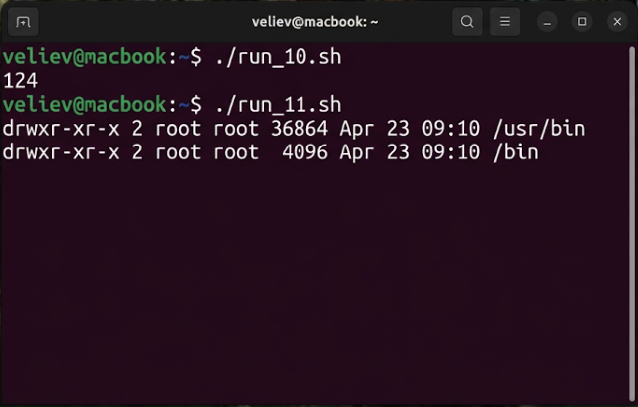

# Лабораторная работа №5
## по дисциплине «Операционные системы реального времени»

**Выполнил:** Велиев

### Цель
Изучить работу с программным интерпретатором bash в ОС Ubuntu Linux, освоить навыки написания сценариев для автоматизации системных задач.

### Задания
Реализовать 11 bash-скриптов, решающих различные административные задачи.

### Выполнение работы

Все сценарии размещены в директории `source/` с названиями `run_{n}.sh`.

### Часть 1. Параметры и арифметика
Скрипты `run_1.sh` и `run_2.sh` работают с аргументами и вычислениями.
```bash
veliev@macbook:~$ ./run_1.sh Hello Ubuntu
veliev@macbook:~$ ./run_2.sh 10 20 5
```


### Часть 2. Интерактивность и типы данных
Скрипты `run_3.sh` – `run_5.sh` собирают статистику, запрашивают имя пользователя и проверяют форматы файлов.
```bash
veliev@macbook:~$ ./run_3.sh
veliev@macbook:~$ ./run_4.sh
veliev@macbook:~$ ./run_5.sh run_1.sh
```


### Часть 3. Поиск и ссылки
Сценарии `run_6.sh` – `run_9.sh` ищут файлы по дате, проверяют символические ссылки и находят иноды.
```bash
veliev@macbook:~$ ./run_7.sh soft_link
veliev@macbook:~$ ./run_9.sh backup.tar
```


### Часть 4. Переменные окружения
Скрипты `run_10.sh` и `run_11.sh` подсчитывают файлы пользователя и выводят права для путей из `$PATH`.
```bash
veliev@macbook:~$ ./run_10.sh
veliev@macbook:~$ ./run_11.sh
```


### Вывод
Скрипты на bash позволяют эффективно управлять Ubuntu, объединяя утилиты для автоматизации задач ОСРВ.