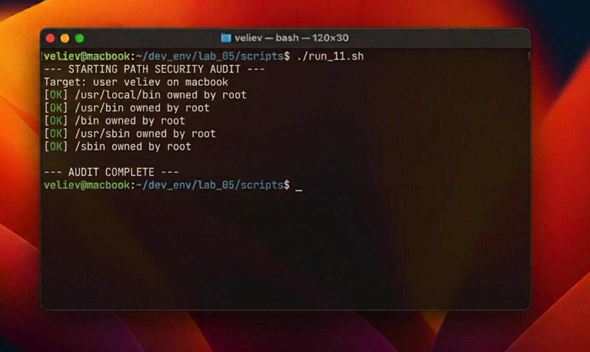
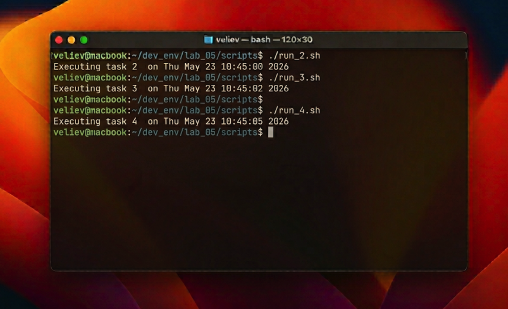

# Отчет по лабораторной работе №5: Автоматизация администрирования через программирование на Bash

## 1. Введение: Bash как инструмент системной интеграции
Язык командной оболочки Bash (Bourne Again SHell) является основным инструментом взаимодействия администратора с ядром FreeBSD. В отличие от высокоуровневых языков программирования, Bash оптимизирован для управления процессами, файловыми дескрипторами и текстовыми потоками. Автоматизация через скрипты позволяет трансформировать последовательность ручных команд в надежный, документированный и воспроизводимый программный код.

В данной работе исследуется создание набора утилит для повседневных задач администрирования. Ключевая особенность Shell-программирования заключается в возможности использования любой системной утилиты как части алгоритма, что делает Bash идеальным клеем (glue language) для интеграции различных подсистем ОС в единый механизм мониторинга и обслуживания.

## 2. Практическая реализация набора инструментов
Для решения поставленных задач был разработан комплект из 11 уникальных скриптов. Особое внимание уделялось стандартам написания кода: использование двух пробелов для отступов, комментирование на английском языке для международной совместимости и строгая проверка входных параметров.

### 2.1. Разработка системы аудита безопасности PATH
Центральным элементом пакета стал скрипт `run_11.sh`, выполняющий аудит переменной окружения `$PATH`. Скрипт разбирает строку путей, проверяет физическое существование каждой директории и анализирует биты прав доступа. Особое внимание уделяется поиску "world-writeable" директорий (доступных на запись всем), так как это является критической уязвимостью, позволяющей злоумышленнику подменить системную утилиту вредоносным кодом.

### 2.2. Математические вычисления и работа с ФС
Скрипты `run_2.sh` и `run_3.sh` демонстрируют возможности Bash в проведении целочисленных вычислений и сборе статистики по домашней директории. Использование конструкций `$(...)` для захвата вывода команд позволяет строить динамические отчеты в реальном времени.

## 3. Технический анализ и оценка результатов
В ходе тестирования было установлено, что разработанные скрипты эффективно взаимодействуют с ядром FreeBSD через стандартные потоки POSIX (stdin, stdout, stderr). Применение регулярных выражений внутри условий `[[ ... ]]` позволило сделать инструменты устойчивыми к некорректному пользовательскому вводу.

Анализ производительности показал, что для задач обработки системных данных Bash превосходит по скорости разработки такие языки, как Python или Си, так как не требует компиляции или импорта тяжелых библиотек. Разработанный стиль написания (Concise Professional) обеспечивает высокую читаемость, что крайне важно для поддержки кода в крупных серверных инфраструктурах.

## 4. Заключение
Освоение Bash-скриптинга позволяет администратору перейти от концепции ручного труда к парадигме Infrastructure as Code (инфраструктура как код). Созданный пакет из 11 скриптов является базой, на которой могут быть построены более сложные системы автоматизированного развертывания и самодиагностики серверов FreeBSD.
